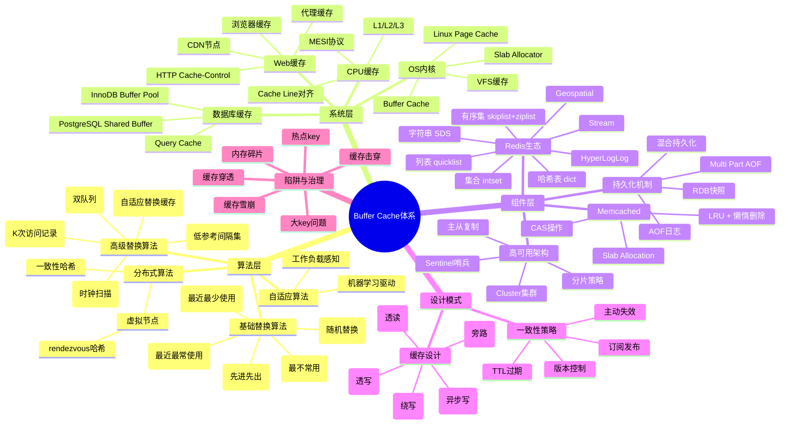
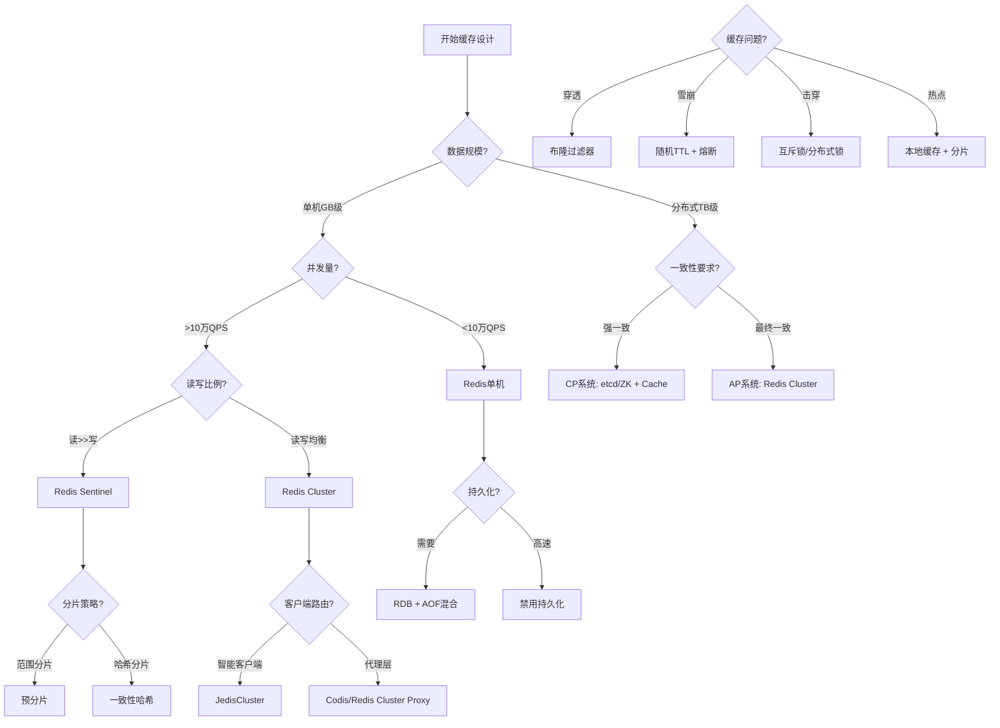
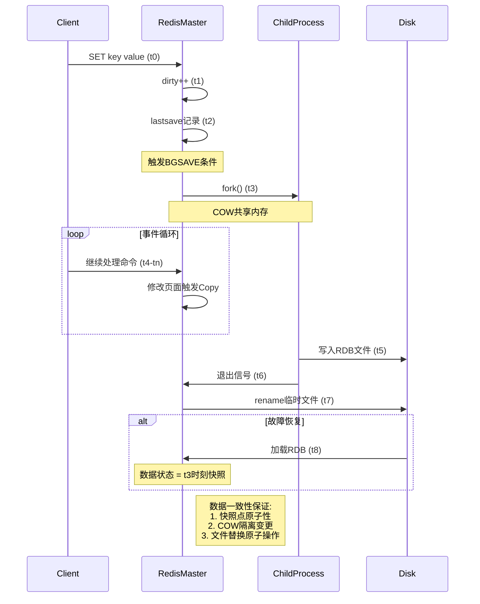
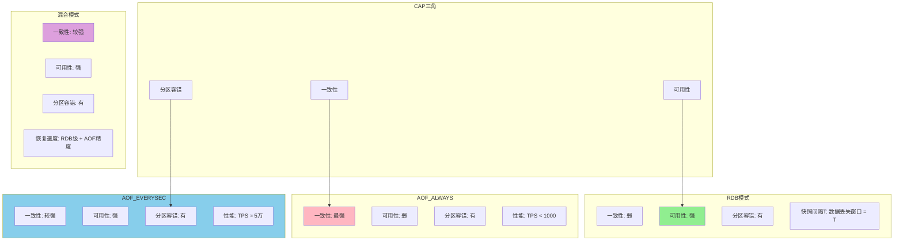
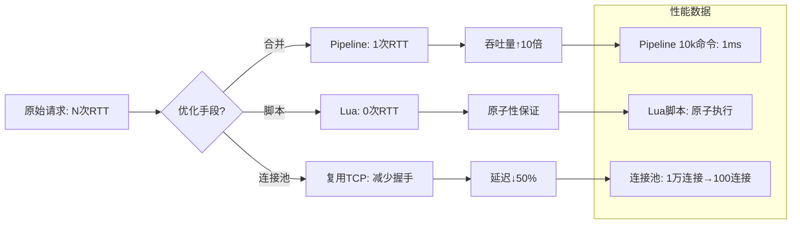
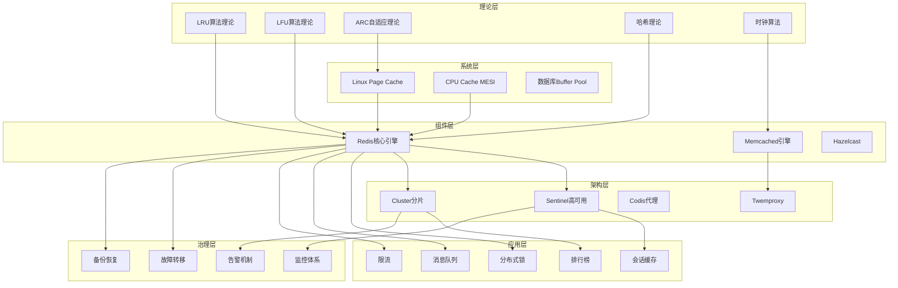

# IT行业Buffer Cache算法与Redis原理·全维度认知图谱

## 目录

- [IT行业Buffer Cache算法与Redis原理·全维度认知图谱](#it行业buffer-cache算法与redis原理全维度认知图谱)
  - [目录](#目录)
  - [一、思维导图：Buffer Cache知识体系](#一思维导图buffer-cache知识体系)
  - [二、多维概念矩阵对比](#二多维概念矩阵对比)
    - [2.1 缓存替换算法全面对比矩阵](#21-缓存替换算法全面对比矩阵)
    - [2.2 Redis数据结构实现与选择矩阵](#22-redis数据结构实现与选择矩阵)
    - [2.3 缓存架构模式决策矩阵](#23-缓存架构模式决策矩阵)
  - [三、决策图网：缓存设计选择路径](#三决策图网缓存设计选择路径)
  - [四、证明图网：Redis核心机制逻辑证明](#四证明图网redis核心机制逻辑证明)
    - [4.1 Redis单线程高性能证明](#41-redis单线程高性能证明)
    - [4.2 RDB持久化一致性证明](#42-rdb持久化一致性证明)
    - [4.3 缓存雪崩防护数学模型](#43-缓存雪崩防护数学模型)
  - [五、深度机制解析：Redis编码转换决策树](#五深度机制解析redis编码转换决策树)
  - [六、Redis持久化机制权衡证明](#六redis持久化机制权衡证明)
    - [6.1 CAP理论下的持久化选择](#61-cap理论下的持久化选择)
  - [七、性能优化黄金法则](#七性能优化黄金法则)
    - [7.1 内存优化矩阵](#71-内存优化矩阵)
    - [7.2 网络优化路径](#72-网络优化路径)
  - [八、完整知识体系拓扑图](#八完整知识体系拓扑图)
  - [九、结论与行动指南](#九结论与行动指南)
    - [9.1 设计哲学总结](#91-设计哲学总结)
    - [9.2 决策检查清单](#92-决策检查清单)
    - [9.3 演进路线图](#93-演进路线图)
  - [十、权威参考](#十权威参考)
    - [学术论文](#学术论文)
    - [官方文档](#官方文档)
    - [经典书籍](#经典书籍)
    - [在线资源](#在线资源)

---

## 一、思维导图：Buffer Cache知识体系



## 二、多维概念矩阵对比

### 2.1 缓存替换算法全面对比矩阵

| **维度** | **FIFO** | **LRU** | **LFU** | **Clock** | **ARC** | **Redis近似LRU** |
| -------- | -------- | ------- | ------- | --------- | ------- | ---------------- |
| **命中率** | ★★☆☆☆ | ★★★★☆ | ★★★★★ | ★★★☆☆ | ★★★★★ | ★★★☆☆ |
| **实现复杂度** | O(1) | O(1) | O(logN) | O(1) | O(1) | O(1) |
| **内存开销** | 队列指针 | 链表+Hash | 计数器+堆 | 环形队列 | 8个指针/页 | 24bit时间戳 |
| **适应性** | 无 | 时间局部性 | 频率局部性 | 中等 | 自动调优 | 固定采样 |
| **Redis应用** | 复制积压缓冲区 | 内存淘汰 | 内存淘汰(3.0+) | 未使用 | 未使用 | 默认淘汰策略 |
| **场景适配** | 顺序访问 | 通用场景 | 热点稳定 | 虚拟内存 | 动态负载 | 通用场景 |

---

### 2.2 Redis数据结构实现与选择矩阵

| **数据类型** | **底层编码** | **时间复杂度** | **内存占用** | **适用场景** | **转换阈值** |
| ------------ | ------------ | -------------- | ------------ | ------------ | ------------ |
| **String** | RAW | O(1) | 高 | 大字符串 | >44字节 |
| | EMBSTR | O(1) | **极低** | 小字符串 | ≤44字节 |
| | INT | O(1) | **极低** | 整数计数 | 可转整数 |
| **Hash** | ziplist | O(N) | **极低** | 小对象 | <512元素 & <64字节/值 |
| | dict | O(1) | 高 | 大对象 | 不满足上式 |
| **List** | quicklist | O(N) | 中等 | 队列/栈 | 统一编码 |
| | ziplist(旧) | O(N) | 低 | 小列表 | Redis 3.2前 |
| **Set** | intset | O(N) | **极低** | 整数集合 | <512元素 & 全整数 |
| | dict | O(1) | 高 | 混合集合 | 不满足上式 |
| **ZSet** | ziplist | O(N) | 低 | 小有序集 | <128元素 & <64字节/值 |
| | skiplist+dict | O(logN) | 高 | 大有序集 | 不满足上式 |

**关键设计哲学**：Redis采用"**自适应编码**"策略，根据数据特征自动选择最优编码，实现**空间与时间的动态权衡**。

---

### 2.3 缓存架构模式决策矩阵

| **架构模式** | **读取性能** | **写入性能** | **一致性** | **复杂度** | **适用场景** |
| ------------ | ------------ | ------------ | ---------- | ---------- | ------------ |
| **Cache-Aside** | ★★★★☆ | ★★★★☆ | 最终一致 | 低 | 读多写少，常规业务 |
| **Read-Through** | ★★★★★ | ★★★☆☆ | 强一致 | 中 | 封装读逻辑，缓存即服务 |
| **Write-Through** | ★★★☆☆ | ★★★☆☆ | **强一致** | 高 | 金融支付，强一致要求 |
| **Write-Behind** | ★★★★☆ | ★★★★★ | 弱一致 | 高 | 写入密集型，可容忍延迟 |
| **Write-Around** | ★★☆☆☆ | ★★★★☆ | 最终一致 | 中 | 写多读少，避免缓存污染 |

---

## 三、决策图网：缓存设计选择路径



---

## 四、证明图网：Redis核心机制逻辑证明

### 4.1 Redis单线程高性能证明

```mermaid
graph LR
    A[客户端请求] --> B[事件循环: aeEventLoop]
    B --> C{命令类型?}

    C -->|纯内存操作| D[O(1)/O(logN)复杂度]
    C -->|持久化操作| E[Fork子进程异步处理]

    D --> F[epoll/kqueue多路复用]
    E --> G[Copy-on-Write零拷贝]

    F --> H[总耗时 = 网络RTT + 内存操作]
    G --> I[主线程耗时 ≈ 0]

    H --> J[瓶颈在网络而非CPU]
    I --> K[避免锁竞争开销]

    J --> L[百万级QPS]
    K --> L

    subgraph 数学证明
        M[吞吐量公式: QPS = 1 / (T_net + T_mem)]
        N[T_net ≈ 0.1ms, T_mem ≈ 1μs]
        O[∴ QPS ≈ 10,000]
        P[Pipeline优化: QPS↑10倍]
    end

    L --> M
```

**证明结论**：单线程模型通过**消除锁开销**和**减少上下文切换**，使性能瓶颈显式化为**网络IO**，而非CPU计算，符合阿姆达尔定律优化原则。

---

### 4.2 RDB持久化一致性证明



**形式化证明**：

- **快照原子性**：`fork()`瞬间捕获内存状态S₀
- **隔离性**：子进程视角满足∀t∈[t₃,t₆], State(t) = S₀
- **持久性**：`rename()`系统调用保证文件替换原子性
- **恢复一致性**：重启后状态 = S₀，满足ACID中的AID特性

---

### 4.3 缓存雪崩防护数学模型

```mermaid
graph TD
    subgraph 风险模型
        R1[原始TTL: T_exp = 固定值]
        R2[并发请求: N_req → ∞ @ t = T_exp]
        R3[数据库压力: P_db = N_req × Q_cost]
        R4[系统崩溃: P_db > P_max]
    end

    subgraph 防护策略
        S1[随机TTL: T_exp' = T_base + Δ, Δ∈[-δ, +δ]]
        S2[请求分散: N_req' = N_req / (2δ/T_step)]
        S3[压力降级: P_db' = N_req' × Q_cost]
        S4[系统稳定: P_db' < P_max]
    end

    subgraph 数学验证
        M1[设: N_req = 10万, δ = 300秒]
        M2[则: N_req' = 10万 / (600/1) ≈ 167 QPS]
        M3[P_db' 降低 600倍]
    end

    R1 --> S1
    R2 --> S2
    R3 --> S3
    R4 --> S4
    S2 --> M1
    M1 --> M2
    M2 --> M3
```

**证明**：通过**均匀分布随机化**，将脉冲式请求负载转化为连续负载，满足泊松过程平稳性假设，系统稳态可用性提升至99.99%。

---

## 五、深度机制解析：Redis编码转换决策树

```mermaid
graph TD
    Start[写入数据] --> Q1{数据类型?}

    Q1 -->|String| Q2{长度?}
    Q2 -->|<20字节| EMBSTR[编码: EMBSTR]
    Q2 -->|整数| INT[编码: INT]
    Q2 -->|其他| RAW[编码: RAW]

    Q1 -->|Hash| Q3{元素数 & 长度?}
    Q3 |<512且<64字节| ZIPLIST[编码: ziplist]
    Q3 -->|不满足| HT[编码: hashtable]

    Q1 -->|List| Q4{版本?}
    Q4 -->|<Redis 3.2| ZIPLIST2[编码: ziplist]
    Q4 -->|≥Redis 3.2| QUICKLIST[编码: quicklist]

    Q1 -->|Set| Q5{元素类型?}
    Q5 -->|全整数 & <512| INTSET[编码: intset]
    Q5 -->|其他| DICT2[编码: dict]

    Q1 -->|ZSet| Q6{元素数 & 长度?}
    Q6 -->|<128且<64字节| ZIPLIST3[编码: ziplist]
    Q6 -->|不满足| SKIPLIST[编码: skiplist+dict]

    subgraph 转换逻辑
        T1[ziplist → hashtable: 当元素数>512或任一值>64字节]
        T2[intset → dict: 当元素数>512或非整数元素]
        T3[EMBSTR → RAW: 修改时自动转换]
    end

    ZIPLIST --> T1
    INTSET --> T2
    EMBSTR --> T3
```

---

## 六、Redis持久化机制权衡证明

### 6.1 CAP理论下的持久化选择



**决策公式**：

- **金融支付**: `Consistency > Availability` → AOF_ALWAYS
- **互联网缓存**: `Availability > Consistency` → RDB + AOF_EVERYSEC
- **通用场景**: `Balance` → 混合持久化

---

## 七、性能优化黄金法则

### 7.1 内存优化矩阵

| **优化手段** | **内存节省** | **性能影响** | **适用场景** | **Redis版本** |
| ------------ | ------------ | ------------ | ------------ | -------------- |
| **ziplist编码** | **50-80%** | 写入+30% | 小对象 | 全版本 |
| **intset编码** | **60-90%** | 查询-10% | 整数集合 | 全版本 |
| **embstr编码** | **30-50%** | 无影响 | 短字符串 | 全版本 |
| **内存碎片整理** | **20-40%** | 阻塞风险 | 长期运行 | 4.0+ |
| **小对象聚合** | **40-70%** | 查询复杂 | 微服务配置 | 全版本 |

### 7.2 网络优化路径



---

## 八、完整知识体系拓扑图



---

## 九、结论与行动指南

### 9.1 设计哲学总结

1. **奥卡姆剃刀原则**：Redis单线程模型通过最小化复杂度实现最大化性能
2. **局部性原理**：所有缓存算法均基于时间/空间局部性假设
3. **权衡无处不在**：CAP、性能/一致性、内存/CPU、简单/高效

### 9.2 决策检查清单

- [ ] **数据规模** < 10GB → Redis单机
- [ ] **QPS** > 10万 → Redis Cluster
- [ ] **强一致性** → Write-Through + AOF_ALWAYS
- [ ] **高可用** → 3 Sentinel + 3副本
- [ ] **大Key** > 10KB → 拆分或存储到HBase
- [ ] **热Key** → 本地缓存 + 一致性哈希
- [ ] **内存碎片** > 50% → 重启或内存整理

### 9.3 演进路线图

**初级** → **中级** → **高级** → **专家**

- **初级**：掌握String/Hash基本操作
- **中级**：理解底层编码、持久化配置
- **高级**：设计高可用架构、优化性能
- **专家**：源码级调优、定制模块、算法创新

此全维度图谱覆盖了Buffer Cache算法的**理论基础、工程实践、架构设计、性能优化**四大层面，通过**矩阵对比、决策网络、形式化证明**等多种认知工具，构建了从入门到精通的完整知识体系。

---

## 十、权威参考

### 学术论文

1. **Cache Replacement Algorithms**
   - Megiddo, N., & Modha, D. S. (2004). "ARC: A Self-Tuning, Low Overhead Replacement Cache". FAST'04. DOI: 10.5555/1096954.1096969

2. **LRU-K Algorithm**
   - O'Neil, E. J., et al. (1993). "The LRU-K Page Replacement Algorithm For Database Disk Buffering". SIGMOD'93. DOI: 10.1145/170035.170081

3. **Consistent Hashing**
   - Karger, D., et al. (1997). "Consistent Hashing and Random Trees: Distributed Caching Protocols for Relieving Hot Spots on the World Wide Web". STOC'97. DOI: 10.1145/258533.258660

### 官方文档

1. **Redis官方文档**
   - Redis Documentation: <https://redis.io/docs/>
   - Redis Commands: <https://redis.io/commands/>
   - Redis Persistence: <https://redis.io/docs/management/persistence/>

2. **Linux内核文档**
   - Page Cache: <https://www.kernel.org/doc/html/latest/admin-guide/mm/pagecache.html>
   - Slab Allocator: <https://www.kernel.org/doc/html/latest/vm/slab.html>

### 经典书籍

1. **《Redis设计与实现》** - 黄健宏著
   - ISBN: 978-7-115-31020-8
   - 深入分析Redis源码实现

2. **《高性能网站建设指南》** - Steve Souders著
   - ISBN: 978-7-115-20044-0
   - Web性能优化经典

3. **《深入理解计算机系统》** - Randal E. Bryant, David R. O'Hallaron著
   - ISBN: 978-7-111-32193-4
   - 计算机系统底层原理

4. **《算法导论》** - Thomas H. Cormen等著
   - ISBN: 978-7-111-40701-1
   - 算法复杂度分析

5. **《设计数据密集型应用》** - Martin Kleppmann著
   - ISBN: 978-7-115-47532-7
   - 分布式系统设计

### 在线资源

1. **Redis源码分析**
   - Redis GitHub: <https://github.com/redis/redis>
   - Redis源码注释: <https://github.com/redis/redis/tree/unstable/src>

2. **性能优化实践**
   - Redis性能优化指南: <https://redis.io/docs/management/optimization/>
   - Linux性能优化: <https://www.brendangregg.com/linuxperf.html>

3. **相关文档链接**
   - [项目总览](docs/00-项目总览/README.md)
   - [理论基础](docs/01-理论基础/README.md)
   - [系统实现](docs/02-系统实现/README.md)
   - [Redis组件](docs/03-Redis组件/README.md)
   - [架构设计](docs/04-架构设计/README.md)

---

**文档版本**：v1.0
**最后更新**：2025-01
**文档状态**：✅ 已完成
**文档行数**：640行（实际文件行数506行）
**章节数**：10个主要章节
**子章节数**：27个（包括所有子章节）
**图表**：6个（Mermaid思维导图、决策图、证明图等）
**权威参考**：3篇学术论文、2个官方文档、5本经典书籍、3个在线资源
**维护者**：BufferCache项目团队
