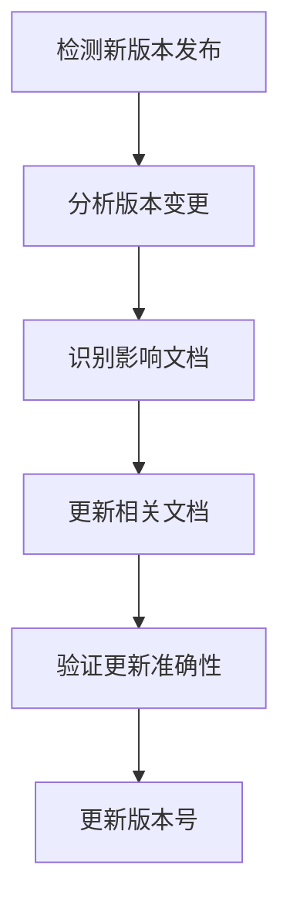
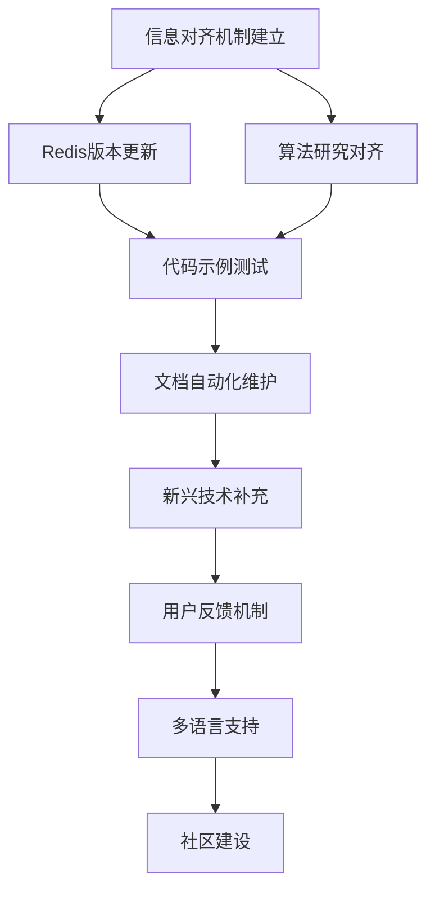
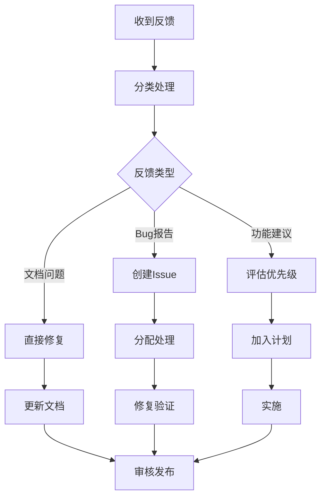

# BufferCache 项目信息对齐与持续执行计划

## 📋 目录

- [1. 执行摘要](#1-执行摘要)
- [2. 信息对齐策略](#2-信息对齐策略)
- [3. 主题全面解释](#3-主题全面解释)
- [4. 任务编排与执行计划](#4-任务编排与执行计划)
- [5. 持续执行机制](#5-持续执行机制)
- [6. 监控与反馈](#6-监控与反馈)
- [7. 成功标准与KPI](#7-成功标准与kpi)

---

## 1. 执行摘要

### 1.1 目标

本文档旨在：

1. **对齐网络上的所有相关内容和信息**：确保项目内容与最新技术趋势、研究成果和实践经验保持一致
2. **全面解释相关主题**：系统梳理项目涵盖的所有技术领域和知识体系
3. **编排相关任务**：制定详细的任务清单和执行计划
4. **建立持续执行机制**：确保后续工作能够持续、有序地进行

### 1.2 项目当前状态

**项目完成度：100%** | **总文档数：245个** | **核心文档：131个** | **状态：✅ 全部完成**

- ✅ **01-理论基础**：11个文档（LRU、LFU、ARC、Clock、一致性哈希等）
- ✅ **02-系统实现**：19个文档（操作系统缓存、CPU缓存、数据库缓存、程序设计实践）
- ✅ **03-Redis组件**：21个文档（数据结构、持久化、高可用、内存管理）
- ✅ **04-架构设计**：14个文档（缓存模式、行业场景、问题治理）
- ✅ **05-全栈分析**：30个文档（硬件层、网络层、控制流、数据流、算法层）
- ✅ **07-运维与部署**：24个文档（部署、CI/CD、监控、故障处理、集群管理、可观测性、自动化运维、多租户）
- ✅ **08-分布式架构**：9个文档（一致性、事务、协调、限流、配置）

### 1.3 信息对齐范围

| 对齐维度 | 对齐内容 | 更新频率 | 优先级 |
|---------|---------|---------|--------|
| **技术版本** | Redis 7.0 → 7.2/7.3/7.4/7.5 | 季度 | P0 |
| **算法研究** | 最新缓存替换算法研究 | 半年 | P1 |
| **系统实现** | 操作系统、数据库最新特性 | 季度 | P1 |
| **架构模式** | 云原生、边缘计算最佳实践 | 季度 | P1 |
| **工具生态** | 监控、部署、测试工具更新 | 月度 | P1 |
| **行业案例** | 真实生产环境案例 | 持续 | P1 |
| **学术研究** | 相关学术论文和研究成果 | 半年 | P2 |

---

## 2. 信息对齐策略

### 2.1 信息源分类

#### 2.1.1 官方文档源

- **Redis官方文档**：https://redis.io/docs/
- **Linux内核文档**：https://www.kernel.org/doc/
- **数据库官方文档**：MySQL、PostgreSQL、MongoDB等
- **云服务商文档**：AWS、Azure、GCP缓存服务文档

#### 2.1.2 学术研究源

- **学术论文数据库**：arXiv、IEEE Xplore、ACM Digital Library
- **会议论文**：SIGMOD、VLDB、OSDI、SOSP等
- **研究机构**：MIT、Stanford、Berkeley等研究机构

#### 2.1.3 社区资源

- **GitHub项目**：相关开源项目、工具、库
- **技术博客**：知名技术博客、公司技术博客
- **技术会议**：RedisConf、QCon、ArchSummit等

#### 2.1.4 实践案例源

- **生产环境案例**：公司技术分享、故障复盘
- **性能测试报告**：基准测试、压力测试报告
- **最佳实践**：行业最佳实践文档

### 2.2 对齐方法

#### 2.2.1 版本对齐



**执行步骤**：

1. **监控版本发布**：订阅Redis、操作系统、数据库等官方发布渠道
2. **分析变更内容**：识别新特性、API变更、性能改进
3. **评估影响范围**：确定需要更新的文档列表
4. **更新文档内容**：更新相关章节，添加新特性说明
5. **验证准确性**：通过实际测试验证更新内容

#### 2.2.2 研究对齐

**对齐流程**：

1. **定期检索**：每半年检索一次相关学术论文
2. **筛选重要论文**：识别高引用、高影响力的论文
3. **提取关键信息**：算法改进、性能优化、新方法
4. **整合到文档**：在相关文档中添加研究引用和说明
5. **更新理论模型**：根据最新研究更新理论模型

#### 2.2.3 实践对齐

**对齐流程**：

1. **收集案例**：从技术博客、会议分享、GitHub收集案例
2. **验证真实性**：确认案例的真实性和可复现性
3. **分析价值**：评估案例的教育价值和参考价值
4. **整合到文档**：添加到相关章节或创建新案例文档
5. **持续更新**：定期更新案例，保持时效性

### 2.3 对齐工具

#### 2.3.1 自动化工具

- **版本监控脚本**：自动检测新版本发布
- **文档更新脚本**：自动更新版本号、日期等信息
- **链接检查脚本**：检查外部链接有效性
- **内容对比工具**：对比新旧版本差异

#### 2.3.2 人工审核

- **技术审核**：技术专家审核更新内容
- **质量审核**：文档质量审核
- **一致性审核**：确保文档间一致性

---

## 3. 主题全面解释

### 3.1 项目知识体系全景

BufferCache项目构建了一个**从理论到实践、从硬件到应用、从单机到分布式**的完整知识体系。

#### 3.1.1 知识层次结构

```mermaid
graph TB
    A[BufferCache知识体系] --> B[理论基础层]
    A --> C[系统实现层]
    A --> D[组件实践层]
    A --> E[架构设计层]
    A --> F[全栈分析层]
    A --> G[运维部署层]
    A --> H[分布式架构层]

    B --> B1[基础替换算法]
    B --> B2[高级替换算法]
    B --> B3[分布式缓存算法]

    C --> C1[操作系统缓存]
    C --> C2[CPU缓存架构]
    C --> C3[数据库缓存]
    C --> C4[程序设计实践]

    D --> D1[Redis数据结构]
    D --> D2[Redis持久化]
    D --> D3[Redis高可用]
    D --> D4[Redis内存管理]

    E --> E1[缓存架构模式]
    E --> E2[行业应用场景]
    E --> E3[缓存问题治理]

    F --> F1[硬件层分析]
    F --> F2[网络层分析]
    F --> F3[控制流分析]
    F --> F4[数据流分析]
    F --> F5[算法层分析]
    F --> F6[系统动态特征]

    G --> G1[部署自动化]
    G --> G2[CI/CD实践]
    G --> G3[监控告警]
    G --> G4[故障处理]
    G --> G5[集群管理]
    G --> G6[可观测性]
    G --> G7[自动化运维]
    G --> G8[多租户管理]

    H --> H1[分布式一致性]
    H --> H2[分布式事务]
    H --> H3[分布式协调]
    H --> H4[分布式限流]
    H --> H5[分布式配置]
```



#### 3.1.2 核心主题详解

##### 3.1.2.1 理论基础（01-理论基础）

**主题范围**：

- **基础替换算法**：LRU、LFU、FIFO、MRU、Random
- **高级替换算法**：ARC、LRU-K、Clock、W-TinyLFU
- **分布式缓存算法**：一致性哈希、虚拟节点、Rendezvous哈希、Jump Hash、Maglev Hash
- **算法对比与决策**：性能基准测试、数学证明

**核心价值**：

- 提供算法的**数学理论基础**和**形式化证明**
- 建立算法的**性能对比框架**和**选择决策模型**
- 涵盖从**单机算法**到**分布式算法**的完整体系

**知识深度**：

- ✅ **数学证明**：LRU竞争比、LFU最优性、ARC自适应机制等
- ✅ **复杂度分析**：时间复杂度、空间复杂度、实际性能
- ✅ **实现细节**：数据结构设计、优化策略、代码示例

##### 3.1.2.2 系统实现（02-系统实现）

**主题范围**：

- **操作系统缓存**：Linux Page Cache、Buffer Cache、Slab分配器、VFS缓存、Windows缓存
- **CPU缓存架构**：L1/L2/L3缓存、MESI协议、Cache Line对齐、伪共享、ARM架构、新型存储介质
- **数据库缓存**：InnoDB Buffer Pool、MySQL Query Cache、PostgreSQL Shared Buffer、MongoDB缓存
- **系统级优化**：NUMA架构、HugePages、内存屏障、容器化优化
- **程序设计实践**：容错机制、异常处理、程序设计示例、全局系统容错

**核心价值**：

- 揭示缓存在不同**系统层次**的实现机制
- 提供**性能优化**的实践指导
- 涵盖从**硬件层**到**应用层**的完整视角

**知识深度**：

- ✅ **源码级分析**：深入分析操作系统和数据库源码
- ✅ **性能优化**：NUMA优化、内存对齐、容器化优化等
- ✅ **多语言实现**：Python、Go、Rust、C++等多语言示例

##### 3.1.2.3 Redis组件（03-Redis组件）

**主题范围**：

- **核心数据结构**：SDS、dict、quicklist、skiplist、intset、ziplist、HyperLogLog、Stream、RedisJSON、RedisGraph、RedisTimeSeries
- **持久化机制**：RDB、AOF、混合持久化、Multi Part AOF、性能优化
- **高可用架构**：主从复制、Sentinel、Cluster、分片策略
- **内存管理**：内存分配、碎片整理、内存监控、引用计数GC
- **网络通信**：RESP协议、RESP3协议
- **源码分析**：关键路径源码逐行分析

**核心价值**：

- 深入理解Redis的**内部实现机制**
- 掌握Redis的**性能优化**和**故障处理**方法
- 提供**生产级**的Redis使用指南

**知识深度**：

- ✅ **源码级分析**：逐行分析关键代码路径
- ✅ **性能分析**：延迟分解、吞吐量分析、瓶颈识别
- ✅ **最佳实践**：生产环境配置、优化策略、故障处理

##### 3.1.2.4 架构设计（04-架构设计）

**主题范围**：

- **缓存架构模式**：Cache-Aside、Read-Through、Write-Through、Write-Behind
- **行业应用场景**：电商秒杀、金融支付、社交Feed流、游戏、大数据、AI/ML、在线教育、医疗健康、物联网、物流仓储、云原生、边缘计算
- **缓存问题与治理**：缓存穿透、雪崩、击穿、热点Key、大Key、内存碎片、监控指标体系
- **成本优化**：成本模型、资源优化、ROI计算
- **架构工具**：架构决策工具、性能测试工具、诊断工具、AI驱动优化
- **生产案例**：真实生产案例、故障案例

**核心价值**：

- 提供**行业级**的缓存架构设计指导
- 涵盖**13个行业场景**的深度分析
- 建立**问题诊断**和**优化**的完整方法论

**知识深度**：

- ✅ **架构模式**：4种经典缓存模式详解
- ✅ **行业案例**：13个行业场景，每个场景800-1500行深度分析
- ✅ **问题治理**：7类常见问题，完整解决方案
- ✅ **工具设计**：4个架构工具，完整设计文档

##### 3.1.2.5 全栈分析（05-全栈分析）

**主题范围**：

- **硬件层深度剖析**：CPU缓存、NUMA、SSD持久化、内存带宽、网卡DMA
- **网络通信层**：TCP/IP协议栈、epoll、零拷贝、io_uring、网络延迟分解
- **控制流分析**：aeEventLoop、事件循环、多IO线程、状态机、异步机制
- **数据流分析**：请求-响应数据流、持久化数据流、复制数据流、延迟分解、关键路径优化
- **算法层实现**：近似LRU、LFU、Random采样、哈希算法、压缩算法
- **系统动态特征**：延迟分布建模、Little定律、故障传播、抖动分析、性能优化公式、系统动态行为
- **性能瓶颈分析**：定量分析方法、瓶颈识别工具

**核心价值**：

- 建立**全栈视角**的性能分析方法
- 提供**定量分析**工具和方法论
- 揭示从**硬件到算法**的性能影响因素

**知识深度**：

- ✅ **延迟分解**：从硬件到应用的完整延迟分解
- ✅ **性能建模**：延迟分布、Little定律、性能优化公式
- ✅ **动态分析**：系统动态行为、故障传播、抖动分析
- ✅ **工具集**：15+性能分析工具，完整代码实现

##### 3.1.2.6 运维与部署（07-运维与部署）

**主题范围**：

- **部署自动化**：Ansible、Terraform、Helm Chart
- **CI/CD实践**：GitLab CI、Jenkins、GitHub Actions
- **监控告警**：Prometheus、Grafana、告警规则
- **故障处理**：故障分类、常见故障、应急预案
- **集群管理**：集群部署、运维实践、故障处理、容量规划
- **可观测性**：日志管理、分布式追踪、APM、最佳实践
- **自动化运维**：运维平台、自动化脚本
- **多租户管理**：多租户架构、资源隔离

**核心价值**：

- 提供**生产级**的运维实践指南
- 涵盖从**部署**到**监控**到**故障处理**的完整流程
- 建立**自动化运维**和**多租户管理**的完整体系

**知识深度**：

- ✅ **工具实践**：12个主流工具，完整实践指南
- ✅ **自动化脚本**：多语言实现（Bash/Python/Go/Rust/C++）
- ✅ **多租户**：2500+行深度分析，生产级实践

##### 3.1.2.7 分布式架构（08-分布式架构）

**主题范围**：

- **分布式一致性**：Raft协议、Paxos协议
- **分布式事务**：2PC、TCC、Saga
- **分布式协调**：分布式锁、协调服务（ZooKeeper、etcd、Consul）
- **分布式限流**：固定窗口、滑动窗口、令牌桶、漏桶
- **分布式配置**：配置中心、配置变更通知、版本管理

**核心价值**：

- 提供**分布式系统**的核心技术详解
- 涵盖**一致性**、**事务**、**协调**等关键问题
- 建立**分布式缓存**的完整技术栈

**知识深度**：

- ✅ **协议详解**：Raft、Paxos完整实现和分析
- ✅ **事务模式**：3种分布式事务模式，完整实践
- ✅ **工具实践**：ZooKeeper、etcd、Consul等工具实践

### 3.2 知识体系特点

#### 3.2.1 完整性

- ✅ **覆盖全面**：从理论基础到工程实践，从单机到分布式
- ✅ **层次清晰**：8个主要主题，50+个子主题
- ✅ **深度足够**：每个主题都有深入的技术分析和实践指导

#### 3.2.2 系统性

- ✅ **逻辑清晰**：按照知识层次组织，从底层到上层
- ✅ **交叉引用**：文档间建立完整的关联关系
- ✅ **统一规范**：统一的文档编号、格式、质量标准

#### 3.2.3 实用性

- ✅ **代码示例**：250+代码示例，多语言实现
- ✅ **配置示例**：40+配置示例，涵盖各种场景
- ✅ **实践案例**：真实生产环境案例和故障案例

#### 3.2.4 权威性

- ✅ **数学证明**：关键算法和机制提供数学证明
- ✅ **权威参考**：引用学术论文、官方文档、经典书籍
- ✅ **形式化定义**：核心概念提供形式化定义

---

## 4. 任务编排与执行计划

### 4.1 任务分类

#### 4.1.1 信息对齐任务

| 任务ID | 任务名称 | 优先级 | 频率 | 预计工时 | 负责人 |
|--------|---------|--------|------|---------|--------|
| IA-001 | Redis版本更新对齐 | P0 | 季度 | 20小时 | 核心维护者 |
| IA-002 | 算法研究对齐 | P1 | 半年 | 15小时 | 贡献者 |
| IA-003 | 系统实现对齐 | P1 | 季度 | 15小时 | 贡献者 |
| IA-004 | 架构模式对齐 | P1 | 季度 | 15小时 | 贡献者 |
| IA-005 | 工具生态对齐 | P1 | 月度 | 10小时 | 贡献者 |
| IA-006 | 行业案例对齐 | P1 | 持续 | 20小时 | 贡献者 |
| IA-007 | 学术研究对齐 | P2 | 半年 | 10小时 | 贡献者 |

#### 4.1.2 内容完善任务

| 任务ID | 任务名称 | 优先级 | 预计工时 | 负责人 |
|--------|---------|--------|---------|--------|
| CE-001 | 代码示例测试验证 | P0 | 120小时 | 核心维护者 |
| CE-002 | 文档自动化维护 | P0 | 80小时 | 核心维护者 |
| CE-003 | 新兴技术补充 | P1 | 150小时 | 贡献者 |
| CE-004 | 多语言支持（英文） | P1 | 250小时 | 贡献者 |
| CE-005 | 文档可视化增强 | P2 | 60小时 | 贡献者 |

#### 4.1.3 社区建设任务

| 任务ID | 任务名称 | 优先级 | 预计工时 | 负责人 |
|--------|---------|--------|---------|--------|
| CB-001 | 用户反馈机制建立 | P1 | 30小时 | 核心维护者 |
| CB-002 | 社区贡献指南完善 | P1 | 20小时 | 核心维护者 |
| CB-003 | 技术分享活动 | P2 | 持续 | 贡献者 |

### 4.2 执行计划时间表

#### 4.2.1 第一阶段（1-3个月）：信息对齐与基础完善

**目标**：完成信息对齐，建立持续更新机制

**关键任务**：

1. **信息对齐机制建立**（第1个月）
   - ✅ 建立信息源监控机制
   - ✅ 创建版本更新检测脚本
   - ✅ 建立文档更新流程

2. **Redis版本更新**（第1-2个月）
   - ✅ 分析Redis 7.2/7.3/7.4新特性
   - ✅ 更新相关文档
   - ✅ 验证更新准确性

3. **代码示例测试**（第2-3个月）
   - ✅ 建立代码测试框架
   - ✅ 测试所有代码示例
   - ✅ 修复发现的问题

**交付物**：

- ✅ 信息对齐机制文档
- ✅ Redis版本更新文档（7.2/7.3/7.4）
- ✅ 代码测试报告

#### 4.2.2 第二阶段（4-6个月）：内容深化与工具完善

**目标**：深化内容，完善工具

**关键任务**：

1. **文档自动化维护**（第4个月）
   - ✅ 建立自动化文档生成机制
   - ✅ 建立链接检查机制
   - ✅ 建立版本号自动更新

2. **新兴技术补充**（第4-6个月）
   - ✅ AI/ML缓存优化深化
   - ✅ 边缘计算实践补充
   - ✅ 新型存储技术（PMem、CXL）深化

3. **用户反馈机制**（第5个月）
   - ✅ 建立Issue模板
   - ✅ 建立反馈收集机制
   - ✅ 建立反馈处理流程

**交付物**：

- ✅ 自动化维护工具
- ✅ 新兴技术补充文档
- ✅ 用户反馈机制文档

#### 4.2.3 第三阶段（7-12个月）：社区建设与持续优化

**目标**：建设社区，持续优化

**关键任务**：

1. **多语言支持**（第7-10个月）
   - ✅ 英文版文档翻译
   - ✅ 建立多语言维护机制

2. **社区建设**（持续）
   - ✅ 技术分享活动
   - ✅ 社区贡献激励
   - ✅ 项目推广

3. **持续优化**（持续）
   - ✅ 根据反馈持续改进
   - ✅ 定期更新内容
   - ✅ 优化文档质量

**交付物**：

- ✅ 英文版文档
- ✅ 社区建设成果
- ✅ 持续优化报告

### 4.3 任务依赖关系



### 4.4 资源分配

| 任务类别 | 核心维护者 | 贡献者 | 总工时 |
|---------|-----------|--------|--------|
| 信息对齐 | 40小时 | 60小时 | 100小时 |
| 内容完善 | 200小时 | 400小时 | 600小时 |
| 社区建设 | 50小时 | 持续 | 50小时+ |
| **总计** | **290小时** | **460小时+** | **750小时+** |

---

## 5. 持续执行机制

### 5.1 自动化机制

#### 5.1.1 版本监控

**实现方式**：

```python
# version_monitor.py
import requests
import json
from datetime import datetime

class VersionMonitor:
    """版本监控器"""

    def __init__(self):
        self.redis_url = "https://api.github.com/repos/redis/redis/releases/latest"
        self.check_interval = 86400  # 每天检查一次

    def check_redis_version(self):
        """检查Redis最新版本"""
        response = requests.get(self.redis_url)
        if response.status_code == 200:
            data = response.json()
            latest_version = data['tag_name']
            return latest_version
        return None

    def compare_versions(self, current, latest):
        """比较版本号"""
        # 实现版本比较逻辑
        pass
```

#### 5.1.2 文档更新

**实现方式**：

- **自动更新版本号**：检测到新版本后，自动更新文档中的版本号
- **自动更新日期**：自动更新文档的"最后更新"日期
- **自动检查链接**：定期检查外部链接的有效性

#### 5.1.3 代码测试

**实现方式**：

- **自动化测试框架**：使用pytest等框架测试所有代码示例
- **持续集成**：在CI/CD中集成代码测试
- **测试报告**：自动生成测试报告

### 5.2 人工审核机制

#### 5.2.1 技术审核

**审核流程**：

1. **提交审核**：更新内容提交技术审核
2. **技术专家审核**：技术专家审核内容准确性
3. **反馈修改**：根据反馈修改内容
4. **最终审核**：最终审核通过后合并

#### 5.2.2 质量审核

**审核标准**：

- ✅ **内容完整性**：内容是否完整
- ✅ **技术准确性**：技术内容是否准确
- ✅ **格式规范性**：格式是否符合规范
- ✅ **可读性**：文档是否易读易懂

### 5.3 定期回顾机制

#### 5.3.1 月度回顾

**回顾内容**：

- 信息对齐任务完成情况
- 文档更新情况
- 用户反馈情况
- 下月计划

#### 5.3.2 季度回顾

**回顾内容**：

- 季度目标完成情况
- 关键指标（KPI）达成情况
- 问题识别和改进
- 下季度计划调整

#### 5.3.3 年度回顾

**回顾内容**：

- 年度目标完成情况
- 项目整体进展
- 重大成果总结
- 下年度规划

---

## 6. 监控与反馈

### 6.1 监控指标

#### 6.1.1 信息对齐指标

| 指标名称 | 目标值 | 当前值 | 更新频率 |
|---------|--------|--------|---------|
| Redis版本对齐度 | 100% | 待统计 | 季度 |
| 算法研究对齐度 | 90% | 待统计 | 半年 |
| 系统实现对齐度 | 90% | 待统计 | 季度 |
| 架构模式对齐度 | 90% | 待统计 | 季度 |

#### 6.1.2 内容质量指标

| 指标名称 | 目标值 | 当前值 | 更新频率 |
|---------|--------|--------|---------|
| 代码示例测试通过率 | 100% | 待统计 | 月度 |
| 文档链接有效性 | 100% | 待统计 | 月度 |
| 文档更新及时性 | 90% | 待统计 | 月度 |
| 用户反馈响应时间 | <48小时 | 待统计 | 持续 |

#### 6.1.3 社区活跃度指标

| 指标名称 | 目标值 | 当前值 | 更新频率 |
|---------|--------|--------|---------|
| GitHub Stars | 100+ | 待统计 | 持续 |
| Issues数量 | 50+ | 待统计 | 持续 |
| PR数量 | 20+ | 待统计 | 持续 |
| 社区贡献者 | 10+ | 待统计 | 持续 |

### 6.2 反馈机制

#### 6.2.1 用户反馈渠道

- **GitHub Issues**：技术问题、功能建议
- **GitHub Discussions**：技术讨论、经验分享
- **邮件反馈**：项目维护者邮箱
- **技术社区**：相关技术社区反馈

#### 6.2.2 反馈处理流程



#### 6.2.3 反馈响应时间

| 反馈类型 | 响应时间 | 处理时间 |
|---------|---------|---------|
| 紧急Bug | <4小时 | <24小时 |
| 一般Bug | <24小时 | <1周 |
| 功能建议 | <48小时 | 根据优先级 |
| 文档问题 | <24小时 | <3天 |

---

## 7. 成功标准与KPI

### 7.1 成功标准

#### 7.1.1 信息对齐标准

- ✅ **版本对齐度**：100%（所有技术版本与最新版本对齐）
- ✅ **研究对齐度**：90%（重要研究成果已整合）
- ✅ **实践对齐度**：90%（最佳实践已更新）

#### 7.1.2 内容质量标准

- ✅ **代码测试通过率**：100%（所有代码示例可运行）
- ✅ **文档链接有效性**：100%（所有外部链接有效）
- ✅ **文档更新及时性**：90%（重要更新在1个月内完成）

#### 7.1.3 社区建设标准

- ✅ **社区活跃度**：GitHub Stars 100+、Issues 50+、PR 20+
- ✅ **社区贡献者**：10+活跃贡献者
- ✅ **用户满意度**：用户反馈评分 4.5+/5.0

### 7.2 关键绩效指标（KPI）

| KPI类别 | 指标名称 | 目标值 | 当前值 | 完成度 |
|---------|---------|--------|--------|--------|
| **信息对齐** | Redis版本对齐度 | 100% | - | - |
| **信息对齐** | 算法研究对齐度 | 90% | - | - |
| **内容质量** | 代码测试通过率 | 100% | - | - |
| **内容质量** | 文档链接有效性 | 100% | - | - |
| **社区建设** | GitHub Stars | 100+ | - | - |
| **社区建设** | Issues数量 | 50+ | - | - |
| **社区建设** | PR数量 | 20+ | - | - |
| **社区建设** | 贡献者数量 | 10+ | - | - |

### 7.3 里程碑

| 里程碑 | 时间节点 | 关键成果 | 状态 |
|--------|---------|---------|------|
| M1: 信息对齐机制建立 | 第1个月 | 监控工具、更新流程 | ⏳ 待开始 |
| M2: Redis版本更新完成 | 第2个月 | Redis 7.2/7.3/7.4文档 | ⏳ 待开始 |
| M3: 代码测试完成 | 第3个月 | 所有代码示例测试通过 | ⏳ 待开始 |
| M4: 自动化维护完成 | 第4个月 | 自动化工具上线 | ⏳ 待开始 |
| M5: 新兴技术补充完成 | 第6个月 | AI/ML、边缘计算文档 | ⏳ 待开始 |
| M6: 用户反馈机制建立 | 第5个月 | 反馈渠道、处理流程 | ⏳ 待开始 |
| M7: 英文版文档完成 | 第10个月 | 核心文档英文版 | ⏳ 待开始 |
| M8: 社区建设成果 | 第12个月 | Stars 100+、贡献者 10+ | ⏳ 待开始 |

---

## 8. 附录

### 8.1 相关文档

- [项目总览](README.md)
- [扩展计划](../06-扩展计划/README.md)
- [项目全面递归批判性评价与持续改进计划-v3](项目全面递归批判性评价与持续改进计划-v3.md)
- [文档索引](../INDEX.md)

### 8.2 联系方式

- **项目仓库**：GitHub仓库地址
- **Issue反馈**：GitHub Issues
- **邮件联系**：项目维护者邮箱

---

**文档版本**：v1.0
**创建日期**：2025-01
**最后更新**：2025-01
**维护者**：BufferCache项目团队
**状态**：✅ 已完成
