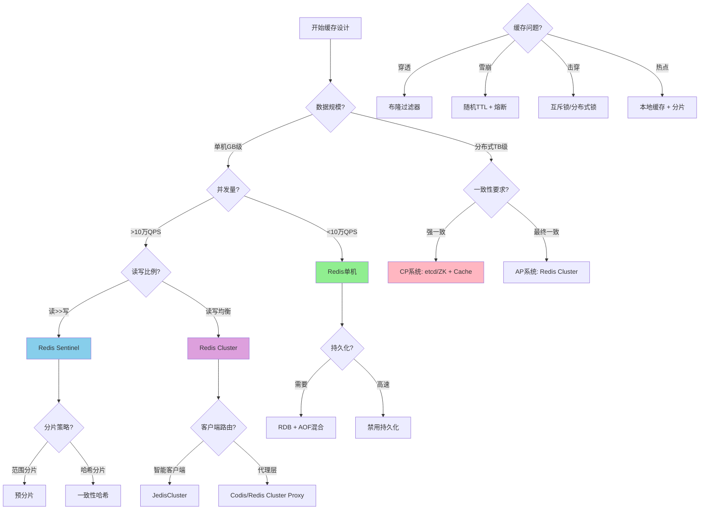
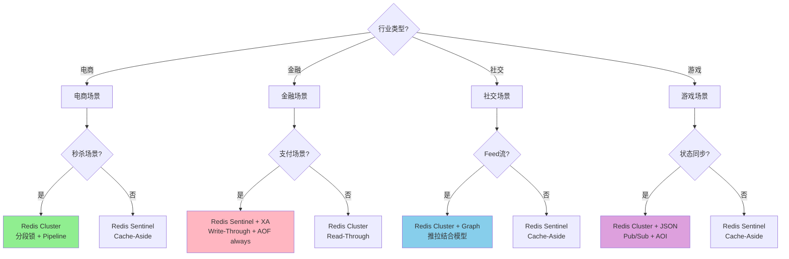
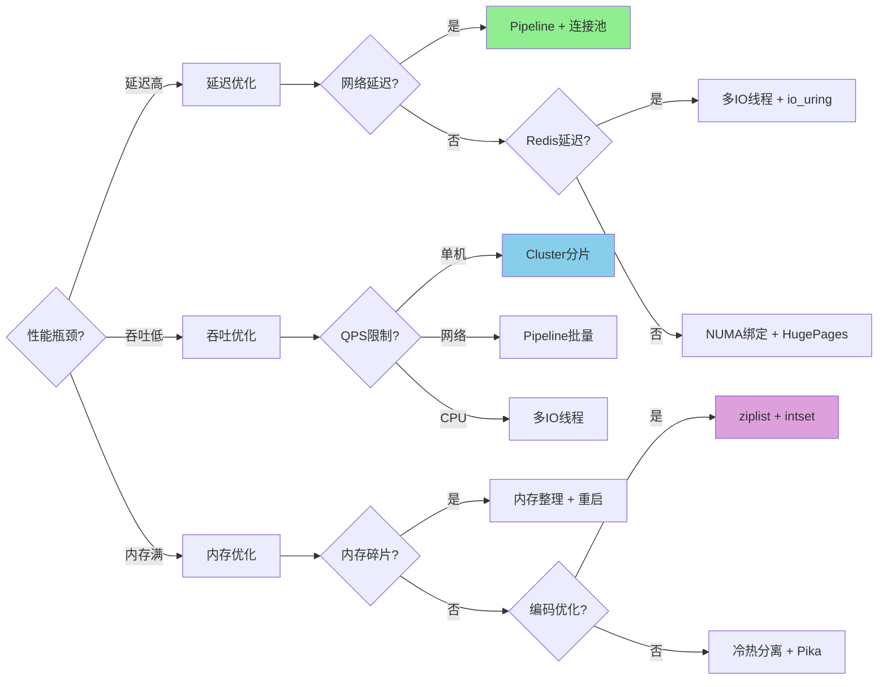
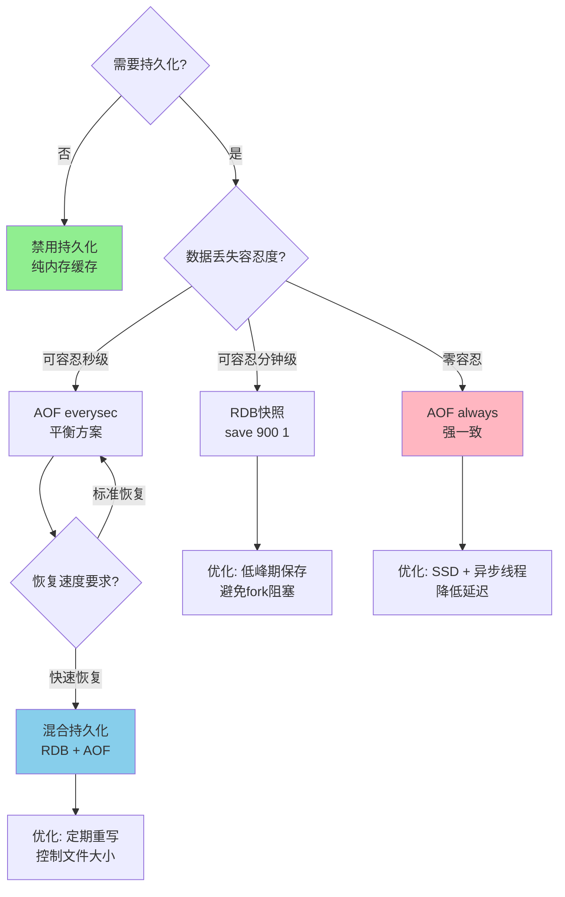
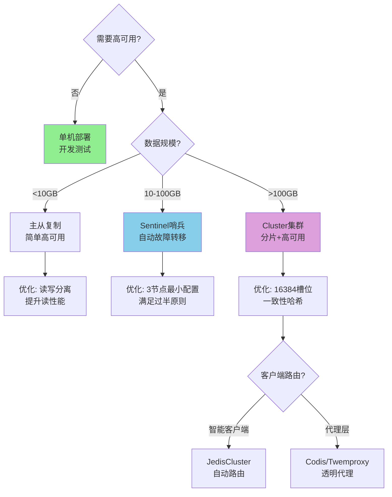
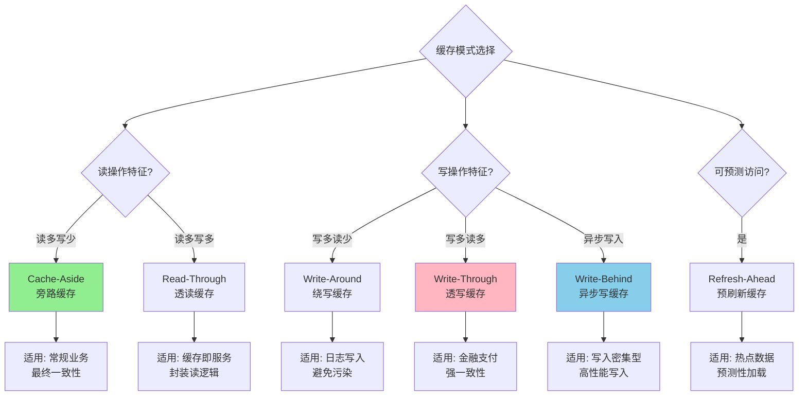

# 决策图网：缓存架构选择路径

## 主决策流程图

## 行业场景决策树

## 性能优化决策路径

## 持久化策略决策

## 高可用架构决策

## 缓存模式选择决策

## 决策检查清单

### 架构选择检查清单

- [ ] **数据规模** < 10GB → Redis单机
- [ ] **QPS** > 10万 → Redis Cluster
- [ ] **强一致性** → Write-Through + AOF_ALWAYS
- [ ] **高可用** → 3 Sentinel + 3副本
- [ ] **大Key** > 10KB → 拆分或存储到HBase
- [ ] **热Key** → 本地缓存 + 一致性哈希
- [ ] **内存碎片** > 50% → 重启或内存整理

### 性能优化检查清单

- [ ] **延迟P99** > 100ms → Pipeline + 连接池
- [ ] **吞吐量** < 目标 → Cluster分片或多IO线程
- [ ] **内存使用率** > 80% → 编码优化或冷热分离
- [ ] **CPU使用率** > 80% → 多IO线程或io_uring

### 问题排查检查清单

- [ ] **缓存穿透** → 布隆过滤器 + 空值缓存
- [ ] **缓存雪崩** → 随机TTL + 熔断降级
- [ ] **缓存击穿** → 互斥锁 + 异步重建
- [ ] **热点Key** → 本地缓存 + Key分片
