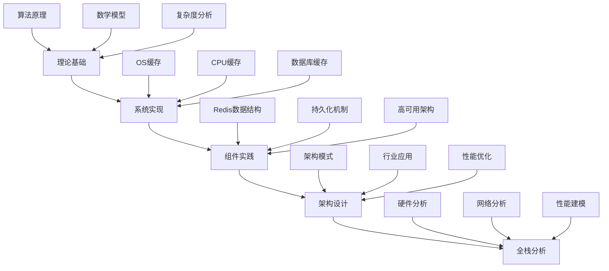

# Buffer Cache知识体系思维导图

## 完整知识体系拓扑

```mermaid
mindmap
  root((Buffer Cache知识体系))
    理论基础
      基础算法
        LRU
          时间局部性
          双向链表+哈希表
          O(1)复杂度
        LFU
          频率局部性
          计数器+堆
          O(logN)复杂度
        FIFO
          先进先出
          队列实现
          简单高效
        MRU
          最近最常使用
          特殊场景
      高级算法
        ARC
          IBM Almaden
          自适应调优
          四个列表
        LRU-K
          K次访问记录
          更精确预测
        Clock
          时钟扫描
          环形队列
        LIRS
          低参考间隔集
          性能优异
      分布式算法
        一致性哈希
          虚拟节点
          负载均衡
        Rendezvous哈希
          无状态路由
      自适应算法
        机器学习驱动
        工作负载感知
    系统实现
      操作系统
        Linux Page Cache
        Buffer Cache
        Slab分配器
        VFS缓存
      CPU缓存
        L1/L2/L3层次
        MESI协议
        Cache Line对齐
        伪共享问题
      数据库缓存
        InnoDB Buffer Pool
        Query Cache
        PostgreSQL Shared Buffer
      Web缓存
        CDN节点
        HTTP Cache-Control
        浏览器缓存
    组件实践
      Redis核心
        数据结构
          SDS字符串
          哈希表dict
          列表quicklist
          集合intset
          有序集skiplist
        持久化
          RDB快照
          AOF日志
          混合持久化
        高可用
          主从复制
          Sentinel哨兵
          Cluster集群
      Memcached
        LRU+懒惰删除
        Slab分配
        CAS操作
    架构设计
      缓存模式
        Cache-Aside
        Read-Through
        Write-Through
        Write-Behind
        Write-Around
      一致性策略
        TTL过期
        主动失效
        版本控制
        订阅发布
      行业应用
        电商秒杀
        金融支付
        社交Feed
        游戏状态
        物联网时序
      问题治理
        缓存穿透
        缓存雪崩
        缓存击穿
        热点Key
        大Key问题
    全栈分析
      硬件层
        CPU缓存
        NUMA架构
        SSD性能
        内存带宽
      网络层
        TCP/IP栈
        epoll机制
        零拷贝
        io_uring
      控制流
        事件循环
        状态机
        多IO线程
      数据流
        请求响应
        持久化
        复制流
      算法层
        近似LRU
        哈希优化
        跳表证明
      动态特征
        延迟分布
        Little定律
        故障传播
```

## 知识体系层次关系



## 学习路径建议

### 入门路径

1. 理论基础 → 基础算法理解
2. 组件实践 → Redis基本使用
3. 架构设计 → 常见问题解决

### 进阶路径

1. 系统实现 → 深入理解底层机制
2. 全栈分析 → 性能优化能力
3. 架构设计 → 复杂场景设计

### 专家路径

1. 理论基础 → 算法创新
2. 全栈分析 → 源码级优化
3. 架构设计 → 行业级架构
