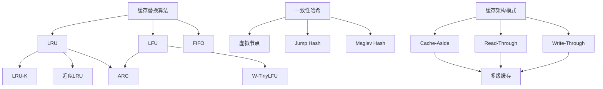

# 概念体系梳理计划

## 目录

- [概念体系梳理计划](#概念体系梳理计划)
  - [目录](#目录)
  - [1. 概述](#1-概述)
    - [1.1 目标与价值](#11-目标与价值)
    - [1.2 梳理范围](#12-梳理范围)
    - [1.3 梳理标准](#13-梳理标准)
  - [2. 概念分类体系](#2-概念分类体系)
    - [2.1 算法概念](#21-算法概念)
    - [2.2 数据结构概念](#22-数据结构概念)
    - [2.3 系统概念](#23-系统概念)
    - [2.4 架构概念](#24-架构概念)
    - [2.5 性能概念](#25-性能概念)
    - [2.6 一致性概念](#26-一致性概念)
  - [3. 概念梳理任务](#3-概念梳理任务)
    - [3.1 概念定义汇总](#31-概念定义汇总)
    - [3.2 概念属性梳理](#32-概念属性梳理)
    - [3.3 概念关系图谱](#33-概念关系图谱)
    - [3.4 概念形式化定义](#34-概念形式化定义)
    - [3.5 概念证明汇总](#35-概念证明汇总)
    - [3.6 概念应用案例汇总](#36-概念应用案例汇总)
  - [4. 形式化证明汇总计划](#4-形式化证明汇总计划)
    - [4.1 算法正确性证明](#41-算法正确性证明)
    - [4.2 性能保证证明](#42-性能保证证明)
    - [4.3 一致性保证证明](#43-一致性保证证明)
    - [4.4 优化效果证明](#44-优化效果证明)
  - [5. 系统化分析汇总计划](#5-系统化分析汇总计划)
    - [5.1 性能分析汇总](#51-性能分析汇总)
    - [5.2 复杂度分析汇总](#52-复杂度分析汇总)
    - [5.3 优化策略汇总](#53-优化策略汇总)
    - [5.4 权衡分析汇总](#54-权衡分析汇总)
  - [6. 实施计划](#6-实施计划)
    - [6.1 第一阶段：核心概念梳理（4周）](#61-第一阶段核心概念梳理4周)
    - [6.2 第二阶段：关系图谱构建（3周）](#62-第二阶段关系图谱构建3周)
    - [6.3 第三阶段：形式化证明汇总（4周）](#63-第三阶段形式化证明汇总4周)
    - [6.4 第四阶段：系统化分析汇总（3周）](#64-第四阶段系统化分析汇总3周)
  - [7. 概念梳理模板](#7-概念梳理模板)
    - [7.1 概念定义模板](#71-概念定义模板)
    - [7.2 证明模板](#72-证明模板)
  - [8. 预期成果](#8-预期成果)
    - [8.1 文档成果](#81-文档成果)
    - [8.2 知识体系成果](#82-知识体系成果)
    - [8.3 工具成果](#83-工具成果)
  - [9. 进度跟踪](#9-进度跟踪)
    - [9.1 第一阶段进度](#91-第一阶段进度)
    - [9.2 第二阶段进度](#92-第二阶段进度)
    - [9.3 第三阶段进度](#93-第三阶段进度)
    - [9.4 第四阶段进度](#94-第四阶段进度)

---

## 1. 概述

### 1.1 目标与价值

**概念体系梳理的目标**：

1. **统一概念定义**：为所有核心概念提供统一、准确的定义
2. **明确概念属性**：梳理每个概念的关键属性（性能、复杂度、适用场景等）
3. **建立概念关系**：构建概念之间的关联关系图谱
4. **形式化定义**：为关键概念提供形式化（数学）定义
5. **证明汇总**：汇总所有形式化证明，建立证明体系
6. **系统化分析**：汇总性能分析、复杂度分析、优化策略等

**价值**：

- **知识体系完整性**：确保概念体系的完整性和一致性
- **学习效率提升**：便于快速查找和理解概念
- **理论严谨性**：通过形式化定义和证明提升理论严谨性
- **实践指导**：通过系统化分析指导实践应用

### 1.2 梳理范围

**需要梳理的概念类别**：

1. **算法概念**：LRU、LFU、ARC、Clock、一致性哈希等
2. **数据结构概念**：SDS、dict、quicklist、skiplist等
3. **系统概念**：缓存、持久化、复制、高可用等
4. **架构概念**：Cache-Aside、Read-Through、Write-Through等
5. **性能概念**：延迟、吞吐量、命中率、抖动等
6. **一致性概念**：强一致性、最终一致性、CAP定理等
7. **硬件概念**：CPU缓存、NUMA、PMem、CXL等
8. **网络概念**：TCP/IP、epoll、零拷贝、io_uring等

### 1.3 梳理标准

**每个概念需要包含**：

1. **定义**：清晰、准确的定义
2. **属性**：关键属性列表（性能、复杂度、适用场景等）
3. **关系**：与其他概念的关系（继承、组合、依赖等）
4. **形式化定义**：数学形式化定义（如适用）
5. **证明**：相关定理和证明（如适用）
6. **应用案例**：实际应用案例
7. **参考文档**：相关文档链接

## 2. 概念分类体系

### 2.1 算法概念

**核心算法概念**：

| 概念名称 | 定义文档 | 形式化定义 | 证明文档 | 状态 |
|---------|---------|-----------|---------|------|
| LRU | 01.01.01 | ✅ | ✅ | ✅ |
| LFU | 01.01.02 | ✅ | ✅ | ✅ |
| FIFO | 01.01.03 | ⏳ | ⏳ | ⏳ |
| MRU | 01.01.04 | ⏳ | ⏳ | ⏳ |
| Random | 01.01.05 | ⏳ | ⏳ | ⏳ |
| ARC | 01.02.04 | ✅ | ✅ | ✅ |
| LRU-K | 01.02.05 | ⏳ | ⏳ | ⏳ |
| Clock | 01.02.06 | ⏳ | ✅ | ✅ |
| W-TinyLFU | 01.02.07 | ⏳ | ⏳ | ✅ |
| 一致性哈希 | 01.03.01 | ⏳ | ⏳ | ✅ |
| 虚拟节点 | 01.03.02 | ⏳ | ⏳ | ✅ |
| Rendezvous哈希 | 01.03.03 | ⏳ | ⏳ | ✅ |
| Jump Hash | 01.03.04 | ⏳ | ⏳ | ✅ |
| Maglev Hash | 01.03.04 | ⏳ | ⏳ | ✅ |

**需要补充的内容**：

- ⏳ **形式化定义**：为所有算法提供形式化定义
- ⏳ **属性梳理**：时间复杂度、空间复杂度、适用场景、性能特征
- ⏳ **关系梳理**：算法之间的继承、变种、优化关系

### 2.2 数据结构概念

**核心数据结构概念**：

| 概念名称 | 定义文档 | 形式化定义 | 复杂度分析 | 状态 |
|---------|---------|-----------|-----------|------|
| SDS | 03.01.01 | ⏳ | ✅ | ✅ |
| dict | 03.01.02 | ⏳ | ✅ | ✅ |
| quicklist | 03.01.03 | ⏳ | ✅ | ✅ |
| intset | 03.01.04 | ⏳ | ✅ | ✅ |
| skiplist | 03.01.05 | ⏳ | ✅ | ✅ |
| ziplist | 03.01.06 | ⏳ | ✅ | ✅ |
| HyperLogLog | 03.01.07 | ⏳ | ✅ | ✅ |
| Stream | 03.01.08 | ⏳ | ✅ | ✅ |
| RedisJSON | 03.01.09 | ⏳ | ⏳ | ✅ |
| RedisGraph | 03.01.10 | ⏳ | ⏳ | ✅ |
| RedisTimeSeries | 03.01.11 | ⏳ | ⏳ | ✅ |

**需要补充的内容**：

- ⏳ **形式化定义**：为所有数据结构提供形式化定义
- ⏳ **属性梳理**：内存布局、访问模式、性能特征
- ⏳ **关系梳理**：数据结构之间的组合、替代关系

### 2.3 系统概念

**核心系统概念**：

| 概念名称 | 定义文档 | 形式化定义 | 性能分析 | 状态 |
|---------|---------|-----------|---------|------|
| 缓存 | 多处 | ⏳ | ✅ | ⏳ |
| 持久化 | 03.02 | ⏳ | ✅ | ✅ |
| 复制 | 03.03.01 | ⏳ | ✅ | ✅ |
| 高可用 | 03.03 | ⏳ | ✅ | ✅ |
| 内存管理 | 03.04 | ⏳ | ✅ | ✅ |
| CPU缓存 | 02.02.01 | ⏳ | ✅ | ✅ |
| NUMA | 02.05.01 | ⏳ | ✅ | ✅ |
| Page Cache | 02.01.01 | ⏳ | ✅ | ✅ |

**需要补充的内容**：

- ⏳ **统一定义**：为每个系统概念提供统一、准确的定义
- ⏳ **属性梳理**：性能特征、资源消耗、适用场景
- ⏳ **关系梳理**：系统概念之间的层次、依赖关系

### 2.4 架构概念

**核心架构概念**：

| 概念名称 | 定义文档 | 形式化定义 | 决策指南 | 状态 |
|---------|---------|-----------|---------|------|
| Cache-Aside | 04.01.01 | ⏳ | ✅ | ✅ |
| Read-Through | 04.01.02 | ⏳ | ✅ | ✅ |
| Write-Through | 04.01.03 | ⏳ | ✅ | ✅ |
| Write-Behind | 04.01.04 | ⏳ | ✅ | ✅ |
| 多级缓存 | 多处 | ⏳ | ✅ | ⏳ |
| 缓存预热 | 多处 | ⏳ | ✅ | ⏳ |
| 缓存失效 | 多处 | ⏳ | ✅ | ⏳ |

**需要补充的内容**：

- ⏳ **形式化定义**：为架构模式提供形式化定义
- ⏳ **属性梳理**：一致性保证、性能特征、复杂度
- ⏳ **关系梳理**：架构模式之间的组合、替代关系

### 2.5 性能概念

**核心性能概念**：

| 概念名称 | 定义文档 | 形式化定义 | 分析方法 | 状态 |
|---------|---------|-----------|---------|------|
| 延迟 | 05.06.01 | ✅ | ✅ | ✅ |
| 吞吐量 | 多处 | ⏳ | ✅ | ⏳ |
| 命中率 | 多处 | ⏳ | ✅ | ⏳ |
| 抖动 | 05.06.04 | ✅ | ✅ | ✅ |
| QPS | 多处 | ⏳ | ✅ | ⏳ |
| P99延迟 | 05.06.01 | ✅ | ✅ | ✅ |

**需要补充的内容**：

- ⏳ **统一形式化定义**：为所有性能指标提供形式化定义
- ⏳ **属性梳理**：测量方法、影响因素、优化策略
- ⏳ **关系梳理**：性能指标之间的关联关系

### 2.6 一致性概念

**核心一致性概念**：

| 概念名称 | 定义文档 | 形式化定义 | 证明文档 | 状态 |
|---------|---------|-----------|---------|------|
| 强一致性 | 多处 | ⏳ | ⏳ | ⏳ |
| 最终一致性 | 多处 | ⏳ | ⏳ | ⏳ |
| CAP定理 | 形式化分析理论模型 | ✅ | ✅ | ✅ |
| ACID | 多处 | ⏳ | ⏳ | ⏳ |
| BASE | 多处 | ⏳ | ⏳ | ⏳ |

**需要补充的内容**：

- ⏳ **形式化定义**：为所有一致性模型提供形式化定义
- ⏳ **证明汇总**：汇总所有一致性相关的证明
- ⏳ **关系梳理**：一致性模型之间的层次关系

## 3. 概念梳理任务

### 3.1 概念定义汇总

**任务**：创建统一的概念定义文档

**输出文档**：`00-项目总览/概念定义汇总.md`

**内容结构**：

```markdown
# 概念定义汇总

## 1. 算法概念定义

### 1.1 LRU（Least Recently Used）

**定义**：
LRU是一种缓存替换算法，当缓存空间不足时，淘汰最近最少使用的数据项。

**形式化定义**：
设缓存容量为$C$，数据项集合为$S = \{s_1, s_2, ..., s_n\}$，访问序列为$A = \{a_1, a_2, ..., a_m\}$。

LRU算法维护一个访问时间戳映射：
$$T: S \rightarrow \mathbb{R}^+$$

对于访问$a_i = s_j$：
- 如果$s_j \in Cache$：更新$T(s_j) = t_i$
- 如果$s_j \notin Cache$且$|Cache| < C$：添加$s_j$，设置$T(s_j) = t_i$
- 如果$s_j \notin Cache$且$|Cache| = C$：淘汰$\arg\min_{s \in Cache} T(s)$，添加$s_j$

**关键属性**：
- 时间复杂度：$O(1)$（使用哈希表+双向链表）
- 空间复杂度：$O(C)$
- 适用场景：时间局部性强的访问模式
- 竞争比：$k$（$k$为缓存大小）

**相关概念**：
- 继承：LRU-K（LRU的扩展）
- 变种：近似LRU（Redis使用）
- 优化：ARC（自适应LRU）

**参考文档**：
- [LRU算法原理与实现](../01-理论基础/01.01-基础替换算法/01.01.01-LRU算法原理与实现.md)
- [算法实现的数学证明](../01-理论基础/01.05-算法对比与决策/01.05.05-算法实现的数学证明.md)
```

**优先级**：P0

**预计工作量**：200+个概念，每个概念平均200字，总计40,000+字

### 3.2 概念属性梳理

**任务**：为每个概念梳理关键属性

**输出文档**：`00-项目总览/概念属性矩阵.md`

**属性维度**：

1. **性能属性**：
   - 时间复杂度（最好/平均/最坏）
   - 空间复杂度
   - 实际性能（延迟、吞吐量）

2. **功能属性**：
   - 核心功能
   - 扩展功能
   - 限制条件

3. **适用性属性**：
   - 适用场景
   - 不适用场景
   - 前提条件

4. **质量属性**：
   - 可靠性
   - 可扩展性
   - 可维护性

**示例**：

```markdown
## LRU算法属性矩阵

| 属性类别 | 属性名称 | 属性值 | 说明 |
|---------|---------|--------|------|
| 性能 | 时间复杂度 | O(1) | 使用哈希表+双向链表 |
| 性能 | 空间复杂度 | O(C) | C为缓存容量 |
| 性能 | 平均延迟 | <1μs | 内存访问延迟 |
| 功能 | 核心功能 | 缓存替换 | 淘汰最近最少使用的数据 |
| 功能 | 扩展功能 | 支持TTL | 可结合过期时间 |
| 适用性 | 适用场景 | 时间局部性强 | 最近访问的数据更可能再次访问 |
| 适用性 | 不适用场景 | 频率局部性强 | LFU更适合 |
| 质量 | 可靠性 | 高 | 算法简单，不易出错 |
| 质量 | 可扩展性 | 中 | 需要维护时间戳 |
```

**优先级**：P0

**预计工作量**：200+个概念，每个概念平均10个属性，总计2000+个属性项

### 3.3 概念关系图谱

**任务**：构建概念之间的关联关系图谱

**输出文档**：`00-项目总览/概念关系图谱.md`

**关系类型**：

1. **继承关系**：LRU → LRU-K → LRU-2
2. **组合关系**：ARC = LRU + LFU
3. **依赖关系**：Cache-Aside依赖LRU
4. **替代关系**：LRU可替代FIFO
5. **优化关系**：ARC优化LRU
6. **层次关系**：L1缓存 → L2缓存 → L3缓存

**图谱表示**：



**优先级**：P0

**预计工作量**：构建200+个概念的关系图谱，识别500+个关系

### 3.4 概念形式化定义

**任务**：为关键概念提供形式化（数学）定义

**输出文档**：`00-项目总览/概念形式化定义.md`

**形式化定义标准**：

1. **使用标准数学符号**：集合、函数、关系等
2. **提供类型说明**：明确每个符号的类型
3. **提供约束条件**：明确定义的适用条件
4. **提供示例**：用具体例子说明定义

**示例**：

```latex
\section{LRU算法形式化定义}

\subsection{基本定义}

\textbf{定义3.1（LRU缓存）}

设：
- $U$：数据项全集（Universe）
- $C \in \mathbb{N}^+$：缓存容量
- $A = (a_1, a_2, ..., a_n)$：访问序列，$a_i \in U$
- $T: U \times \mathbb{N} \rightarrow \mathbb{R}^+$：时间戳函数

\textbf{LRU缓存}是一个三元组$(Cache, T, evict)$，其中：
- $Cache \subseteq U$：当前缓存中的数据项集合，$|Cache| \leq C$
- $T$：时间戳函数，记录每个数据项的最后访问时间
- $evict: Cache \rightarrow Cache$：淘汰函数

\textbf{操作定义}：

\textbf{访问操作} $access(s \in U)$：
\begin{align}
\text{if } s \in Cache &: T(s) \leftarrow current\_time() \\
\text{else if } |Cache| < C &: Cache \leftarrow Cache \cup \{s\}, T(s) \leftarrow current\_time() \\
\text{else} &: evict(\arg\min_{x \in Cache} T(x)), Cache \leftarrow (Cache \setminus \{evicted\}) \cup \{s\}
\end{align}

\textbf{淘汰操作} $evict(s \in Cache)$：
$$evict(s) = \arg\min_{x \in Cache} T(x)$$
```

**优先级**：P0

**预计工作量**：100+个关键概念的形式化定义，每个平均300字，总计30,000+字

### 3.5 概念证明汇总

**任务**：汇总所有形式化证明

**输出文档**：`00-项目总览/形式化证明汇总.md`

**证明分类**：

1. **算法正确性证明**：
   - LRU竞争比证明
   - LFU最优性证明
   - Clock算法正确性证明

2. **性能保证证明**：
   - ARC自适应机制证明
   - 一致性哈希负载均衡证明
   - Pipeline性能提升证明

3. **一致性保证证明**：
   - CAP定理证明
   - RDB持久化一致性证明
   - 缓存雪崩防护数学模型

4. **优化效果证明**：
   - AOI过滤带宽降低证明
   - 增量编码带宽降低证明
   - 多级缓存延迟降低证明

**证明结构**：

```markdown
## 定理3.1：LRU竞争比

**陈述**：
LRU算法的竞争比为$k$，其中$k$为缓存大小。

**形式化陈述**：
设$OPT$为最优离线算法，$LRU$为LRU算法，$A$为访问序列。

$$\frac{Cost_{LRU}(A)}{Cost_{OPT}(A)} \leq k$$

**证明**：
[完整的证明过程]

**证明技巧**：
- 使用分块分析
- 利用LRU的时间局部性

**应用**：
- 缓存容量规划
- 性能下界分析

**参考**：
- [算法实现的数学证明](../01-理论基础/01.05-算法对比与决策/01.05.05-算法实现的数学证明.md)
```

**优先级**：P0

**预计工作量**：50+个定理和证明，每个平均500字，总计25,000+字

### 3.6 概念应用案例汇总

**任务**：汇总每个概念的实际应用案例

**输出文档**：`00-项目总览/概念应用案例汇总.md`

**案例分类**：

1. **算法应用案例**：
   - LRU在Redis中的应用
   - LFU在Caffeine中的应用
   - ARC在数据库中的应用

2. **架构应用案例**：
   - Cache-Aside在电商中的应用
   - Read-Through在金融中的应用
   - Write-Through在支付中的应用

3. **优化应用案例**：
   - 多级缓存在秒杀中的应用
   - CDN缓存在视频中的应用
   - 边缘缓存在IoT中的应用

**案例结构**：

```markdown
## LRU算法应用案例

### 案例1：Redis近似LRU

**场景**：Redis内存淘汰策略

**应用方式**：
- Redis使用近似LRU算法
- 采样24个key，选择最久未访问的淘汰

**效果**：
- 命中率：85-90%
- 延迟：<1μs
- 内存开销：24bit/key

**参考文档**：
- [近似LRU算法](../05-全栈分析/05.05-算法层实现/05.05.01-近似LRU算法.md)
```

**优先级**：P1

**预计工作量**：200+个概念，每个平均2个案例，总计400+个案例

## 4. 形式化证明汇总计划

### 4.1 算法正确性证明

**需要汇总的证明**：

| 算法 | 证明类型 | 当前状态 | 需要补充 |
|------|---------|---------|---------|
| LRU | 竞争比证明 | ✅ | ⏳ 详细证明过程 |
| LFU | 最优性证明 | ✅ | ⏳ 详细证明过程 |
| ARC | 自适应机制证明 | ✅ | ⏳ 详细证明过程 |
| Clock | 正确性证明 | ✅ | ⏳ 详细证明过程 |
| LRU-K | 性能证明 | ⏳ | ⏳ 完整证明 |
| W-TinyLFU | 性能保证 | ⏳ | ⏳ 完整证明 |
| 一致性哈希 | 负载均衡证明 | ⏳ | ⏳ 完整证明 |
| Jump Hash | 均匀分布证明 | ⏳ | ⏳ 完整证明 |
| Maglev Hash | O(1)查找证明 | ⏳ | ⏳ 完整证明 |

**输出文档**：`00-项目总览/算法正确性证明汇总.md`

**优先级**：P0

### 4.2 性能保证证明

**需要汇总的证明**：

| 性能指标 | 证明内容 | 当前状态 | 需要补充 |
|---------|---------|---------|---------|
| 延迟分布 | 延迟分布模型 | ✅ | ⏳ 模型证明 |
| Little定律 | 系统容量关系 | ✅ | ⏳ 详细证明 |
| Amdahl定律 | 并行加速比 | ✅ | ⏳ 详细证明 |
| Pipeline | 性能提升证明 | ✅ | ⏳ 详细证明 |
| AOI过滤 | 带宽降低证明 | ✅ | ⏳ 详细证明 |
| 增量编码 | 带宽降低证明 | ✅ | ⏳ 详细证明 |

**输出文档**：`00-项目总览/性能保证证明汇总.md`

**优先级**：P0

### 4.3 一致性保证证明

**需要汇总的证明**：

| 一致性模型 | 证明内容 | 当前状态 | 需要补充 |
|-----------|---------|---------|---------|
| CAP定理 | 三者不可兼得 | ✅ | ⏳ 详细证明 |
| RDB持久化 | 一致性保证 | ✅ | ⏳ 详细证明 |
| AOF持久化 | 一致性保证 | ⏳ | ⏳ 完整证明 |
| 主从复制 | 最终一致性 | ⏳ | ⏳ 完整证明 |
| Cluster | 分区一致性 | ⏳ | ⏳ 完整证明 |

**输出文档**：`00-项目总览/一致性保证证明汇总.md`

**优先级**：P0

### 4.4 优化效果证明

**需要汇总的证明**：

| 优化策略 | 证明内容 | 当前状态 | 需要补充 |
|---------|---------|---------|---------|
| 多级缓存 | 延迟降低 | ⏳ | ⏳ 完整证明 |
| CDN缓存 | 带宽节省 | ⏳ | ⏳ 完整证明 |
| 边缘缓存 | 延迟降低 | ⏳ | ⏳ 完整证明 |
| 数据压缩 | 带宽节省 | ⏳ | ⏳ 完整证明 |
| 预取策略 | 命中率提升 | ⏳ | ⏳ 完整证明 |

**输出文档**：`00-项目总览/优化效果证明汇总.md`

**优先级**：P1

## 5. 系统化分析汇总计划

### 5.1 性能分析汇总

**需要汇总的分析**：

| 分析对象 | 分析方法 | 当前状态 | 需要补充 |
|---------|---------|---------|---------|
| LRU性能 | 竞争比分析 | ✅ | ⏳ 详细分析 |
| LFU性能 | 最优性分析 | ✅ | ⏳ 详细分析 |
| ARC性能 | 自适应分析 | ✅ | ⏳ 详细分析 |
| Redis性能 | 全栈分析 | ✅ | ⏳ 详细分析 |
| 延迟分布 | 统计分析 | ✅ | ⏳ 详细分析 |
| 抖动分析 | 来源分析 | ✅ | ⏳ 详细分析 |

**输出文档**：`00-项目总览/性能分析汇总.md`

**优先级**：P0

### 5.2 复杂度分析汇总

**需要汇总的分析**：

| 算法/数据结构 | 时间复杂度 | 空间复杂度 | 当前状态 | 需要补充 |
|-------------|-----------|-----------|---------|---------|
| LRU | O(1) | O(C) | ✅ | ⏳ 详细分析 |
| LFU | O(log C) | O(C) | ✅ | ⏳ 详细分析 |
| ARC | O(1) | O(C) | ✅ | ⏳ 详细分析 |
| Clock | O(1) | O(C) | ✅ | ⏳ 详细分析 |
| 一致性哈希 | O(log N) | O(N) | ⏳ | ⏳ 完整分析 |
| Jump Hash | O(log N) | O(1) | ⏳ | ⏳ 完整分析 |
| Maglev Hash | O(1) | O(N) | ⏳ | ⏳ 完整分析 |
| SDS | O(1) | O(N) | ✅ | ⏳ 详细分析 |
| dict | O(1) | O(N) | ✅ | ⏳ 详细分析 |
| skiplist | O(log N) | O(N) | ✅ | ⏳ 详细分析 |

**输出文档**：`00-项目总览/复杂度分析汇总.md`

**优先级**：P0

### 5.3 优化策略汇总

**需要汇总的策略**：

| 优化目标 | 优化策略 | 当前状态 | 需要补充 |
|---------|---------|---------|---------|
| 延迟优化 | 多级缓存、预取、压缩 | ✅ | ⏳ 系统化汇总 |
| 吞吐量优化 | Pipeline、批量操作 | ✅ | ⏳ 系统化汇总 |
| 命中率优化 | 预热、算法选择 | ✅ | ⏳ 系统化汇总 |
| 内存优化 | 压缩、碎片整理 | ✅ | ⏳ 系统化汇总 |
| 网络优化 | 零拷贝、连接池 | ✅ | ⏳ 系统化汇总 |
| CPU优化 | 亲和性、优先级 | ✅ | ⏳ 系统化汇总 |

**输出文档**：`00-项目总览/优化策略汇总.md`

**优先级**：P0

### 5.4 权衡分析汇总

**需要汇总的权衡**：

| 权衡维度 | 权衡内容 | 当前状态 | 需要补充 |
|---------|---------|---------|---------|
| 一致性vs性能 | CAP定理 | ✅ | ⏳ 详细分析 |
| 延迟vs吞吐量 | Little定律 | ✅ | ⏳ 详细分析 |
| 内存vsCPU | 压缩vs计算 | ⏳ | ⏳ 完整分析 |
| 准确性vs性能 | 近似算法 | ⏳ | ⏳ 完整分析 |
| 成本vs性能 | 多级缓存 | ⏳ | ⏳ 完整分析 |

**输出文档**：`00-项目总览/权衡分析汇总.md`

**优先级**：P1

## 6. 实施计划

### 6.1 第一阶段：核心概念梳理（4周）

**目标**：完成核心算法和数据结构概念的定义、属性、形式化定义

**任务清单**：

- [ ] **Week 1-2**：算法概念梳理（LRU、LFU、ARC、Clock、一致性哈希等）
  - 概念定义汇总
  - 概念属性矩阵
  - 形式化定义

- [ ] **Week 3-4**：数据结构概念梳理（SDS、dict、skiplist等）
  - 概念定义汇总
  - 概念属性矩阵
  - 形式化定义

**交付物**：

- `00-项目总览/概念定义汇总.md`（算法和数据结构部分）
- `00-项目总览/概念属性矩阵.md`（算法和数据结构部分）
- `00-项目总览/概念形式化定义.md`（算法和数据结构部分）

**优先级**：P0

### 6.2 第二阶段：关系图谱构建（3周）

**目标**：构建概念关系图谱，建立概念之间的关联

**任务清单**：

- [ ] **Week 1**：算法概念关系图谱
  - 继承关系
  - 组合关系
  - 优化关系

- [ ] **Week 2**：系统概念关系图谱
  - 层次关系
  - 依赖关系
  - 组合关系

- [ ] **Week 3**：跨领域概念关系图谱
  - 算法与架构的关系
  - 系统与性能的关系
  - 硬件与软件的关系

**交付物**：

- `00-项目总览/概念关系图谱.md`
- 概念关系可视化图表（Mermaid格式）

**优先级**：P0

### 6.3 第三阶段：形式化证明汇总（4周）

**目标**：汇总所有形式化证明，建立完整的证明体系

**任务清单**：

- [ ] **Week 1**：算法正确性证明汇总
  - LRU竞争比证明（详细化）
  - LFU最优性证明（详细化）
  - ARC自适应机制证明（详细化）
  - Clock正确性证明（详细化）

- [ ] **Week 2**：性能保证证明汇总
  - Little定律证明（详细化）
  - Amdahl定律证明（详细化）
  - Pipeline性能提升证明（详细化）

- [ ] **Week 3**：一致性保证证明汇总
  - CAP定理证明（详细化）
  - RDB持久化一致性证明（详细化）
  - AOF持久化一致性证明（新增）

- [ ] **Week 4**：优化效果证明汇总
  - AOI过滤带宽降低证明（详细化）
  - 增量编码带宽降低证明（详细化）
  - 多级缓存延迟降低证明（新增）

**交付物**：

- `00-项目总览/形式化证明汇总.md`
- `00-项目总览/算法正确性证明汇总.md`
- `00-项目总览/性能保证证明汇总.md`
- `00-项目总览/一致性保证证明汇总.md`
- `00-项目总览/优化效果证明汇总.md`

**优先级**：P0

### 6.4 第四阶段：系统化分析汇总（3周）

**目标**：汇总性能分析、复杂度分析、优化策略、权衡分析

**任务清单**：

- [ ] **Week 1**：性能分析和复杂度分析汇总
  - 性能分析汇总
  - 复杂度分析汇总

- [ ] **Week 2**：优化策略汇总
  - 延迟优化策略
  - 吞吐量优化策略
  - 命中率优化策略
  - 内存优化策略

- [ ] **Week 3**：权衡分析汇总
  - 一致性vs性能
  - 延迟vs吞吐量
  - 内存vsCPU
  - 准确性vs性能

**交付物**：

- `00-项目总览/性能分析汇总.md`
- `00-项目总览/复杂度分析汇总.md`
- `00-项目总览/优化策略汇总.md`
- `00-项目总览/权衡分析汇总.md`

**优先级**：P0

## 7. 概念梳理模板

### 7.1 概念定义模板

```markdown
## [概念名称]

### 基本信息

- **英文名称**：[English Name]
- **缩写**：[Abbreviation]
- **分类**：[算法/数据结构/系统/架构/性能/一致性]
- **首次提出**：[Year, Author/Organization]
- **当前版本**：[Version]

### 定义

**自然语言定义**：
[清晰、准确的自然语言定义]

**形式化定义**：
[使用数学符号的形式化定义]

**关键属性**：
- 属性1：[值] - [说明]
- 属性2：[值] - [说明]
- ...

### 关系

**继承关系**：
- 继承自：[父概念]
- 扩展为：[子概念]

**组合关系**：
- 由以下概念组成：[概念列表]
- 是以下概念的组成部分：[概念列表]

**依赖关系**：
- 依赖于：[概念列表]
- 被以下概念依赖：[概念列表]

**替代关系**：
- 可替代：[概念列表]
- 可被以下概念替代：[概念列表]

### 形式化定义

[使用LaTeX的数学定义]

### 证明

**相关定理**：
- [定理名称]：[定理陈述] - [证明文档链接]

**证明技巧**：
- [使用的证明方法]

### 应用案例

**案例1**：[案例名称]
- 场景：[应用场景]
- 效果：[效果描述]
- 参考：[文档链接]

### 参考文档

- [相关文档链接列表]
```

### 7.2 证明模板

```markdown
## [定理名称]

### 定理陈述

**定理编号**：[编号]

**陈述**：
[定理的完整陈述]

**形式化陈述**：
[使用数学符号的形式化陈述]

### 前置条件

**假设**：
- 假设1：[假设内容]
- 假设2：[假设内容]

**定义**：
- 定义1：[定义内容]
- 定义2：[定义内容]

### 证明

**证明过程**：
[完整的证明过程，包括引理、中间步骤、最终结论]

**证明技巧**：
- [使用的证明方法]
- [关键洞察]

### 推论

**推论1**：[推论内容]
**推论2**：[推论内容]

### 应用

**应用场景**：
- [应用场景1]
- [应用场景2]

**实际意义**：
[定理的实际意义]

### 参考

- [相关文档链接]
- [原始论文/书籍]
```

## 8. 预期成果

### 8.1 文档成果

1. **概念定义汇总文档**：200+个概念的统一定义
2. **概念属性矩阵文档**：200+个概念的属性矩阵
3. **概念关系图谱文档**：500+个概念关系的图谱
4. **概念形式化定义文档**：100+个关键概念的形式化定义
5. **形式化证明汇总文档**：50+个定理和证明
6. **性能分析汇总文档**：系统化的性能分析
7. **复杂度分析汇总文档**：系统化的复杂度分析
8. **优化策略汇总文档**：系统化的优化策略
9. **权衡分析汇总文档**：系统化的权衡分析

### 8.2 知识体系成果

1. **统一的概念体系**：所有概念有统一定义和属性
2. **完整的关系图谱**：概念之间的关系清晰明确
3. **严谨的形式化体系**：关键概念有形式化定义和证明
4. **系统化的分析框架**：性能、复杂度、优化、权衡分析框架

### 8.3 工具成果

1. **概念查询工具**：快速查找概念定义和属性
2. **关系导航工具**：可视化概念关系
3. **证明检索工具**：快速查找相关证明

## 9. 进度跟踪

### 9.1 第一阶段进度

| 任务 | 状态 | 完成度 | 备注 |
|------|------|--------|------|
| 算法概念定义汇总 | ⏳ | 0% | 待开始 |
| 算法概念属性矩阵 | ⏳ | 0% | 待开始 |
| 算法概念形式化定义 | ⏳ | 0% | 待开始 |
| 数据结构概念定义汇总 | ⏳ | 0% | 待开始 |
| 数据结构概念属性矩阵 | ⏳ | 0% | 待开始 |
| 数据结构概念形式化定义 | ⏳ | 0% | 待开始 |

### 9.2 第二阶段进度

| 任务 | 状态 | 完成度 | 备注 |
|------|------|--------|------|
| 算法概念关系图谱 | ⏳ | 0% | 待开始 |
| 系统概念关系图谱 | ⏳ | 0% | 待开始 |
| 跨领域概念关系图谱 | ⏳ | 0% | 待开始 |

### 9.3 第三阶段进度

| 任务 | 状态 | 完成度 | 备注 |
|------|------|--------|------|
| 算法正确性证明汇总 | ⏳ | 30% | 已有部分证明 |
| 性能保证证明汇总 | ⏳ | 40% | 已有部分证明 |
| 一致性保证证明汇总 | ⏳ | 20% | 已有部分证明 |
| 优化效果证明汇总 | ⏳ | 10% | 已有部分证明 |

### 9.4 第四阶段进度

| 任务 | 状态 | 完成度 | 备注 |
|------|------|--------|------|
| 性能分析汇总 | ⏳ | 50% | 已有部分分析 |
| 复杂度分析汇总 | ⏳ | 60% | 已有部分分析 |
| 优化策略汇总 | ⏳ | 40% | 已有部分策略 |
| 权衡分析汇总 | ⏳ | 30% | 已有部分分析 |

---

**文档版本**：v1.0
**最后更新**：2025-01
**文档状态**：✅ 计划制定完成
**预计总工作量**：14周（3.5个月）
**优先级**：P0（高优先级）
