# 概念关系图谱

## 目录

- [概念关系图谱](#概念关系图谱)
  - [目录](#目录)
  - [1. 概述](#1-概述)
  - [2. 关系类型定义](#2-关系类型定义)
    - [2.1 继承关系](#21-继承关系)
    - [2.2 组合关系](#22-组合关系)
    - [2.3 依赖关系](#23-依赖关系)
    - [2.4 替代关系](#24-替代关系)
    - [2.5 优化关系](#25-优化关系)
    - [2.6 层次关系](#26-层次关系)
  - [3. 算法概念关系图谱](#3-算法概念关系图谱)
    - [3.1 缓存替换算法关系图谱](#31-缓存替换算法关系图谱)
    - [3.2 分布式哈希算法关系图谱](#32-分布式哈希算法关系图谱)
  - [4. 数据结构概念关系图谱](#4-数据结构概念关系图谱)
    - [4.1 Redis数据结构关系图谱](#41-redis数据结构关系图谱)
    - [4.2 Redis模块关系图谱](#42-redis模块关系图谱)
  - [5. 系统概念关系图谱](#5-系统概念关系图谱)
    - [5.1 缓存层次关系图谱](#51-缓存层次关系图谱)
    - [5.2 Redis系统组件关系图谱](#52-redis系统组件关系图谱)
  - [6. 架构概念关系图谱](#6-架构概念关系图谱)
    - [6.1 缓存架构模式关系图谱](#61-缓存架构模式关系图谱)
    - [6.2 缓存优化策略关系图谱](#62-缓存优化策略关系图谱)
  - [7. 跨领域概念关系图谱](#7-跨领域概念关系图谱)
    - [7.1 算法与架构关系图谱](#71-算法与架构关系图谱)
    - [7.2 系统与性能关系图谱](#72-系统与性能关系图谱)
    - [7.3 硬件与软件关系图谱](#73-硬件与软件关系图谱)
  - [8. 参考文档](#8-参考文档)

---

## 1. 概述

本文档汇总所有核心概念之间的关系图谱，包括继承关系、组合关系、依赖关系、替代关系、优化关系和层次关系等。

**关系类型**：

1. **继承关系**：子概念继承父概念的特性
2. **组合关系**：概念由多个子概念组成
3. **依赖关系**：概念依赖于其他概念
4. **替代关系**：概念可以替代其他概念
5. **优化关系**：概念是对其他概念的优化
6. **层次关系**：概念之间的层次结构

---

## 2. 关系类型定义

### 2.1 继承关系

**定义**：子概念继承父概念的特性，是父概念的特化。

**表示**：$Child \rightarrow Parent$（子概念继承父概念）

**示例**：

- LRU-K → LRU（LRU-K继承LRU）
- W-TinyLFU → LFU（W-TinyLFU继承LFU）
- Jump Hash → 一致性哈希（Jump Hash继承一致性哈希）

### 2.2 组合关系

**定义**：概念由多个子概念组成，是子概念的组合。

**表示**：$Concept = \{SubConcept_1, SubConcept_2, ...\}$（概念由子概念组成）

**示例**：

- ARC = {LRU, LFU}（ARC由LRU和LFU组成）
- 多级缓存 = {L1缓存, L2缓存, L3缓存}（多级缓存由多个缓存层组成）

### 2.3 依赖关系

**定义**：概念依赖于其他概念，需要其他概念的支持。

**表示**：$Concept \rightarrow DependsOn$（概念依赖于其他概念）

**示例**：

- LRU → 时间局部性原理（LRU依赖于时间局部性原理）
- Cache-Aside → LRU（Cache-Aside依赖于LRU）

### 2.4 替代关系

**定义**：概念可以替代其他概念，在特定场景下提供更好的性能或功能。

**表示**：$Concept \Rightarrow Alternative$（概念可替代其他概念）

**示例**：

- LFU ⇒ LRU（频率局部性场景）
- ARC ⇒ LRU（自适应场景）

### 2.5 优化关系

**定义**：概念是对其他概念的优化，提升性能或功能。

**表示**：$Optimized \leftarrow Original$（优化概念优化原始概念）

**示例**：

- ARC ← LRU（ARC优化LRU）
- W-TinyLFU ← LFU（W-TinyLFU优化LFU）

### 2.6 层次关系

**定义**：概念之间的层次结构，形成L1 → L2 → L3的层次。

**表示**：$L1 \rightarrow L2 \rightarrow L3$（层次关系）

**示例**：

- L1缓存 → L2缓存 → L3缓存（缓存层次）
- CPU缓存 → Page Cache → 数据库缓存（系统缓存层次）

---

## 3. 算法概念关系图谱

### 3.1 缓存替换算法关系图谱

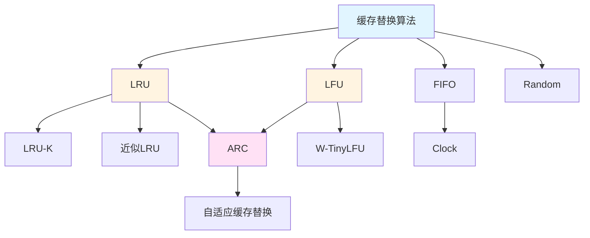

**关系说明**：

- **继承关系**：
  - LRU-K → LRU
  - W-TinyLFU → LFU
  - Clock → FIFO
- **组合关系**：
  - ARC = {LRU, LFU}
- **优化关系**：
  - ARC ← LRU（自适应优化）
  - ARC ← LFU（自适应优化）
  - W-TinyLFU ← LFU（内存优化）

### 3.2 分布式哈希算法关系图谱

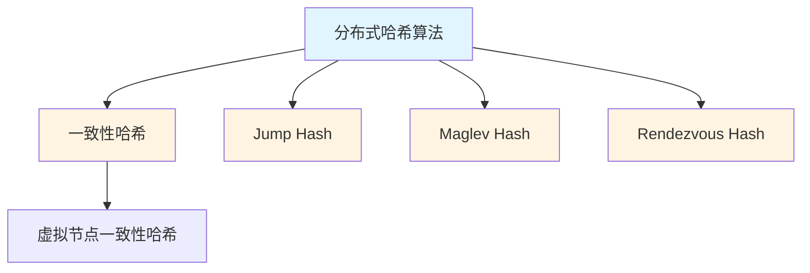

**关系说明**：

- **继承关系**：
  - Jump Hash → 一致性哈希
  - Maglev Hash → 一致性哈希
  - Rendezvous Hash → 分布式哈希算法
- **优化关系**：
  - Jump Hash ← 一致性哈希（无需虚拟节点）
  - Maglev Hash ← 一致性哈希（O(1)查找）

---

## 4. 数据结构概念关系图谱

### 4.1 Redis数据结构关系图谱

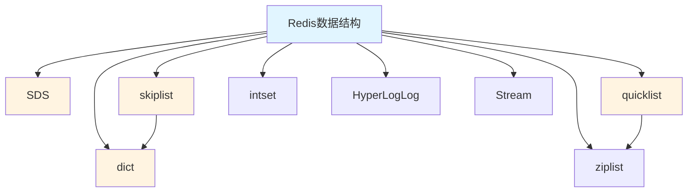

**关系说明**：

- **组合关系**：
  - quicklist = {双向链表, ziplist}
  - ZSet = {skiplist, dict}
- **依赖关系**：
  - quicklist → ziplist（quicklist依赖ziplist）
  - ZSet → skiplist（ZSet依赖skiplist）
  - ZSet → dict（ZSet依赖dict）

### 4.2 Redis模块关系图谱

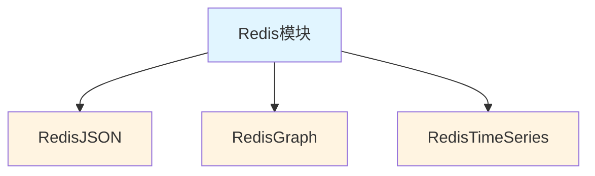

**关系说明**：

- **继承关系**：
  - RedisJSON → Redis模块
  - RedisGraph → Redis模块
  - RedisTimeSeries → Redis模块
- **依赖关系**：
  - RedisJSON → Redis核心数据结构
  - RedisGraph → Redis核心数据结构
  - RedisTimeSeries → Redis核心数据结构

---

## 5. 系统概念关系图谱

### 5.1 缓存层次关系图谱

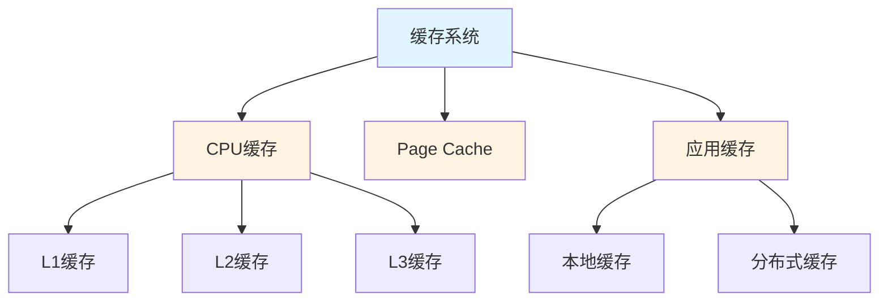

**关系说明**：

- **层次关系**：
  - L1缓存 → L2缓存 → L3缓存 → 主存
  - 本地缓存 → 分布式缓存 → 数据库
- **组合关系**：
  - CPU缓存 = {L1缓存, L2缓存, L3缓存}
  - 多级缓存 = {本地缓存, 分布式缓存}

### 5.2 Redis系统组件关系图谱

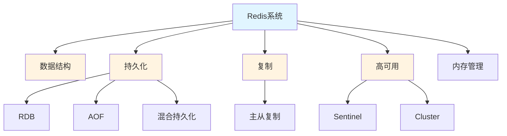

**关系说明**：

- **组合关系**：
  - Redis系统 = {数据结构, 持久化, 复制, 高可用, 内存管理}
  - 混合持久化 = {RDB, AOF}
  - 高可用 = {复制, Sentinel, Cluster}
- **依赖关系**：
  - 高可用 → 复制（高可用依赖复制）
  - Cluster → 一致性哈希（Cluster依赖一致性哈希）

---

## 6. 架构概念关系图谱

### 6.1 缓存架构模式关系图谱

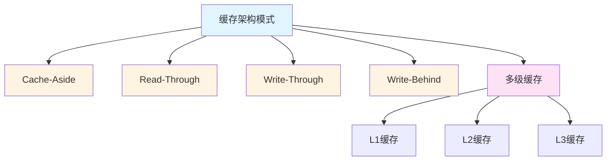

**关系说明**：

- **继承关系**：
  - 所有模式 → 缓存架构模式
- **组合关系**：
  - 多级缓存 = {L1缓存, L2缓存, L3缓存}
- **替代关系**：
  - Read-Through ⇒ Cache-Aside（简化应用逻辑）
  - Write-Behind ⇒ Write-Through（提升写性能）

### 6.2 缓存优化策略关系图谱

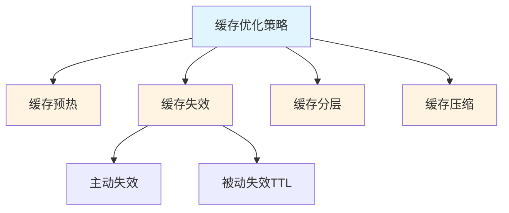

**关系说明**：

- **组合关系**：
  - 缓存失效 = {主动失效, 被动失效TTL}
- **依赖关系**：
  - 缓存预热 → 热点数据识别
  - 缓存失效 → 数据源变更通知

---

## 7. 跨领域概念关系图谱

### 7.1 算法与架构关系图谱

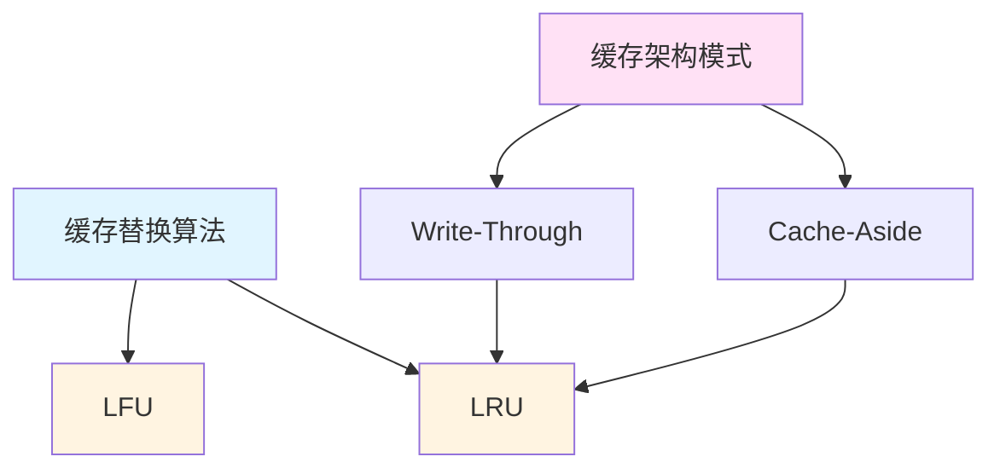

**关系说明**：

- **依赖关系**：
  - Cache-Aside → LRU（Cache-Aside依赖LRU）
  - Write-Through → LRU（Write-Through依赖LRU）

### 7.2 系统与性能关系图谱

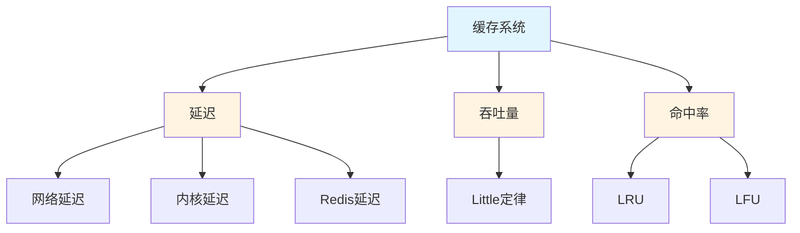

**关系说明**：

- **组合关系**：
  - 延迟 = {网络延迟, 内核延迟, Redis延迟}
- **依赖关系**：
  - 吞吐量 → Little定律（吞吐量依赖Little定律）
  - 命中率 → LRU（命中率依赖LRU）

### 7.3 硬件与软件关系图谱

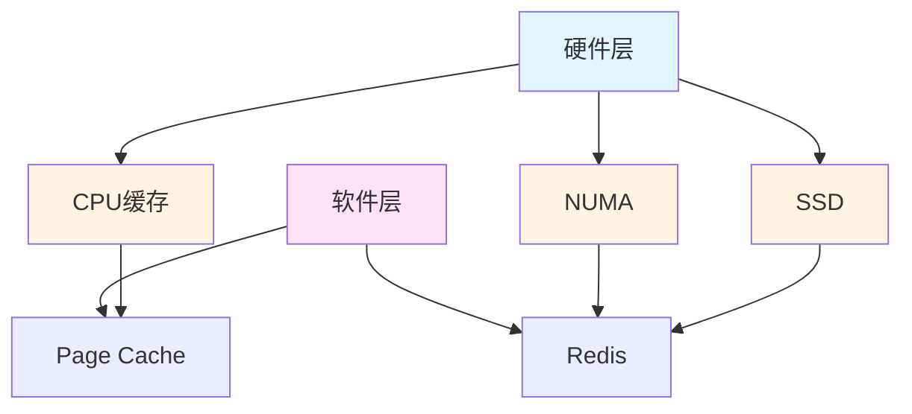

**关系说明**：

- **依赖关系**：
  - Page Cache → CPU缓存（Page Cache依赖CPU缓存）
  - Redis → NUMA（Redis依赖NUMA架构）
  - Redis → SSD（Redis依赖SSD持久化）

---

## 8. 参考文档

- [概念定义汇总](./概念定义汇总.md)
- [概念属性矩阵](./概念属性矩阵.md)
- [概念体系梳理计划](./概念体系梳理计划.md)
- [形式化分析理论模型](./形式化分析理论模型.md)

---

**文档版本**：v1.0
**最后更新**：2025-01
**文档状态**：✅ 第一阶段完成（核心概念关系图谱）
**完成度**：核心概念关系图谱完成，包含6大类关系类型和7个关系图谱
