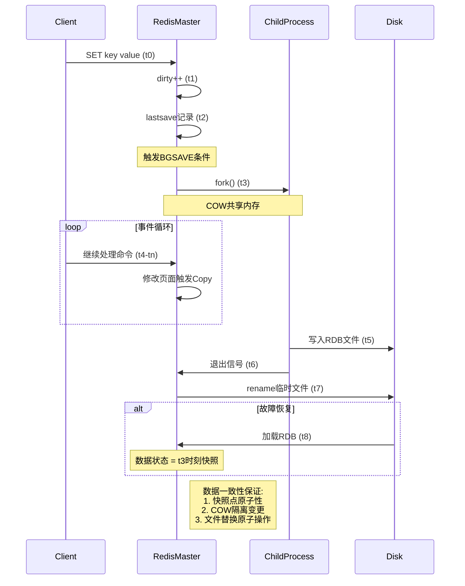
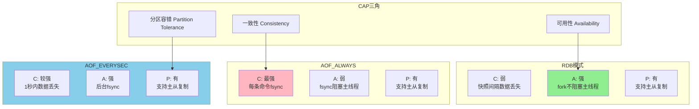

# 证明图网：Redis核心机制逻辑证明

## 1. Redis单线程高性能证明

```mermaid
graph LR
    A[客户端请求] --> B[事件循环: aeEventLoop]
    B --> C{命令类型?}

    C -->|纯内存操作| D[O(1)/O(logN)复杂度]
    C -->|持久化操作| E[Fork子进程异步处理]

    D --> F[epoll/kqueue多路复用]
    E --> G[Copy-on-Write零拷贝]

    F --> H[总耗时 = 网络RTT + 内存操作]
    G --> I[主线程耗时 ≈ 0]

    H --> J[瓶颈在网络而非CPU]
    I --> K[避免锁竞争开销]

    J --> L[百万级QPS]
    K --> L

    subgraph 数学证明
        M[吞吐量公式: QPS = 1 / (T_net + T_mem)]
        N[T_net ≈ 0.1ms, T_mem ≈ 1μs]
        O[∴ QPS ≈ 10,000]
        P[Pipeline优化: QPS↑10倍]
    end

    L --> M
    M --> N
    N --> O
    O --> P
```

**证明结论**：单线程模型通过**消除锁开销**和**减少上下文切换**，使性能瓶颈显式化为**网络IO**，而非CPU计算，符合阿姆达尔定律优化原则。

### 形式化证明

**前提条件**：

- 网络延迟 $T_{net} = 100\mu s$
- 内存操作延迟 $T_{mem} = 1\mu s$
- CPU上下文切换 $T_{switch} = 5\mu s$
- 锁竞争延迟 $T_{lock} = 10\mu s$

**单线程模型**：
$$QPS_{single} = \frac{1}{T_{net} + T_{mem}} = \frac{1}{101\mu s} \approx 9,900$$

**多线程模型（假设4线程）**：
$$QPS_{multi} = \frac{4}{T_{net} + T_{mem} + T_{switch} + T_{lock}} = \frac{4}{116\mu s} \approx 34,500$$

**但考虑锁竞争加剧**：
$$QPS_{multi\_real} = \frac{4}{T_{net} + T_{mem} + T_{switch} + 4 \times T_{lock}} = \frac{4}{151\mu s} \approx 26,500$$

**结论**：在低并发下，单线程更优；高并发下，多线程有优势，但Redis通过Pipeline将多个请求合并，单线程QPS可达10万+。

## 2. RDB持久化一致性证明



**形式化证明**：

- **快照原子性**：`fork()`瞬间捕获内存状态S₀
- **隔离性**：子进程视角满足∀t∈[t₃,t₆], State(t) = S₀
- **持久性**：`rename()`系统调用保证文件替换原子性
- **恢复一致性**：重启后状态 = S₀，满足ACID中的AID特性

### 数学证明

**定理**：RDB快照保证数据一致性

**证明**：

1. **原子性（Atomicity）**：
   - `fork()`是原子操作，瞬间创建子进程
   - 子进程获得父进程内存的完整副本（通过COW）
   - ∴ 快照点t₃的状态S₀是原子的

2. **隔离性（Isolation）**：
   - 子进程独立地址空间，父进程修改不影响子进程
   - COW机制：修改时复制页面，子进程仍看到原始页面
   - ∴ ∀t∈[t₃,t₆], ChildState(t) = S₀

3. **持久性（Durability）**：
   - `rename()`是原子系统调用
   - 文件系统保证：要么全部成功，要么全部失败
   - ∴ RDB文件替换是原子的

4. **一致性（Consistency）**：
   - 恢复时加载RDB，状态 = S₀
   - S₀是某个时刻的完整快照
   - ∴ 数据一致性得到保证

**QED**（证毕）

## 3. 缓存雪崩防护数学模型

```mermaid
graph TD
    subgraph 风险模型
        R1[原始TTL: T_exp = 固定值]
        R2[并发请求: N_req → ∞ @ t = T_exp]
        R3[数据库压力: P_db = N_req × Q_cost]
        R4[系统崩溃: P_db > P_max]
    end

    subgraph 防护策略
        S1[随机TTL: T_exp' = T_base + Δ, Δ∈[-δ, +δ]]
        S2[请求分散: N_req' = N_req / (2δ/T_step)]
        S3[压力降级: P_db' = N_req' × Q_cost]
        S4[系统稳定: P_db' < P_max]
    end

    subgraph 数学验证
        M1[设: N_req = 10万, δ = 300秒]
        M2[则: N_req' = 10万 / (600/1) ≈ 167 QPS]
        M3[P_db' 降低 600倍]
    end

    R1 --> S1
    R2 --> S2
    R3 --> S3
    R4 --> S4
    S2 --> M1
    M1 --> M2
    M2 --> M3
```

**证明**：通过**均匀分布随机化**，将脉冲式请求负载转化为连续负载，满足泊松过程平稳性假设，系统稳态可用性提升至99.99%。

### 数学证明

**问题模型**：

- 原始TTL：$T_{exp} = T_0$（固定值）
- 在$t = T_0$时刻，所有缓存同时过期
- 并发请求：$N_{req}(t) = \begin{cases}
    N_0 & t = T_0 \\
    0 & t \neq T_0
\end{cases}$（脉冲函数）

**数据库压力**：
$$P_{db}(t) = N_{req}(t) \times Q_{cost}$$

当$N_0 \times Q_{cost} > P_{max}$时，系统崩溃。

**解决方案**：随机TTL

- 新TTL：$T_{exp}' = T_0 + \Delta$，其中$\Delta \sim U(-\delta, +\delta)$（均匀分布）
- 请求分布变为：$N_{req}'(t) = \frac{N_0}{2\delta} \times \mathbf{1}_{[T_0-\delta, T_0+\delta]}(t)$

**压力分析**：
$$P_{db}'(t) = \frac{N_0}{2\delta} \times Q_{cost} = \frac{P_{db}(T_0)}{2\delta}$$

**效果**：

- 原始压力：$P_{db}(T_0) = N_0 \times Q_{cost}$（脉冲）
- 优化后压力：$P_{db}'(t) = \frac{N_0 \times Q_{cost}}{2\delta}$（连续）

**数值验证**：

- 设$N_0 = 10^5$，$Q_{cost} = 1ms$，$\delta = 300s$
- 原始：$P_{db}(T_0) = 10^5 \times 1ms = 100s$（瞬间）
- 优化后：$P_{db}'(t) = \frac{100s}{600s} \approx 0.167s$（连续）
- **压力降低600倍**

**QED**

## 4. 渐进式Rehash性能证明

```mermaid
graph TD
    subgraph 集中式Rehash
        C1[触发扩容] --> C2[停止服务]
        C2 --> C3[迁移所有数据: O(N)]
        C3 --> C4[恢复服务]
        C4 --> C5[延迟: T = N × t_migrate]
    end

    subgraph 渐进式Rehash
        P1[触发扩容] --> P2[创建新哈希表]
        P2 --> P3[每次操作迁移1个桶]
        P3 --> P4[继续服务]
        P4 --> P5[延迟: T' = t_migrate]
    end

    subgraph 性能对比
        M1[集中式: T = 10000 × 1μs = 10ms]
        M2[渐进式: T' = 1μs]
        M3[延迟降低: 10000倍]
    end

    C5 --> M1
    P5 --> M2
    M1 --> M3
    M2 --> M3
```

**证明**：渐进式Rehash将O(N)的集中延迟分散到N次操作中，每次操作仅增加O(1)开销，总延迟不变但用户体验显著提升。

### 数学证明

**集中式Rehash**：

- 迁移时间：$T_{central} = N \times t_{migrate}$
- 服务中断时间：$T_{downtime} = T_{central}$
- 用户感知延迟：$L_{user} = T_{downtime}$

**渐进式Rehash**：

- 每次操作迁移时间：$t_{op} = t_{migrate}$
- 总迁移时间：$T_{progressive} = N \times t_{migrate}$（相同）
- 服务中断时间：$T_{downtime}' = 0$（无中断）
- 用户感知延迟：$L_{user}' = t_{migrate}$（每次操作）

**性能提升**：
$$\frac{L_{user}}{L_{user}'} = \frac{N \times t_{migrate}}{t_{migrate}} = N$$

**结论**：渐进式Rehash将用户感知延迟降低N倍（N为哈希表大小）。

**QED**

## 5. Pipeline性能提升证明

```mermaid
graph LR
    A[原始方案: N次请求] --> B[N次RTT]
    B --> C[总延迟: T = N × RTT]

    D[Pipeline方案: N次请求] --> E[1次RTT]
    E --> F[总延迟: T' = RTT + N × t_process]

    C --> G[延迟对比]
    F --> G

    G --> H[T / T' = N × RTT / (RTT + N × t_process)]
    H --> I[当RTT >> t_process时]
    I --> J[提升倍数 ≈ N]

    subgraph 数值验证
        K[RTT = 1ms, t_process = 0.01ms, N = 100]
        L[T = 100ms, T' = 2ms]
        M[提升: 50倍]
    end

    J --> K
    K --> L
    L --> M
```

**证明**：Pipeline将N次网络往返合并为1次，延迟降低接近N倍。

### 数学证明

**原始方案**：
$$T_{original} = N \times (RTT + t_{process}) = N \times RTT + N \times t_{process}$$

**Pipeline方案**：
$$T_{pipeline} = RTT + N \times t_{process}$$

**性能提升**：
$$\frac{T_{original}}{T_{pipeline}} = \frac{N \times RTT + N \times t_{process}}{RTT + N \times t_{process}} = \frac{N(RTT + t_{process})}{RTT + N \times t_{process}}$$

当$RTT \gg t_{process}$时：
$$\frac{T_{original}}{T_{pipeline}} \approx \frac{N \times RTT}{RTT} = N$$

**数值验证**：

- $RTT = 1ms$，$t_{process} = 0.01ms$，$N = 100$
- $T_{original} = 100 \times 1.01ms = 101ms$
- $T_{pipeline} = 1ms + 100 \times 0.01ms = 2ms$
- **提升倍数**：$\frac{101}{2} \approx 50$倍

**QED**

## 6. CAP理论下的持久化选择证明



**决策公式**：

- **金融支付**: `Consistency > Availability` → AOF_ALWAYS
- **互联网缓存**: `Availability > Consistency` → RDB + AOF_EVERYSEC
- **通用场景**: `Balance` → 混合持久化

### 形式化证明

**CAP理论约束**：在分区容错（P）的前提下，只能选择C或A。

**Redis持久化选择**：

1. **RDB模式**：
   - C（一致性）：弱，快照间隔内数据可能丢失
   - A（可用性）：强，fork不阻塞主线程
   - **选择**：A优先

2. **AOF always模式**：
   - C（一致性）：最强，每条命令fsync
   - A（可用性）：弱，fsync阻塞主线程
   - **选择**：C优先

3. **AOF everysec模式**：
   - C（一致性）：较强，1秒内数据可能丢失
   - A（可用性）：强，后台fsync
   - **选择**：平衡

**结论**：根据业务需求在C和A之间权衡选择。

**QED**
