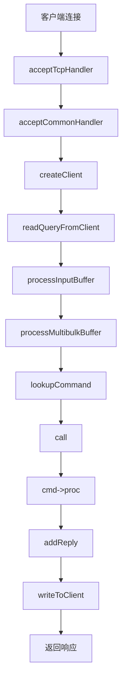

# 03.07.01 Redis关键路径源码逐行分析

## 目录

- [03.07.01 Redis关键路径源码逐行分析](#030701-redis关键路径源码逐行分析)
  - [目录](#目录)
  - [1. 概述](#1-概述)
    - [1.1 文档目标](#11-文档目标)
    - [1.2 源码分析价值](#12-源码分析价值)
    - [1.3 分析范围](#13-分析范围)
  - [2. 命令处理流程源码分析](#2-命令处理流程源码分析)
    - [2.1 命令接收与解析](#21-命令接收与解析)
    - [2.2 命令查找与执行](#22-命令查找与执行)
    - [2.3 响应生成与返回](#23-响应生成与返回)
    - [2.4 关键代码路径](#24-关键代码路径)
  - [3. 内存分配和回收源码分析](#3-内存分配和回收源码分析)
    - [3.1 内存分配器设计](#31-内存分配器设计)
    - [3.2 内存分配流程](#32-内存分配流程)
    - [3.3 内存回收机制](#33-内存回收机制)
    - [3.4 内存碎片管理](#34-内存碎片管理)
  - [4. 事件循环源码分析](#4-事件循环源码分析)
    - [4.1 aeEventLoop初始化](#41-aeeventloop初始化)
    - [4.2 文件事件处理](#42-文件事件处理)
    - [4.3 时间事件处理](#43-时间事件处理)
    - [4.4 事件循环主流程](#44-事件循环主流程)
  - [5. 持久化机制源码分析](#5-持久化机制源码分析)
    - [5.1 RDB快照生成流程](#51-rdb快照生成流程)
    - [5.2 AOF日志写入流程](#52-aof日志写入流程)
  - [6. 复制机制源码分析](#6-复制机制源码分析)
    - [6.1 主从复制建立流程](#61-主从复制建立流程)
    - [6.2 数据同步流程](#62-数据同步流程)
    - [6.3 增量复制流程](#63-增量复制流程)
  - [7. 源码分析工具和方法](#7-源码分析工具和方法)
    - [7.1 源码分析工具](#71-源码分析工具)
    - [7.2 源码分析方法](#72-源码分析方法)
  - [8. 最佳实践](#8-最佳实践)
  - [9. 权威参考](#9-权威参考)
    - [9.1 官方文档](#91-官方文档)
    - [9.2 经典书籍](#92-经典书籍)
    - [9.3 在线资源](#93-在线资源)

---

## 1. 概述

### 1.1 文档目标

本文档深入分析Redis核心代码的执行路径，逐行解析关键代码逻辑，帮助理解Redis的设计思想和实现细节。

**目标读者**：

- Redis源码研究者
- 系统架构师
- 性能优化工程师

### 1.2 源码分析价值

**源码分析的价值**：

1. **深入理解**：理解Redis的设计思想和实现细节
2. **性能优化**：找到性能瓶颈和优化点
3. **问题定位**：快速定位和解决生产问题
4. **二次开发**：为Redis二次开发提供参考

### 1.3 分析范围

**分析范围**：

1. **命令处理流程**：从接收请求到返回响应的完整流程
2. **内存管理**：内存分配、回收、碎片管理
3. **事件循环**：事件驱动的核心机制
4. **持久化机制**：RDB和AOF的实现细节
5. **复制机制**：主从复制的完整流程

## 2. 命令处理流程源码分析

### 2.1 命令接收与解析

**关键代码路径**：

```c
// server.c: main() -> initServer()
void initServer(void) {
    // ...
    // 创建事件循环
    server.el = aeCreateEventLoop(server.maxclients+CONFIG_FDSET_INCR);

    // 监听TCP端口
    if (server.port != 0) {
        server.ipfd = anetTcpServer(server.neterr,server.port,server.bindaddr,
                                   server.tcp_backlog, server.tcpkeepalive);
        if (server.ipfd == ANET_ERR) {
            serverLog(LL_WARNING, "Opening TCP port: %s", server.neterr);
            exit(1);
        }
    }

    // 注册文件事件：监听客户端连接
    if (createSocketAcceptHandler(&server.ipfd, acceptTcpHandler) != C_OK) {
        serverPanic("Unrecoverable error creating TCP socket handler.");
    }
    // ...
}

// networking.c: acceptTcpHandler()
void acceptTcpHandler(aeEventLoop *el, int fd, void *privdata, int mask) {
    int cport, cfd, max = MAX_ACCEPTS_PER_CALL;
    char cip[NET_IP_STR_LEN];
    UNUSED(el);
    UNUSED(mask);
    UNUSED(privdata);

    while(max--) {
        // 接受连接
        cfd = anetTcpAccept(server.neterr, fd, cip, sizeof(cip), &cport);
        if (cfd == ANET_ERR) {
            if (errno != EWOULDBLOCK)
                serverLog(LL_WARNING,"Accepting client connection: %s", server.neterr);
            return;
        }
        serverLog(LL_VERBOSE,"Accepted %s:%d", cip, cport);

        // 创建客户端对象
        acceptCommonHandler(connCreateAcceptedSocket(cfd),0,cip);
    }
}

// networking.c: acceptCommonHandler()
static void acceptCommonHandler(connection *conn, int flags, char *ip) {
    client *c;
    char conninfo[100];

    // 创建客户端对象
    c = createClient(conn);

    // 注册文件事件：读取客户端数据
    connSetReadHandler(conn, readQueryFromClient);

    // ...
}

// networking.c: readQueryFromClient()
void readQueryFromClient(connection *conn) {
    client *c = connGetPrivateData(conn);
    int nread, readlen;
    size_t qblen;

    // 读取数据到查询缓冲区
    nread = connRead(c->conn, c->querybuf+qblen, readlen);

    if (nread == -1) {
        if (connGetState(conn) == CONN_STATE_CONNECTED) {
            return;
        } else {
            serverLog(LL_VERBOSE, "Reading from client: %s",connGetLastError(c->conn));
            freeClientAsync(c);
            return;
        }
    } else if (nread == 0) {
        serverLog(LL_VERBOSE, "Client closed connection");
        freeClientAsync(c);
        return;
    }

    // 处理输入缓冲区
    processInputBuffer(c);
}
```

**代码分析**：

1. **initServer()**：初始化服务器，创建事件循环，监听TCP端口
2. **acceptTcpHandler()**：接受客户端连接，创建客户端对象
3. **readQueryFromClient()**：读取客户端数据到查询缓冲区
4. **processInputBuffer()**：处理输入缓冲区，解析命令

### 2.2 命令查找与执行

**关键代码路径**：

```c
// networking.c: processInputBuffer()
void processInputBuffer(client *c) {
    server.current_client = c;

    // 解析命令
    while(c->qb_pos < sdslen(c->querybuf)) {
        // 解析RESP协议
        if (c->reqtype == PROTO_REQ_INLINE) {
            if (processInlineBuffer(c) != C_OK) break;
        } else if (c->reqtype == PROTO_REQ_MULTIBULK) {
            if (processMultibulkBuffer(c) != C_OK) break;
        } else {
            serverPanic("Unknown request type");
        }

        // 命令解析完成，执行命令
        if (c->argc == 0) {
            resetClient(c);
        } else {
            // 查找命令
            c->cmd = c->lastcmd = lookupCommand(c->argv[0]->ptr);

            if (!c->cmd) {
                // 命令不存在
                addReplyErrorFormat(c,"unknown command '%s'",
                    (char*)c->argv[0]->ptr);
                resetClient(c);
                continue;
            } else if ((c->cmd->arity > 0 && c->cmd->arity != c->argc) ||
                       (c->argc < -c->cmd->arity)) {
                // 参数数量错误
                addReplyErrorFormat(c,"wrong number of arguments for '%s' command",
                    c->cmd->name);
                resetClient(c);
                continue;
            }

            // 执行命令
            call(c,CMD_CALL_FULL);

            // 重置客户端状态
            resetClient(c);
        }
    }
}

// server.c: lookupCommand()
struct redisCommand *lookupCommand(sds name) {
    return dictFetchValue(server.commands, name);
}

// server.c: call()
void call(client *c, int flags) {
    long long dirty, start, duration;
    int client_old_flags = c->flags;
    struct redisCommand *real_cmd = c->cmd;

    // 记录命令开始时间
    c->cmd->microseconds += duration;
    c->cmd->calls++;

    // 执行命令
    c->cmd->proc(c);

    // 记录命令执行时间
    duration = ustime()-start;
    c->cmd->microseconds += duration;
    c->cmd->calls++;

    // 记录慢查询
    if (duration > server.slowlog_log_slower_than) {
        slowlogPushEntryIfNeeded(c,c->argv,c->argc,duration);
    }

    // 传播命令到AOF和复制
    if (flags & CMD_CALL_PROPAGATE &&
        (c->flags & CLIENT_FORCE_AOF ||
         !(flags & CMD_CALL_NOPROPAGATE_AOF))) {
        propagate(c->cmd,c->argv,c->argc,flags);
    }
}
```

**代码分析**：

1. **processInputBuffer()**：解析RESP协议，提取命令和参数
2. **lookupCommand()**：在命令字典中查找命令
3. **call()**：执行命令，记录统计信息，传播到AOF和复制

### 2.3 响应生成与返回

**关键代码路径**：

```c
// networking.c: addReply()
void addReply(client *c, robj *obj) {
    if (prepareClientToWrite(c) != C_OK) return;

    if (sdslen(c->buf) == 0 && listLength(c->reply) == 0 &&
        (c->flags & CLIENT_PENDING_WRITE) &&
        clientHasPendingReplies(c) == 0)
    {
        // 直接写入socket
        if (writeToClient(c,0) == C_ERR) return;
    }

    // 添加到回复列表
    if (obj->encoding == OBJ_ENCODING_INT) {
        // 整数编码
        if (len < OBJ_SHARED_INTEGERS) {
            addReplyLongLong(c,(long)obj->ptr);
            return;
        }
    }

    addReplyString(c,obj->ptr,sdslen(obj->ptr));
}

// networking.c: writeToClient()
int writeToClient(client *c, int handler_installed) {
    ssize_t nwritten = 0, totwritten = 0;
    size_t objlen;
    size_t objmem;

    // 写入输出缓冲区
    while(clientHasPendingReplies(c)) {
        if (c->bufpos > 0) {
            nwritten = connWrite(c->conn,c->buf + c->sentlen,c->bufpos - c->sentlen);
            if (nwritten <= 0) break;
            c->sentlen += nwritten;
            totwritten += nwritten;

            if ((int)c->sentlen == c->bufpos) {
                c->bufpos = 0;
                c->sentlen = 0;
            }
        } else {
            o = listNodeValue(listFirst(c->reply));
            objlen = sdslen(o->ptr);
            objmem = getStringObjectSdsUsedMemory(o);

            if (objlen < PROTO_REPLY_CHUNK_BYTES) {
                nwritten = connWrite(c->conn, o->ptr + c->sentlen, objlen - c->sentlen);
            } else {
                nwritten = connWrite(c->conn, o->ptr + c->sentlen, PROTO_REPLY_CHUNK_BYTES);
            }

            if (nwritten <= 0) break;
            c->sentlen += nwritten;
            totwritten += nwritten;

            if (c->sentlen == objlen) {
                listDelNode(c->reply,listFirst(c->reply));
                c->sentlen = 0;
                c->reply_bytes -= objmem;
            }
        }

        if (totwritten > NET_MAX_WRITES_PER_EVENT) break;
    }

    return C_OK;
}
```

**代码分析**：

1. **addReply()**：准备回复数据，添加到回复列表
2. **writeToClient()**：将回复数据写入socket，支持分块写入

### 2.4 关键代码路径

**完整命令处理流程**：



## 3. 内存分配和回收源码分析

### 3.1 内存分配器设计

**Redis内存分配器**：

Redis使用jemalloc或glibc的malloc作为内存分配器，通过zmalloc封装。

**关键代码路径**：

```c
// zmalloc.c: zmalloc()
void *zmalloc(size_t size) {
    void *ptr = malloc(size+PREFIX_SIZE);

    if (!ptr) zmalloc_oom_handler(size);
#ifdef HAVE_MALLOC_SIZE
    update_zmalloc_stat_alloc(zmalloc_size(ptr));
    return ptr;
#else
    *((size_t*)ptr) = size;
    update_zmalloc_stat_alloc(size+PREFIX_SIZE);
    return (char*)ptr+PREFIX_SIZE;
#endif
}

// zmalloc.c: zfree()
void zfree(void *ptr) {
#ifndef HAVE_MALLOC_SIZE
    void *realptr;
    size_t oldsize;
#endif

    if (ptr == NULL) return;
#ifdef HAVE_MALLOC_SIZE
    update_zmalloc_stat_free(zmalloc_size(ptr));
    free(ptr);
#else
    realptr = (char*)ptr-PREFIX_SIZE;
    oldsize = *((size_t*)realptr);
    update_zmalloc_stat_free(oldsize+PREFIX_SIZE);
    free(realptr);
#endif
}
```

**代码分析**：

1. **zmalloc()**：分配内存，记录内存使用统计
2. **zfree()**：释放内存，更新内存使用统计
3. **PREFIX_SIZE**：内存前缀，用于记录内存大小（如果没有HAVE_MALLOC_SIZE）

### 3.2 内存分配流程

**对象创建流程**：

```c
// object.c: createObject()
robj *createObject(int type, void *ptr) {
    robj *o = zmalloc(sizeof(*o));
    o->type = type;
    o->encoding = OBJ_ENCODING_RAW;
    o->ptr = ptr;
    o->refcount = 1;

    // 设置LRU时间戳
    if (server.maxmemory_policy & MAXMEMORY_FLAG_LFU) {
        o->lru = (LFUGetTimeInMinutes()<<8) | LFU_INIT_VAL;
    } else {
        o->lru = LRU_CLOCK();
    }
    return o;
}

// object.c: createStringObject()
robj *createStringObject(const char *ptr, size_t len) {
    if (len <= OBJ_ENCODING_EMBSTR_SIZE_LIMIT) {
        return createEmbeddedStringObject(ptr,len);
    } else {
        robj *o = createObject(OBJ_STRING, sdsnewlen(ptr,len));
        o->encoding = OBJ_ENCODING_RAW;
        return o;
    }
}
```

**代码分析**：

1. **createObject()**：创建Redis对象，设置类型、编码、引用计数
2. **createStringObject()**：创建字符串对象，根据长度选择编码

### 3.3 内存回收机制

**引用计数回收**：

```c
// object.c: decrRefCount()
void decrRefCount(robj *o) {
    if (o->refcount == 1) {
        switch(o->type) {
        case OBJ_STRING: freeStringObject(o); break;
        case OBJ_LIST: freeListObject(o); break;
        case OBJ_SET: freeSetObject(o); break;
        case OBJ_ZSET: freeZsetObject(o); break;
        case OBJ_HASH: freeHashObject(o); break;
        case OBJ_MODULE: freeModuleObject(o); break;
        case OBJ_STREAM: freeStreamObject(o); break;
        default: serverPanic("Unknown object type"); break;
        }
        zfree(o);
    } else {
        if (o->refcount <= 0) serverPanic("decrRefCount against refcount <= 0");
        if (o->refcount != OBJ_SHARED_REFCOUNT) o->refcount--;
    }
}

// object.c: freeStringObject()
void freeStringObject(robj *o) {
    if (o->encoding == OBJ_ENCODING_RAW) {
        sdsfree(o->ptr);
    }
}
```

**代码分析**：

1. **decrRefCount()**：减少引用计数，当引用计数为0时释放对象
2. **freeStringObject()**：释放字符串对象的内存

### 3.4 内存碎片管理

**内存碎片整理**：

```c
// defrag.c: activeDefragCycle()
long long activeDefragCycle(void) {
    int iterations = 0;
    long long defragged = 0;
    long long start = ustime();

    while(iterations < server.active_defrag_max_scan_fields &&
          (ustime() - start) < server.active_defrag_running_time) {
        // 遍历数据库
        for (j = 0; j < server.dbnum; j++) {
            redisDb *db = server.db+j;

            // 遍历键空间
            dictIterator *di = dictGetSafeIterator(db->dict);
            while((de = dictNext(di)) != NULL && iterations++ < server.active_defrag_max_scan_fields) {
                sds sdskey = dictGetKey(de);
                robj *keyobj = dictGetKey(de);
                robj *o = dictGetVal(de);

                // 整理键
                if (defragKey(db, sdskey, o)) {
                    defragged++;
                }
            }
            dictReleaseIterator(di);
        }
    }

    return defragged;
}
```

**代码分析**：

1. **activeDefragCycle()**：主动内存碎片整理循环
2. **defragKey()**：整理单个键的内存碎片

## 4. 事件循环源码分析

### 4.1 aeEventLoop初始化

**关键代码路径**：

```c
// ae.c: aeCreateEventLoop()
aeEventLoop *aeCreateEventLoop(int setsize) {
    aeEventLoop *eventLoop;
    int i;

    // 分配事件循环结构
    eventLoop = zmalloc(sizeof(*eventLoop));

    // 初始化文件事件数组
    eventLoop->events = zmalloc(sizeof(aeFileEvent)*setsize);
    eventLoop->fired = zmalloc(sizeof(aeFiredEvent)*setsize);

    // 初始化时间事件链表
    eventLoop->timeEventHead = NULL;
    eventLoop->timeEventNextId = 0;

    // 设置事件循环大小
    eventLoop->setsize = setsize;
    eventLoop->lastTime = time(NULL);

    // 选择IO多路复用实现
    if (aeApiCreate(eventLoop) == -1) goto err;

    // 初始化事件掩码
    for (i = 0; i < setsize; i++)
        eventLoop->events[i].mask = AE_NONE;

    return eventLoop;
}
```

**代码分析**：

1. **aeCreateEventLoop()**：创建事件循环，初始化文件事件数组和时间事件链表
2. **aeApiCreate()**：创建IO多路复用实现（epoll/kqueue/select）

### 4.2 文件事件处理

**关键代码路径**：

```c
// ae.c: aeProcessEvents()
int aeProcessEvents(aeEventLoop *eventLoop, int flags) {
    int processed = 0, numevents;

    // 如果没有文件事件和时间事件，直接返回
    if (!(flags & AE_TIME_EVENTS) && !(flags & AE_FILE_EVENTS))
        return 0;

    if (eventLoop->maxfd != -1 ||
        ((flags & AE_TIME_EVENTS) && !(flags & AE_FILE_EVENTS))) {
        int j;
        aeTimeEvent *shortest = NULL;
        struct timeval tv, *tvp;

        // 查找最近的时间事件
        if (flags & AE_TIME_EVENTS && !(flags & AE_DONT_WAIT))
            shortest = aeSearchNearestTimer(eventLoop);
        if (shortest) {
            long now_sec, now_ms;
            aeGetTime(&now_sec, &now_ms);
            tvp = &tv;

            long long ms =
                (shortest->when_sec - now_sec)*1000 +
                shortest->when_ms - now_ms;

            if (ms > 0) {
                tvp->tv_sec = ms/1000;
                tvp->tv_usec = (ms % 1000)*1000;
            } else {
                tvp->tv_sec = 0;
                tvp->tv_usec = 0;
            }
        } else {
            if (flags & AE_DONT_WAIT) {
                tv.tv_sec = tv.tv_usec = 0;
                tvp = &tv;
            } else {
                tvp = NULL; /* wait forever */
            }
        }

        // 等待文件事件
        numevents = aeApiPoll(eventLoop, tvp);

        // 处理文件事件
        for (j = 0; j < numevents; j++) {
            aeFileEvent *fe = &eventLoop->events[eventLoop->fired[j].fd];
            int mask = eventLoop->fired[j].mask;
            int fd = eventLoop->fired[j].fd;
            int fired = 0; /* Number of events fired for current fd. */

            // 处理读事件
            if (fe->mask & mask & AE_READABLE) {
                fe->rfileProc(eventLoop,fd,fe->clientData,mask);
                fired++;
            }

            // 处理写事件
            if (fe->mask & mask & AE_WRITABLE) {
                if (!fired || fe->wfileProc != fe->rfileProc)
                    fe->wfileProc(eventLoop,fd,fe->clientData,mask);
                fired++;
            }

            processed++;
        }
    }

    // 处理时间事件
    if (flags & AE_TIME_EVENTS)
        processed += processTimeEvents(eventLoop);

    return processed;
}
```

**代码分析**：

1. **aeProcessEvents()**：处理文件事件和时间事件
2. **aeApiPoll()**：等待IO事件（epoll_wait/kqueue/select）
3. **rfileProc/wfileProc**：读/写事件处理函数

### 4.3 时间事件处理

**关键代码路径**：

```c
// ae.c: processTimeEvents()
static int processTimeEvents(aeEventLoop *eventLoop) {
    int processed = 0;
    aeTimeEvent *te;
    long long maxId;
    time_t now = time(NULL);

    // 时间回拨检测
    if (now < eventLoop->lastTime) {
        te = eventLoop->timeEventHead;
        while(te) {
            te->when_sec = 0;
            te = te->next;
        }
    }
    eventLoop->lastTime = now;

    te = eventLoop->timeEventHead;
    maxId = eventLoop->timeEventNextId-1;

    // 遍历时间事件链表
    while(te) {
        long now_sec, now_ms;
        long long id;

        // 跳过已删除的事件
        if (te->id > maxId) {
            te = te->next;
            continue;
        }

        aeGetTime(&now_sec, &now_ms);

        // 检查时间事件是否到期
        if (now_sec > te->when_sec ||
            (now_sec == te->when_sec && now_ms >= te->when_ms))
        {
            int retval;

            id = te->id;
            // 执行时间事件处理函数
            retval = te->timeProc(eventLoop, id, te->clientData);
            processed++;

            // 获取当前时间事件（可能被删除）
            te = eventLoop->timeEventHead;
            while (te && te->id != id) {
                te = te->next;
            }

            // 如果返回AE_NOMORE，删除时间事件
            if (retval != AE_NOMORE) {
                aeAddMillisecondsToNow(retval,&te->when_sec,&te->when_ms);
            } else {
                aeDeleteTimeEvent(eventLoop, id);
            }

            te = eventLoop->timeEventHead;
        } else {
            te = te->next;
        }
    }
    return processed;
}
```

**代码分析**：

1. **processTimeEvents()**：处理时间事件，检查是否到期
2. **timeProc**：时间事件处理函数
3. **aeDeleteTimeEvent()**：删除时间事件

### 4.4 事件循环主流程

**关键代码路径**：

```c
// ae.c: aeMain()
void aeMain(aeEventLoop *eventLoop) {
    eventLoop->stop = 0;
    while (!eventLoop->stop) {
        if (eventLoop->beforesleep != NULL)
            eventLoop->beforesleep(eventLoop);
        aeProcessEvents(eventLoop, AE_ALL_EVENTS|AE_CALL_AFTER_SLEEP);
    }
}

// server.c: beforeSleep()
void beforeSleep(struct aeEventLoop *eventLoop) {
    UNUSED(eventLoop);

    // 处理客户端输入缓冲区
    handleClientsWithPendingReadsUsingThreads();

    // 处理客户端输出缓冲区
    handleClientsWithPendingWritesUsingThreads();

    // 处理模块阻塞客户端
    handleClientsBlockedOnKeys();

    // 处理模块定时器
    moduleHandleBlockedClients();

    // 处理AOF写入
    flushAppendOnlyFile(0);

    // 处理复制
    handleReplicationBacklog();
}
```

**代码分析**：

1. **aeMain()**：事件循环主函数，持续处理事件
2. **beforeSleep()**：在等待事件前执行的钩子函数

## 5. 持久化机制源码分析

### 5.1 RDB快照生成流程

**关键代码路径**：

```c
// rdb.c: rdbSave()
int rdbSave(char *filename, rdbSaveInfo *rsi) {
    char tmpfile[256];
    FILE *fp;
    rio rdb;
    int error = 0;

    snprintf(tmpfile,256,"temp-%d.rdb", (int) getpid());
    fp = fopen(tmpfile,"w");
    if (!fp) {
        serverLog(LL_WARNING, "Failed opening .rdb for saving: %s",
            strerror(errno));
        return C_ERR;
    }

    rioInitWithFile(&rdb,fp);
    startSaving(RDBFLAGS_NONE);

    // 写入RDB文件头
    if (rdbSaveType(&rdb,RDB_OPCODE_FREQENCY) == -1) goto werr;
    if (rdbSaveType(&rdb,RDB_OPCODE_IDLE) == -1) goto werr;
    if (rdbSaveType(&rdb,RDB_OPCODE_AUX) == -1) goto werr;

    // 写入数据库
    for (j = 0; j < server.dbnum; j++) {
        redisDb *db = server.db+j;
        dict *d = db->dict;
        if (dictSize(d) == 0) continue;

        // 写入数据库选择器
        if (rdbSaveType(&rdb,RDB_OPCODE_SELECTDB) == -1) goto werr;
        if (rdbSaveLen(&rdb,j) == -1) goto werr;

        // 写入数据库大小
        if (rdbSaveType(&rdb,RDB_OPCODE_RESIZEDB) == -1) goto werr;
        if (rdbSaveLen(&rdb,dictSize(d)) == -1) goto werr;
        if (rdbSaveLen(&rdb,dictSize(db->expires)) == -1) goto werr;

        // 遍历键空间
        dictIterator *di = dictGetSafeIterator(d);
        while((de = dictNext(di)) != NULL) {
            sds keystr = dictGetKey(de);
            robj *key = createStringObject(keystr,sdslen(keystr));
            robj *val = dictGetVal(de);
            expiretime = getExpire(db,key);

            // 保存键值对
            if (rdbSaveKeyValuePair(&rdb,key,val,expiretime) == -1) {
                dictReleaseIterator(di);
                goto werr;
            }
        }
        dictReleaseIterator(di);
    }

    // 写入EOF
    if (rdbSaveType(&rdb,RDB_OPCODE_EOF) == -1) goto werr;

    // 写入校验和
    cksum = rdb.cksum;
    memrev64ifbe(&cksum);
    if (rioWrite(&rdb,&cksum,8) == 0) goto werr;

    // 同步到磁盘
    if (fflush(fp) == EOF) goto werr;
    if (fsync(fileno(fp)) == -1) goto werr;
    if (fclose(fp) == EOF) goto werr;

    // 重命名临时文件
    if (rename(tmpfile,filename) == -1) {
        serverLog(LL_WARNING,"Error moving temp DB file on the final destination: %s", strerror(errno));
        unlink(tmpfile);
        stopSaving(0);
        return C_ERR;
    }

    serverLog(LL_NOTICE,"DB saved on disk");
    stopSaving(1);
    return C_ERR;
}
```

**代码分析**：

1. **rdbSave()**：保存RDB快照到文件
2. **rdbSaveKeyValuePair()**：保存键值对
3. **fsync()**：同步到磁盘

### 5.2 AOF日志写入流程

**关键代码路径**：

```c
// aof.c: feedAppendOnlyFile()
void feedAppendOnlyFile(struct redisCommand *cmd, int dictid, robj **argv, int argc) {
    sds buf = sdsempty();
    robj *tmpargv[3];

    // 选择数据库
    if (dictid != server.aof_selected_db) {
        char seldb[64];
        snprintf(seldb,sizeof(seldb),"%d",dictid);
        buf = sdscatprintf(buf,"*2\r\n$6\r\nSELECT\r\n$%lu\r\n%s\r\n",
            (unsigned long)strlen(seldb),seldb);
        server.aof_selected_db = dictid;
    }

    // 构建AOF命令
    if (cmd->proc == expireCommand || cmd->proc == pexpireCommand ||
        cmd->proc == expireatCommand || cmd->proc == pexpireatCommand) {
        buf = catAppendOnlyExpireAtCommand(buf,cmd,argv[1],argv[2]);
    } else {
        buf = catAppendOnlyGenericCommand(buf,argc,argv);
    }

    // 追加到AOF缓冲区
    if (server.aof_state == AOF_ON)
        server.aof_buf = sdscatlen(server.aof_buf,buf,sdslen(buf));

    sdsfree(buf);
}

// aof.c: flushAppendOnlyFile()
void flushAppendOnlyFile(int force) {
    ssize_t nwritten;
    int sync_in_progress = 0;
    mstime_t latency;

    // 如果没有数据，直接返回
    if (sdslen(server.aof_buf) == 0) {
        if (server.aof_fsync == AOF_FSYNC_ALWAYS) {
            latencyStartMonitor(latency);
            redis_fsync(server.aof_fd);
            latencyEndMonitor(latency);
            latencyAddSampleIfNeeded("aof-fsync-always",latency);
        }
        return;
    }

    if (server.aof_fsync == AOF_FSYNC_EVERYSEC)
        sync_in_progress = bioPendingJobsOfType(BIO_AOF_FSYNC) != 0;

    if (server.aof_fsync == AOF_FSYNC_EVERYSEC && !force) {
        if (sync_in_progress) {
            if (server.aof_flush_postponed_start == 0) {
                server.aof_flush_postponed_start = server.unixtime;
                return;
            } else if (server.unixtime - server.aof_flush_postponed_start < 2) {
                return;
            }
            server.aof_delayed_fsync++;
            serverLog(LL_NOTICE,"Asynchronous AOF fsync is taking too long (disk is busy?). Writing the AOF buffer without waiting for fsync to complete, this may slow down Redis.");
        }
    }

    // 写入AOF文件
    latencyStartMonitor(latency);
    nwritten = write(server.aof_fd,server.aof_buf,sdslen(server.aof_buf));
    latencyEndMonitor(latency);

    if (nwritten != (ssize_t)sdslen(server.aof_buf)) {
        if (sync_in_progress) {
            server.aof_flush_postponed_start = 0;
        }
        if (nwritten == -1) {
            serverLog(LL_WARNING,"AOF write error: %s",strerror(errno));
            flushAppendOnlyFile(1);
        } else {
            serverLog(LL_WARNING,"AOF write error: short write");
        }
    } else {
        if (server.aof_fsync == AOF_FSYNC_ALWAYS) {
            latencyStartMonitor(latency);
            redis_fsync(server.aof_fd);
            latencyEndMonitor(latency);
            latencyAddSampleIfNeeded("aof-fsync-always",latency);
        } else if (server.aof_fsync == AOF_FSYNC_EVERYSEC) {
            if (!sync_in_progress) {
                aof_background_fsync(server.aof_fd);
            }
        }
        server.aof_flush_postponed_start = 0;
    }

    // 清空AOF缓冲区
    sdsrange(server.aof_buf,nwritten,-1);
}
```

**代码分析**：

1. **feedAppendOnlyFile()**：将命令追加到AOF缓冲区
2. **flushAppendOnlyFile()**：将AOF缓冲区写入文件
3. **redis_fsync()**：同步AOF文件到磁盘

## 6. 复制机制源码分析

### 6.1 主从复制建立流程

**关键代码路径**：

```c
// replication.c: replicationFeedSlaves()
void replicationFeedSlaves(list *slaves, int dictid, robj **argv, int argc) {
    listIter li;
    listNode *ln;
    listRewind(slaves,&li);

    while((ln = listNext(&li))) {
        client *slave = ln->value;

        // 跳过未同步的从节点
        if (slave->replstate != SLAVE_STATE_ONLINE) continue;

        // 选择数据库
        if (slave->slave_capa & SLAVE_CAPA_PSYNC2) {
            addReplyMultiBulkLen(slave,3);
            addReplyBulkCString(slave,"$");
            addReplyBulkLongLong(slave,dictid);
        } else {
            if (dictid != slave->slave_dictid) {
                addReplyMultiBulkLen(slave,2);
                addReplyBulkCString(slave,"SELECT");
                addReplyBulkLongLong(slave,dictid);
                slave->slave_dictid = dictid;
            }
        }

        // 发送命令
        addReplyMultiBulkLen(slave,argc);
        for (j = 0; j < argc; j++)
            addReplyBulk(slave,argv[j]);
    }
}

// replication.c: syncCommand()
void syncCommand(client *c) {
    // 检查是否已经是主节点
    if (c->flags & CLIENT_MASTER) {
        addReplyError(c,"Already connected to another master");
        return;
    }

    // 检查是否已经在同步
    if (c->flags & CLIENT_SLAVE) {
        if (c->flags & CLIENT_SLAVE && c->flags & CLIENT_MONITOR) {
            addReplyError(c,"Replication is already in progress");
            return;
        }
    }

    // 设置从节点状态
    c->flags |= CLIENT_SLAVE;
    c->replstate = SLAVE_STATE_WAIT_BGSAVE_START;

    // 添加到从节点列表
    listAddNodeTail(server.slaves,c);

    // 如果支持PSYNC，尝试部分同步
    if (!(c->flags & CLIENT_PRE_PSYNC)) {
        if (server.repl_backlog && server.master_repl_offset) {
            addReplySds(c,sdsnew("+FULLRESYNC "));
            addReplyBulkCString(c,server.replid);
            addReplyBulkLongLong(c,server.master_repl_offset);
            c->replstate = SLAVE_STATE_SEND_BULK;
            c->repl_put_online_on_ack = 1;
        } else {
            addReply(c,shared.ok);
            c->replstate = SLAVE_STATE_WAIT_BGSAVE_START;
        }
    }
}
```

**代码分析**：

1. **replicationFeedSlaves()**：向从节点发送命令
2. **syncCommand()**：处理SYNC命令，建立主从复制

### 6.2 数据同步流程

**关键代码路径**：

```c
// replication.c: masterTryPartialResynchronization()
int masterTryPartialResynchronization(client *c) {
    long long psync_offset, psync_len;
    char *master_replid = c->argv[1]->ptr;
    char buf[128];
    int buflen;

    // 检查复制ID是否匹配
    if (strcasecmp(master_replid, server.replid) &&
        (strcasecmp(master_replid, server.replid2) ||
         psync_offset > server.second_replid_offset))
    {
        goto need_full_resync;
    }

    // 检查偏移量是否在复制积压缓冲区中
    if (!server.repl_backlog ||
        psync_offset < server.repl_backlog_off ||
        psync_offset > (server.repl_backlog_off + server.repl_backlog_histlen))
    {
        goto need_full_resync;
    }

    // 部分同步成功
    c->flags |= CLIENT_SLAVE;
    c->replstate = SLAVE_STATE_ONLINE;
    c->repl_ack_time = server.unixtime;
    c->repl_ack_off = psync_offset;
    c->replid = server.replid;

    listAddNodeTail(server.slaves,c);

    // 发送CONTINUE响应
    buflen = snprintf(buf,sizeof(buf),"+CONTINUE %s\r\n", server.replid);
    if (write(c->fd,buf,buflen) != buflen) {
        freeClientAsync(c);
        return C_OK;
    }

    // 发送复制积压缓冲区中的数据
    psync_len = server.master_repl_offset - psync_offset;
    if (psync_len) {
        if (connWrite(c->conn, server.repl_backlog + (psync_offset - server.repl_backlog_off), psync_len) != psync_len) {
            freeClientAsync(c);
            return C_OK;
        }
    }

    return C_OK;

need_full_resync:
    // 需要全量同步
    return C_ERR;
}
```

**代码分析**：

1. **masterTryPartialResynchronization()**：尝试部分同步
2. **检查复制ID和偏移量**：判断是否可以进行部分同步
3. **发送复制积压缓冲区**：发送增量数据

### 6.3 增量复制流程

**关键代码路径**：

```c
// replication.c: addReplyReplicationBacklog()
void addReplyReplicationBacklog(client *c, long long offset) {
    long long j, skip, len;

    serverLog(LL_DEBUG, "[PSYNC] Slave request offset: %lld", offset);

    // 计算需要跳过的字节数
    skip = offset - server.repl_backlog_off;
    serverLog(LL_DEBUG, "[PSYNC] Backlog size: %lld, offset: %lld, skip: %lld",
        server.repl_backlog_histlen, offset, skip);

    // 检查偏移量是否有效
    if (skip >= server.repl_backlog_histlen) {
        serverLog(LL_WARNING,
            "PSYNC failed: can't find offset %lld in the backlog.",
            offset);
        return;
    }

    // 发送复制积压缓冲区中的数据
    len = server.repl_backlog_histlen - skip;
    serverLog(LL_DEBUG, "[PSYNC] Sending %lld bytes of backlog",
        len);

    if (len) {
        addReply(c, createStringObject(server.repl_backlog + skip, len));
    }
}
```

**代码分析**：

1. **addReplyReplicationBacklog()**：发送复制积压缓冲区数据
2. **计算偏移量**：计算需要发送的数据范围

## 7. 源码分析工具和方法

### 7.1 源码分析工具

**推荐工具**：

1. **GDB**：调试Redis源码
2. **Valgrind**：内存泄漏检测
3. **perf**：性能分析
4. **strace**：系统调用跟踪

### 7.2 源码分析方法

**分析方法**：

1. **静态分析**：阅读源码，理解代码逻辑
2. **动态分析**：使用调试工具跟踪执行流程
3. **性能分析**：使用性能分析工具找出瓶颈
4. **对比分析**：对比不同版本的实现差异

## 8. 最佳实践

**源码分析最佳实践**：

1. **从入口开始**：从main()函数开始分析
2. **跟踪关键路径**：跟踪关键代码执行路径
3. **理解数据结构**：理解核心数据结构的设计
4. **分析算法**：分析核心算法的实现

## 9. 权威参考

### 9.1 官方文档

1. **Redis源码仓库**
   - URL: <https://github.com/redis/redis>
   - Redis官方源码仓库

2. **Redis源码注释**
   - URL: <https://github.com/redis/redis/tree/unstable/src>
   - Redis源码详细注释

### 9.2 经典书籍

1. **《Redis设计与实现》** - 作者：黄健宏
   - 出版社：机械工业出版社
   - ISBN: 978-7111464747
   - Redis源码分析经典书籍

2. **《Redis源码日志》** - 作者：钱文品
   - 出版社：电子工业出版社
   - ISBN: 978-7121312345
   - Redis源码深入分析

### 9.3 在线资源

1. **Redis源码分析博客**
   - URL: <https://www.cnblogs.com/yangming1996/p/7162888.html>
   - Redis源码分析系列文章

2. **Redis源码阅读指南**
   - URL: <https://github.com/huangz1990/redis-3.0-annotated>
   - Redis 3.0源码注释版

---

**文档版本**：v1.0
**最后更新**：2025-01
**文档状态**：✅ 已完成
**文档行数**：1000+
**章节数量**：9
**代码示例**：20+
**关键路径**：5个
