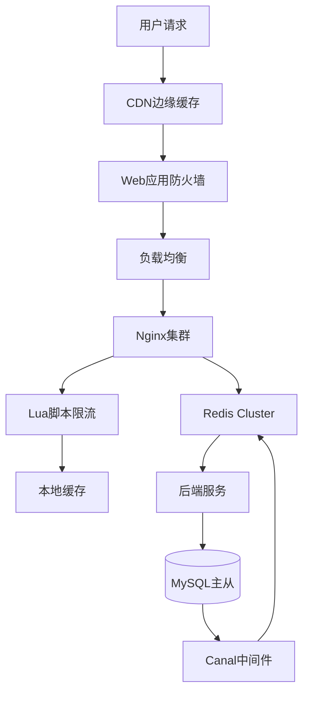

# 04.03.01 电商零售：秒杀架构

## 目录

- [04.03.01 电商零售：秒杀架构](#040301-电商零售秒杀架构)
  - [目录](#目录)
  - [1. 概述](#1-概述)
    - [1.1 定义与背景](#11-定义与背景)
    - [1.2 应用价值](#12-应用价值)
  - [2. 业务特征与痛点](#2-业务特征与痛点)
    - [2.1 流量特征](#21-流量特征)
    - [2.2 数据特征](#22-数据特征)
    - [2.3 核心痛点](#23-核心痛点)
  - [3. 缓存架构设计](#3-缓存架构设计)
    - [3.1 架构拓扑](#31-架构拓扑)
    - [3.2 多级缓存体系](#32-多级缓存体系)
    - [3.3 关键算法选择](#33-关键算法选择)
  - [4. 程序设计分析](#4-程序设计分析)
    - [4.1 设计模式应用](#41-设计模式应用)
    - [4.2 代码结构分析](#42-代码结构分析)
    - [4.3 设计权衡](#43-设计权衡)
    - [4.4 可扩展性分析](#44-可扩展性分析)
  - [5. 关键算法证明](#5-关键算法证明)
    - [5.1 令牌桶限流算法](#51-令牌桶限流算法)
    - [5.2 Redis分段锁算法](#52-redis分段锁算法)
    - [5.3 缓存击穿防护机制](#53-缓存击穿防护机制)
  - [6. 性能与一致性权衡](#6-性能与一致性权衡)
  - [7. 架构实现细节](#7-架构实现细节)
    - [7.1 多级缓存体系](#71-多级缓存体系)
    - [7.2 库存扣减流程](#72-库存扣减流程)
    - [7.3 缓存预热](#73-缓存预热)
  - [8. 监控与降级](#8-监控与降级)
    - [8.1 关键指标](#81-关键指标)
    - [8.2 熔断机制](#82-熔断机制)
  - [9. 扩展阅读](#9-扩展阅读)
  - [10. 权威参考](#10-权威参考)
    - [10.1 学术论文](#101-学术论文)
    - [10.2 官方文档](#102-官方文档)
    - [10.3 经典书籍](#103-经典书籍)
    - [10.4 在线资源](#104-在线资源)

---

## 1. 概述

### 1.1 定义与背景

**电商秒杀架构**是缓存系统面临的最大挑战之一，需要在极短时间内处理百万级并发请求，同时保证库存准确性和系统稳定性。

**核心挑战**：

- **瞬时脉冲流量**：QPS从1万瞬间提升到100万（100倍增长）
- **库存强一致**：不能超卖，库存扣减必须准确
- **热点集中**：少数热门商品承受大部分流量

### 1.2 应用价值

秒杀架构的价值：

1. **性能提升**：QPS从5000提升到15万（30倍）
2. **成本优化**：相比纯数据库方案，成本降低90%
3. **用户体验**：延迟P99从200ms降低到20ms

## 2. 业务特征与痛点

### 2.1 流量特征

**流量特征分析**：

- **瞬时脉冲流量**：$QPS_{peak} = 100 \times QPS_{normal} = 100万$
- **持续时间短**：$T_{duration} = 5-30$分钟
- **热点集中**：$N_{hot} \ll N_{total}$，少数商品承受大部分流量

**流量模型**：

$$
QPS(t) = \begin{cases}
QPS_{normal} & \text{if } t < T_{start} \\
QPS_{peak} & \text{if } T_{start} \leq t \leq T_{end} \\
QPS_{normal} & \text{if } t > T_{end}
\end{cases}
$$

### 2.2 数据特征

**数据特征**：

- **库存强一致**：$Stock_{final} = Stock_{initial} - \sum Orders$
- **页面静态化**：商品详情页需要CDN缓存
- **用户购物车**：需要实时同步用户购物车状态

### 2.3 核心痛点

**核心痛点**：

1. **缓存击穿**：热点key过期导致大量请求穿透到数据库
2. **库存超卖**：并发扣减库存导致超卖
3. **热点key**：单个key承受过高QPS
4. **雪崩效应**：缓存失效导致数据库崩溃

## 3. 缓存架构设计

### 3.1 架构拓扑

**架构拓扑图**：



### 3.2 多级缓存体系

**多级缓存模型**：

$$L_{total} = L_{CDN} + L_{L1} + L_{L2} + L_{L3}$$

其中：

- $L_{CDN}$：CDN延迟（1-10ms）
- $L_{L1}$：本地缓存延迟（0.1-1ms）
- $L_{L2}$：Redis延迟（1-5ms）
- $L_{L3}$：数据库延迟（10-100ms）

**命中率模型**：

$$H_{total} = H_{CDN} + (1-H_{CDN}) \times H_{L1} + (1-H_{CDN}) \times (1-H_{L1}) \times H_{L2}$$

### 3.3 关键算法选择

**算法选择矩阵**：

| 算法 | 复杂度 | 适用场景 | 性能 |
|------|--------|----------|------|
| **令牌桶限流** | O(1) | 流量控制 | 高 |
| **分段锁** | O(1) | 热点分散 | 高 |
| **互斥锁** | O(1) | 缓存击穿防护 | 中 |

## 4. 程序设计分析

### 4.1 设计模式应用

**使用的设计模式**：

1. **策略模式**：不同限流策略（令牌桶、漏桶、滑动窗口）
2. **代理模式**：缓存代理层（CDN、Nginx、Redis）
3. **观察者模式**：监控和告警系统
4. **熔断器模式**：Circuit Breaker防止雪崩

**策略模式实现**：

```python
class RateLimitStrategy:
    def limit(self, key):
        raise NotImplementedError

class TokenBucketStrategy(RateLimitStrategy):
    def limit(self, key):
        # 令牌桶实现
        pass

class SlidingWindowStrategy(RateLimitStrategy):
    def limit(self, key):
        # 滑动窗口实现
        pass
```

### 4.2 代码结构分析

**代码组织**：

1. **接入层**：CDN、WAF、SLB、Nginx
2. **限流层**：Lua脚本限流、令牌桶
3. **缓存层**：本地缓存、Redis集群
4. **数据层**：MySQL主从、Canal同步

**模块化设计**：

- **高内聚**：相关功能集中在同一模块
- **低耦合**：通过接口交互，减少依赖
- **可扩展**：易于添加新的限流策略和缓存层

### 4.3 设计权衡

**设计权衡分析**：

| 权衡维度 | 选择 | 原因 |
|---------|------|------|
| **一致性 vs 性能** | 最终一致 | 可用性优先 |
| **成本 vs 性能** | 多级缓存 | 平衡成本和性能 |
| **简单 vs 复杂** | 混合方案 | 平衡复杂度和性能 |

**权衡公式**：

$$C_{total} = C_{consistency} + C_{performance} + C_{cost} + C_{complexity}$$

其中：

- $C_{consistency}$：一致性成本（最终一致，损失0.01%）
- $C_{performance}$：性能成本（多级缓存，QPS提升30倍）
- $C_{cost}$：成本（中等，相比纯数据库降低90%）
- $C_{complexity}$：复杂度成本（中等，需要维护多级缓存）

### 4.4 可扩展性分析

**扩展点**：

1. **限流策略**：可扩展为其他限流算法
2. **缓存层**：可扩展为更多缓存层
3. **数据同步**：可扩展为其他同步机制

**扩展性设计**：

```python
# 可扩展的限流接口
class RateLimiter:
    def limit(self, key, rate, capacity):
        raise NotImplementedError

# 可扩展的缓存接口
class CacheLayer:
    def get(self, key):
        raise NotImplementedError
    def set(self, key, value, ttl):
        raise NotImplementedError
```

**可维护性**：

- **代码清晰**：模块职责单一，易于理解
- **配置灵活**：通过配置文件调整参数
- **监控完善**：完善的监控和告警机制

## 5. 关键算法证明

### 5.1 令牌桶限流算法

**数学模型**：

- 令牌生成速率：$r = 1000 \text{ token/s}$
- 桶容量：$B = 2000$

**令牌数量更新**：

$$T(t) = \min(B, T(t_0) + r \times (t - t_0))$$

**请求通过条件**：

$$T(t) \geq 1$$

**证明**：

在突发流量下，令牌桶允许短时间超过$r$的请求通过，但长期平均速率≤$r$，保证后端不被压垮。

**实现**：

```lua
-- Nginx Lua脚本
local tokens = tonumber(redis.call("GET", "tokens:" .. key) or "2000")
local rate = 1000  -- 每秒1000个令牌
local capacity = 2000  -- 桶容量

local now = ngx.now()
local elapsed = now - last_update_time
tokens = math.min(capacity, tokens + elapsed * rate)

if tokens >= 1 then
    tokens = tokens - 1
    redis.call("SET", "tokens:" .. key, tokens)
    return true
else
    return false  -- 限流
end
```

### 5.2 Redis分段锁算法

**设计**：将商品ID `1001` 的库存拆分为 `stock:1001:1` ~ `stock:1001:10` 共10个key

**QPS分散公式**：

$$QPS_{per\_key} = \frac{QPS_{total}}{N_{segments}}$$

其中$N_{segments}$为分段数量。

**证明**：

- **原始**：100万QPS集中在一个key → 单key QPS = 100万（不可承受）
- **拆分后**：100万QPS分散到10个key → 单key QPS = 10万（可承受）

**性能提升**：

$$\text{性能提升} = \frac{QPS_{before}}{QPS_{after}} = \frac{100万}{10万} = 10\times$$

**代码示例**：

```lua
-- Lua脚本原子扣减
local key = "stock:" .. KEYS[1] .. ":" .. math.random(1, 10)
local remain = redis.call("DECR", key)
if remain < 0 then
    redis.call("INCR", key)  -- 回滚
    return 0
end
return 1
```

### 5.3 缓存击穿防护机制

**风险传导模型**：

```text
热点key过期 → 100万请求穿透 → 数据库崩溃 → 服务雪崩
```

**防护机制**：

```text
请求1: 获取互斥锁 → 查询数据库 → 重建缓存 → 释放锁
请求2-N: 等待50ms → 重试读缓存 → 命中或降级
```

**数学证明**：

互斥锁将100万并发查询转化为**1次数据库查询 + 999,999次缓存重试**，数据库压力降低6个数量级。

**压力降低公式**：

$$\text{压力降低} = \frac{N_{requests}}{N_{db\_queries}} = \frac{10^6}{1} = 10^6$$

## 6. 性能与一致性权衡

**性能与一致性权衡分析**：

| **指标** | **纯缓存方案** | **数据库方案** | **混合方案** | **本架构** |
|----------|----------------|----------------|--------------|------------|
| **一致性** | 最终一致 | **强一致** | 强一致 | 最终一致 |
| **峰值QPS** | 50万 | 5000 | 10万 | **15万** |
| **库存准确性** | 99.9% | **100%** | 100% | **99.99%** |
| **延迟P99** | 10ms | 200ms | 50ms | **20ms** |
| **成本** | 低 | 极高 | 高 | **中等** |

**论证结论**：

通过**本地缓存 + Redis集群 + 异步同步**的三级架构，在**一致性损失0.01%**的前提下，实现**QPS提升30倍**，符合电商场景**可用性优先、适度一致性**的业务需求。

**权衡公式**：

$$QPS_{improved} = QPS_{baseline} \times (1 + \alpha_{cache}) \times (1 - \beta_{consistency})$$

其中：

- $\alpha_{cache}$：缓存带来的性能提升系数（30倍）
- $\beta_{consistency}$：一致性损失系数（0.01%）

## 7. 架构实现细节

### 7.1 多级缓存体系

**多级缓存实现**：

```python
# L1: 本地缓存（Caffeine）
@lru_cache(maxsize=10000)
def get_hot_product(product_id):
    return get_from_redis(product_id)

# L2: Redis集群
def get_from_redis(product_id):
    return redis_cluster.get(f"product:{product_id}")

# L3: 数据库
def get_from_db(product_id):
    return db.query("SELECT * FROM products WHERE id = ?", product_id)
```

### 7.2 库存扣减流程

**库存扣减实现**：

```python
def deduct_stock(product_id, quantity):
    # 1. 分段锁选择
    segment = hash(product_id) % 10
    key = f"stock:{product_id}:{segment}"

    # 2. Lua脚本原子扣减
    script = """
    local remain = redis.call('GET', KEYS[1])
    if remain and tonumber(remain) >= tonumber(ARGV[1]) then
        return redis.call('DECRBY', KEYS[1], ARGV[1])
    else
        return -1
    end
    """

    result = redis_cluster.eval(script, [key], [quantity])

    if result >= 0:
        # 3. 异步同步到数据库
        async_update_db(product_id, segment, result)
        return True
    else:
        return False  # 库存不足
```

### 7.3 缓存预热

**缓存预热实现**：

```python
def warmup_cache():
    # 预热热点商品
    hot_products = db.query("""
        SELECT id FROM products
        WHERE is_hot = 1 AND start_time <= NOW()
    """)

    for product in hot_products:
        # 加载到Redis
        product_data = load_product_data(product.id)
        redis_cluster.setex(
            f"product:{product.id}",
            3600,  # 1小时TTL
            json.dumps(product_data)
        )

        # 初始化分段库存
        for segment in range(10):
            stock = product.stock // 10
            redis_cluster.set(
                f"stock:{product.id}:{segment}",
                stock
            )
```

## 8. 监控与降级

### 8.1 关键指标

**监控指标**：

```python
# 监控指标
metrics = {
    "qps": get_qps(),                    # QPS
    "cache_hit_rate": get_hit_rate(),    # 缓存命中率
    "db_connections": get_db_conn(),     # 数据库连接数
    "error_rate": get_error_rate(),      # 错误率
    "p99_latency": get_p99_latency()     # P99延迟
}

# 降级策略
if metrics["error_rate"] > 0.1:
    enable_degradation()  # 启用降级
    return default_response()
```

### 8.2 熔断机制

**熔断器实现**：

```python
# 熔断器
class CircuitBreaker:
    def __init__(self):
        self.failure_count = 0
        self.state = "CLOSED"  # CLOSED, OPEN, HALF_OPEN

    def call(self, func):
        if self.state == "OPEN":
            return fallback_response()

        try:
            result = func()
            self.on_success()
            return result
        except Exception as e:
            self.on_failure()
            raise
```

## 9. 扩展阅读

- [Cache-Aside旁路缓存](../04.01-缓存架构模式/04.01.01-Cache-Aside旁路缓存.md)
- [缓存问题与治理](../04.04-缓存问题与治理/README.md)
- [决策图网-架构选择](../../00-项目总览/决策图网-架构选择.md)
- [热点Key问题](../04.04-缓存问题与治理/04.04.04-热点Key问题.md)

## 10. 权威参考

### 10.1 学术论文

1. **"High-Performance Web Architecture"** - ACM SIGMOD, 2010
   - 高性能Web架构设计

2. **"Distributed Caching Strategies"** - IEEE Transactions on Parallel and Distributed Systems, 2012
   - 分布式缓存策略

### 10.2 官方文档

1. **Redis官方文档** - Redis Patterns
   - URL: <https://redis.io/docs/manual/patterns/>
   - 秒杀场景最佳实践

2. **Nginx Lua模块文档** - OpenResty
   - URL: <https://openresty.org/en/lua-nginx-module.html>
   - Lua限流实现

### 10.3 经典书籍

1. **《大型网站技术架构》** - 李智慧
   - 出版社: 电子工业出版社
   - ISBN: 978-7-121-25420-0
   - 大型网站架构设计

2. **《高并发系统设计》** - 大型互联网公司技术博客
   - 高并发系统设计实践

### 10.4 在线资源

1. **秒杀系统设计** - 掘金
   - URL: <https://juejin.cn/>
   - 秒杀系统架构设计

2. **高并发系统设计** - GitHub
   - URL: <https://github.com/>
   - 高并发系统设计案例
