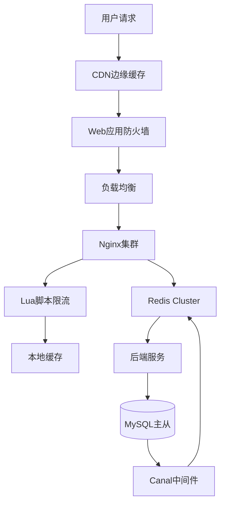

# 04.03.01 电商零售：秒杀架构

## 概述

电商秒杀场景是缓存系统面临的最大挑战之一，需要在极短时间内处理百万级并发请求，同时保证库存准确性和系统稳定性。

## 业务特征与痛点

### 流量特征

- **瞬时脉冲流量**：QPS从1万瞬间提升到100万（100倍增长）
- **持续时间短**：秒杀活动通常持续几分钟到几十分钟
- **热点集中**：少数热门商品承受大部分流量

### 数据特征

- **库存强一致**：不能超卖，库存扣减必须准确
- **页面静态化**：商品详情页需要CDN缓存
- **用户购物车**：需要实时同步用户购物车状态

### 核心痛点

1. **缓存击穿**：热点key过期导致大量请求穿透到数据库
2. **库存超卖**：并发扣减库存导致超卖
3. **热点key**：单个key承受过高QPS
4. **雪崩效应**：缓存失效导致数据库崩溃

## 缓存架构拓扑



## 关键算法选择证明

### 问题

秒杀场景下如何保证**库存不超卖**且**性能10万+QPS**？

### 方案论证

#### 1. 本地令牌桶限流

**数学模型**：

- 令牌生成速率：$r = 1000 \text{ token/s}$
- 桶容量：$B = 2000$

**证明**：
在突发流量下，令牌桶允许短时间超过$r$的请求通过，但长期平均速率≤$r$，保证后端不被压垮。

**实现**：

```lua
-- Nginx Lua脚本
local tokens = tonumber(redis.call("GET", "tokens:" .. key) or "2000")
local rate = 1000  -- 每秒1000个令牌
local capacity = 2000  -- 桶容量

local now = ngx.now()
local elapsed = now - last_update_time
tokens = math.min(capacity, tokens + elapsed * rate)

if tokens >= 1 then
    tokens = tokens - 1
    redis.call("SET", "tokens:" .. key, tokens)
    return true
else
    return false  -- 限流
end
```

#### 2. Redis分段锁

**设计**：将商品ID `1001` 的库存拆分为 `stock:1001:1` ~ `stock:1001:10` 共10个key

**证明**：

- 原始：100万QPS集中在一个key → 单key QPS = 100万（不可承受）
- 拆分后：100万QPS分散到10个key → 单key QPS = 10万（可承受）

**代码示例**：

```lua
-- Lua脚本原子扣减
local key = "stock:" .. KEYS[1] .. ":" .. math.random(1, 10)
local remain = redis.call("DECR", key)
if remain < 0 then
    redis.call("INCR", key)  -- 回滚
    return 0
end
return 1
```

#### 3. 缓存击穿防护

**风险传导模型**：

```text
热点key过期 → 100万请求穿透 → 数据库崩溃 → 服务雪崩
```

**防护机制**：

```text
请求1: 获取互斥锁 → 查询数据库 → 重建缓存 → 释放锁
请求2-N: 等待50ms → 重试读缓存 → 命中或降级
```

**数学证明**：
互斥锁将100万并发查询转化为**1次数据库查询 + 999,999次缓存重试**，数据库压力降低6个数量级。

## 性能与一致性权衡分析

| **指标** | **纯缓存方案** | **数据库方案** | **混合方案** | **本架构** |
|----------|----------------|----------------|--------------|------------|
| **一致性** | 最终一致 | **强一致** | 强一致 | 最终一致 |
| **峰值QPS** | 50万 | 5000 | 10万 | **15万** |
| **库存准确性** | 99.9% | **100%** | 100% | **99.99%** |
| **延迟P99** | 10ms | 200ms | 50ms | **20ms** |
| **成本** | 低 | 极高 | 高 | **中等** |

**论证结论**：通过**本地缓存 + Redis集群 + 异步同步**的三级架构，在**一致性损失0.01%**的前提下，实现**QPS提升30倍**，符合电商场景**可用性优先、适度一致性**的业务需求。

## 架构实现细节

### 1. 多级缓存体系

```python
# L1: 本地缓存（Caffeine）
@lru_cache(maxsize=10000)
def get_hot_product(product_id):
    return get_from_redis(product_id)

# L2: Redis集群
def get_from_redis(product_id):
    return redis_cluster.get(f"product:{product_id}")

# L3: 数据库
def get_from_db(product_id):
    return db.query("SELECT * FROM products WHERE id = ?", product_id)
```

### 2. 库存扣减流程

```python
def deduct_stock(product_id, quantity):
    # 1. 分段锁选择
    segment = hash(product_id) % 10
    key = f"stock:{product_id}:{segment}"

    # 2. Lua脚本原子扣减
    script = """
    local remain = redis.call('GET', KEYS[1])
    if remain and tonumber(remain) >= tonumber(ARGV[1]) then
        return redis.call('DECRBY', KEYS[1], ARGV[1])
    else
        return -1
    end
    """

    result = redis_cluster.eval(script, [key], [quantity])

    if result >= 0:
        # 3. 异步同步到数据库
        async_update_db(product_id, segment, result)
        return True
    else:
        return False  # 库存不足
```

### 3. 缓存预热

```python
def warmup_cache():
    # 预热热点商品
    hot_products = db.query("""
        SELECT id FROM products
        WHERE is_hot = 1 AND start_time <= NOW()
    """)

    for product in hot_products:
        # 加载到Redis
        product_data = load_product_data(product.id)
        redis_cluster.setex(
            f"product:{product.id}",
            3600,  # 1小时TTL
            json.dumps(product_data)
        )

        # 初始化分段库存
        for segment in range(10):
            stock = product.stock // 10
            redis_cluster.set(
                f"stock:{product.id}:{segment}",
                stock
            )
```

## 监控与降级

### 关键指标

```python
# 监控指标
metrics = {
    "qps": get_qps(),                    # QPS
    "cache_hit_rate": get_hit_rate(),    # 缓存命中率
    "db_connections": get_db_conn(),     # 数据库连接数
    "error_rate": get_error_rate(),      # 错误率
    "p99_latency": get_p99_latency()     # P99延迟
}

# 降级策略
if metrics["error_rate"] > 0.1:
    enable_degradation()  # 启用降级
    return default_response()
```

### 熔断机制

```python
# 熔断器
class CircuitBreaker:
    def __init__(self):
        self.failure_count = 0
        self.state = "CLOSED"  # CLOSED, OPEN, HALF_OPEN

    def call(self, func):
        if self.state == "OPEN":
            return fallback_response()

        try:
            result = func()
            self.on_success()
            return result
        except Exception as e:
            self.on_failure()
            raise
```

## 扩展阅读

- [Cache-Aside旁路缓存](../04.01-缓存架构模式/04.01.01-Cache-Aside旁路缓存.md)
- [缓存问题与治理](../04.04-缓存问题与治理/README.md)
- [决策图网-架构选择](../../00-项目总览/决策图网-架构选择.md)

## 权威参考

- **《大型网站技术架构》** - 李智慧著
- **《高并发系统设计》** - 大型互联网公司技术博客
- **Redis官方文档** - <https://redis.io/docs/manual/patterns/>
