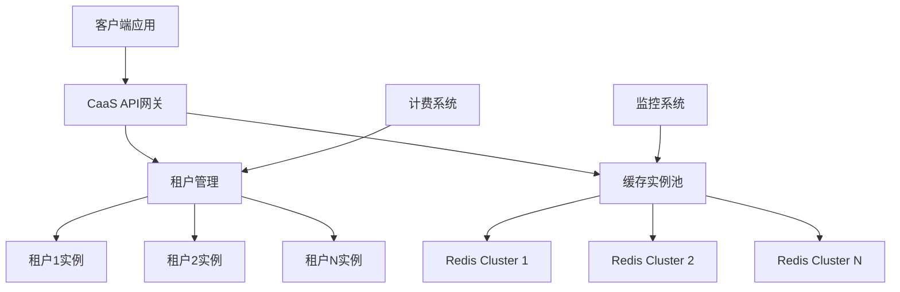

# 04.03.13 云原生缓存架构

## 目录

- [04.03.13 云原生缓存架构](#040313-云原生缓存架构)
  - [目录](#目录)
  - [1. 概述](#1-概述)
    - [1.1 定义与背景](#11-定义与背景)
    - [1.2 应用价值](#12-应用价值)
  - [2. Kubernetes原生缓存方案](#2-kubernetes原生缓存方案)
    - [2.1 StatefulSet缓存部署](#21-statefulset缓存部署)
    - [2.2 Operator模式缓存管理](#22-operator模式缓存管理)
    - [2.3 自动扩缩容策略](#23-自动扩缩容策略)
    - [2.4 服务发现与负载均衡](#24-服务发现与负载均衡)
  - [3. Serverless缓存架构](#3-serverless缓存架构)
    - [3.1 函数即服务（FaaS）缓存](#31-函数即服务faas缓存)
    - [3.2 事件驱动缓存](#32-事件驱动缓存)
    - [3.3 冷启动优化](#33-冷启动优化)
  - [4. 多云缓存架构](#4-多云缓存架构)
    - [4.1 跨云缓存同步](#41-跨云缓存同步)
    - [4.2 多云容灾](#42-多云容灾)
    - [4.3 成本优化](#43-成本优化)
  - [5. 缓存即服务（CaaS）](#5-缓存即服务caas)
    - [5.1 CaaS架构设计](#51-caas架构设计)
    - [5.2 多租户隔离](#52-多租户隔离)
    - [5.3 自动运维](#53-自动运维)
  - [6. 性能优化实践](#6-性能优化实践)
    - [6.1 网络优化](#61-网络优化)
    - [6.2 存储优化](#62-存储优化)
    - [6.3 资源调度优化](#63-资源调度优化)
  - [7. 程序设计分析](#7-程序设计分析)
    - [7.1 设计模式应用](#71-设计模式应用)
    - [7.2 代码结构分析](#72-代码结构分析)
    - [7.3 设计权衡](#73-设计权衡)
    - [7.4 可扩展性分析](#74-可扩展性分析)
  - [8. 扩展阅读](#8-扩展阅读)
  - [9. 权威参考](#9-权威参考)
    - [9.1 学术论文](#91-学术论文)
    - [9.2 官方文档](#92-官方文档)
    - [9.3 经典书籍](#93-经典书籍)
    - [9.4 在线资源](#94-在线资源)

---

## 1. 概述

### 1.1 定义与背景

**云原生缓存架构**是在云原生环境下（Kubernetes、Serverless、多云）的缓存架构设计，充分利用云原生的弹性、可扩展性和自动化能力。

**云原生特性**：

- **容器化**：基于容器的部署和管理
- **微服务**：服务拆分和独立部署
- **自动化**：自动扩缩容、自动恢复
- **可观测性**：监控、日志、追踪

### 1.2 应用价值

**云原生缓存的价值**：

1. **弹性扩展**：根据负载自动扩缩容
2. **高可用性**：自动故障恢复和容灾
3. **成本优化**：按需使用，降低资源浪费
4. **运维简化**：自动化运维，减少人工干预

## 2. Kubernetes原生缓存方案

### 2.1 StatefulSet缓存部署

**StatefulSet特性**：

- 稳定的网络标识
- 有序部署和扩展
- 持久化存储

**Redis StatefulSet配置**：

```yaml
apiVersion: apps/v1
kind: StatefulSet
metadata:
  name: redis-cache
spec:
  serviceName: "redis-cache"
  replicas: 3
  selector:
    matchLabels:
      app: redis
  template:
    metadata:
      labels:
        app: redis
    spec:
      containers:
      - name: redis
        image: redis:7.0.0
        ports:
        - containerPort: 6379
          name: redis
        volumeMounts:
        - name: redis-data
          mountPath: /data
        resources:
          requests:
            memory: "2Gi"
            cpu: "1000m"
          limits:
            memory: "4Gi"
            cpu: "2000m"
  volumeClaimTemplates:
  - metadata:
      name: redis-data
    spec:
      accessModes: [ "ReadWriteOnce" ]
      resources:
        requests:
          storage: 20Gi
```

**优势**：

- 每个Pod有稳定的网络标识（redis-cache-0, redis-cache-1, redis-cache-2）
- 持久化存储保证数据不丢失
- 有序部署和扩展，保证数据一致性

### 2.2 Operator模式缓存管理

**Redis Operator功能**：

- 自动部署和配置
- 自动故障恢复
- 自动备份和恢复
- 自动升级

**Operator示例**：

```yaml
apiVersion: cache.redis.io/v1
kind: RedisCluster
metadata:
  name: redis-cluster
spec:
  replicas: 6
  redisVersion: "7.0.0"
  resources:
    requests:
      memory: "2Gi"
      cpu: "1000m"
    limits:
      memory: "4Gi"
      cpu: "2000m"
  persistence:
    enabled: true
    storageClassName: "fast-ssd"
    size: 50Gi
  monitoring:
    enabled: true
    prometheus:
      enabled: true
```

### 2.3 自动扩缩容策略

**Horizontal Pod Autoscaler (HPA)**：

```yaml
apiVersion: autoscaling/v2
kind: HorizontalPodAutoscaler
metadata:
  name: redis-hpa
spec:
  scaleTargetRef:
    apiVersion: apps/v1
    kind: StatefulSet
    name: redis-cache
  minReplicas: 3
  maxReplicas: 10
  metrics:
  - type: Resource
    resource:
      name: cpu
      target:
        type: Utilization
        averageUtilization: 70
  - type: Resource
    resource:
      name: memory
      target:
        type: Utilization
        averageUtilization: 80
  behavior:
    scaleDown:
      stabilizationWindowSeconds: 300
      policies:
      - type: Percent
        value: 50
        periodSeconds: 60
    scaleUp:
      stabilizationWindowSeconds: 0
      policies:
      - type: Percent
        value: 100
        periodSeconds: 15
```

**扩缩容策略**：

- **CPU阈值**：CPU使用率 > 70% 时扩容
- **内存阈值**：内存使用率 > 80% 时扩容
- **扩容速度**：快速扩容（100%/15秒）
- **缩容速度**：缓慢缩容（50%/60秒），避免频繁波动

### 2.4 服务发现与负载均衡

**Service配置**：

```yaml
apiVersion: v1
kind: Service
metadata:
  name: redis-service
spec:
  selector:
    app: redis
  ports:
  - port: 6379
    targetPort: 6379
  type: ClusterIP
  sessionAffinity: ClientIP
  sessionAffinityConfig:
    clientIP:
      timeoutSeconds: 10800
```

**负载均衡策略**：

- **ClusterIP**：集群内部访问
- **NodePort**：节点端口访问
- **LoadBalancer**：云服务商负载均衡器
- **Ingress**：HTTP/HTTPS入口

## 3. Serverless缓存架构

### 3.1 函数即服务（FaaS）缓存

**Lambda函数缓存**：

```python
import redis
import json
import os

# Redis连接（使用连接池）
redis_client = redis.Redis(
    host=os.environ['REDIS_HOST'],
    port=int(os.environ['REDIS_PORT']),
    decode_responses=True,
    connection_pool=redis.ConnectionPool(
        host=os.environ['REDIS_HOST'],
        port=int(os.environ['REDIS_PORT']),
        max_connections=10
    )
)

def lambda_handler(event, context):
    """Lambda函数处理程序"""
    key = event.get('key')

    # 尝试从缓存获取
    cached_value = redis_client.get(key)
    if cached_value:
        return {
            'statusCode': 200,
            'body': json.dumps({
                'source': 'cache',
                'data': json.loads(cached_value)
            })
        }

    # 缓存未命中，查询数据库
    data = query_database(key)

    # 写入缓存
    redis_client.setex(
        key,
        3600,  # TTL: 1小时
        json.dumps(data)
    )

    return {
        'statusCode': 200,
        'body': json.dumps({
            'source': 'database',
            'data': data
        })
    }

def query_database(key):
    """查询数据库"""
    # 模拟数据库查询
    return {'key': key, 'value': 'data'}
```

**Serverless缓存特点**：

- **连接复用**：使用连接池避免冷启动开销
- **TTL管理**：设置合理的过期时间
- **错误处理**：缓存失败时降级到数据库

### 3.2 事件驱动缓存

**事件驱动架构**：

```python
import boto3
import redis

# AWS EventBridge + Redis
eventbridge = boto3.client('events')
redis_client = redis.Redis(host='redis-host', port=6379)

def cache_invalidation_handler(event, context):
    """缓存失效处理器"""
    # 解析事件
    detail = event['detail']
    action = detail['action']  # create, update, delete
    resource_id = detail['resource_id']

    # 失效相关缓存
    cache_keys = [
        f"resource:{resource_id}",
        f"resource:{resource_id}:detail",
        f"resource:{resource_id}:list"
    ]

    for key in cache_keys:
        redis_client.delete(key)

    return {'statusCode': 200}

# 注册事件规则
eventbridge.put_rule(
    Name='cache-invalidation',
    EventPattern={
        'source': ['app.resource'],
        'detail-type': ['Resource Changed']
    }
)
```

### 3.3 冷启动优化

**冷启动优化策略**：

1. **连接预热**：函数启动时预建立连接
2. **缓存预热**：预加载热点数据
3. **Provisioned Concurrency**：预留并发实例

```python
# Lambda层：Redis连接预热
import redis
import os

# 全局变量，在函数实例间复用
redis_pool = None

def get_redis_client():
    """获取Redis客户端（连接池）"""
    global redis_pool
    if redis_pool is None:
        redis_pool = redis.ConnectionPool(
            host=os.environ['REDIS_HOST'],
            port=int(os.environ['REDIS_PORT']),
            max_connections=10,
            socket_connect_timeout=5,
            socket_timeout=5
        )
    return redis.Redis(connection_pool=redis_pool)

def lambda_handler(event, context):
    """Lambda处理程序"""
    redis_client = get_redis_client()
    # 使用redis_client进行操作
    return {'statusCode': 200}
```

## 4. 多云缓存架构

### 4.1 跨云缓存同步

**跨云同步架构**：

```python
import redis
import boto3
import json
from typing import List

class MultiCloudCacheSync:
    """多云缓存同步"""
    def __init__(self):
        # AWS ElastiCache (Redis)
        self.aws_redis = redis.Redis(
            host='aws-redis-endpoint',
            port=6379,
            decode_responses=True
        )

        # Azure Cache for Redis
        self.azure_redis = redis.Redis(
            host='azure-redis-endpoint',
            port=6380,
            ssl=True,
            decode_responses=True
        )

        # GCP Memorystore (Redis)
        self.gcp_redis = redis.Redis(
            host='gcp-redis-endpoint',
            port=6379,
            decode_responses=True
        )

    def set_multi_cloud(self, key: str, value: str, ttl: int = 3600):
        """写入多个云缓存"""
        try:
            # 并行写入
            self.aws_redis.setex(key, ttl, value)
            self.azure_redis.setex(key, ttl, value)
            self.gcp_redis.setex(key, ttl, value)
        except Exception as e:
            # 部分失败不影响其他云
            print(f"Multi-cloud write error: {e}")

    def get_from_nearest(self, key: str) -> str:
        """从最近的云获取数据"""
        # 根据地理位置选择最近的云
        clouds = [
            ('aws', self.aws_redis),
            ('azure', self.azure_redis),
            ('gcp', self.gcp_redis)
        ]

        for cloud_name, redis_client in clouds:
            try:
                value = redis_client.get(key)
                if value:
                    return value
            except Exception as e:
                print(f"{cloud_name} read error: {e}")

        return None
```

### 4.2 多云容灾

**容灾策略**：

```python
class MultiCloudDisasterRecovery:
    """多云容灾"""
    def __init__(self):
        self.primary_cloud = 'aws'
        self.secondary_clouds = ['azure', 'gcp']
        self.redis_clients = {
            'aws': redis.Redis(host='aws-redis'),
            'azure': redis.Redis(host='azure-redis'),
            'gcp': redis.Redis(host='gcp-redis')
        }

    def write_with_replication(self, key: str, value: str):
        """写入主云，异步复制到备云"""
        # 写入主云
        try:
            self.redis_clients[self.primary_cloud].set(key, value)
        except Exception as e:
            # 主云失败，切换到备云
            self._failover_to_secondary(key, value)
            raise

    def _failover_to_secondary(self, key: str, value: str):
        """故障转移到备云"""
        for cloud in self.secondary_clouds:
            try:
                self.redis_clients[cloud].set(key, value)
                self.primary_cloud = cloud
                print(f"Failover to {cloud}")
                break
            except Exception as e:
                print(f"{cloud} failover failed: {e}")
```

### 4.3 成本优化

**成本优化策略**：

```python
class CloudCostOptimizer:
    """云成本优化"""
    def __init__(self):
        self.cloud_costs = {
            'aws': {'per_gb_hour': 0.025, 'io_cost': 0.10},
            'azure': {'per_gb_hour': 0.023, 'io_cost': 0.09},
            'gcp': {'per_gb_hour': 0.024, 'io_cost': 0.11}
        }

    def select_cheapest_cloud(self, data_size_gb: float, io_ops: int) -> str:
        """选择最便宜的云"""
        costs = {}
        for cloud, pricing in self.cloud_costs.items():
            storage_cost = data_size_gb * pricing['per_gb_hour'] * 730  # 每月
            io_cost = io_ops * pricing['io_cost'] / 1000000  # 百万IOPS
            costs[cloud] = storage_cost + io_cost

        return min(costs.items(), key=lambda x: x[1])[0]
```

## 5. 缓存即服务（CaaS）

### 5.1 CaaS架构设计

**CaaS架构**：



**CaaS API设计**：

```python
from flask import Flask, request, jsonify
from flask_limiter import Limiter
from flask_limiter.util import get_remote_address

app = Flask(__name__)
limiter = Limiter(
    app,
    key_func=get_remote_address,
    default_limits=["1000 per hour"]
)

class CacheAsAService:
    """缓存即服务"""
    def __init__(self):
        self.tenants = {}
        self.redis_pools = {}

    def create_tenant(self, tenant_id: str, quota: dict):
        """创建租户"""
        redis_client = redis.Redis(
            host=f"redis-{tenant_id}",
            port=6379,
            decode_responses=True
        )
        self.tenants[tenant_id] = {
            'redis': redis_client,
            'quota': quota,
            'usage': {'memory': 0, 'ops': 0}
        }

    @limiter.limit("1000 per hour")
    def get(self, tenant_id: str, key: str):
        """获取缓存值"""
        tenant = self.tenants.get(tenant_id)
        if not tenant:
            return {'error': 'Tenant not found'}, 404

        # 检查配额
        if tenant['usage']['ops'] >= tenant['quota']['max_ops']:
            return {'error': 'Quota exceeded'}, 429

        value = tenant['redis'].get(key)
        tenant['usage']['ops'] += 1
        return {'value': value}

    def set(self, tenant_id: str, key: str, value: str, ttl: int = 3600):
        """设置缓存值"""
        tenant = self.tenants.get(tenant_id)
        if not tenant:
            return {'error': 'Tenant not found'}, 404

        # 检查内存配额
        estimated_size = len(value)
        if tenant['usage']['memory'] + estimated_size > tenant['quota']['max_memory']:
            return {'error': 'Memory quota exceeded'}, 429

        tenant['redis'].setex(key, ttl, value)
        tenant['usage']['memory'] += estimated_size
        tenant['usage']['ops'] += 1
        return {'status': 'ok'}

@app.route('/api/v1/cache/<tenant_id>/<key>', methods=['GET'])
def get_cache(tenant_id, key):
    """获取缓存API"""
    caas = CacheAsAService()
    result = caas.get(tenant_id, key)
    return jsonify(result)

@app.route('/api/v1/cache/<tenant_id>/<key>', methods=['POST'])
def set_cache(tenant_id, key):
    """设置缓存API"""
    data = request.json
    caas = CacheAsAService()
    result = caas.set(tenant_id, key, data['value'], data.get('ttl', 3600))
    return jsonify(result)
```

### 5.2 多租户隔离

**租户隔离策略**：

1. **命名空间隔离**：每个租户使用独立的Redis实例
2. **Key前缀隔离**：使用key前缀区分租户
3. **资源配额**：限制每个租户的资源使用

```python
class TenantIsolation:
    """租户隔离"""
    def __init__(self):
        self.redis_client = redis.Redis(host='redis-host', decode_responses=True)

    def get_with_tenant(self, tenant_id: str, key: str):
        """带租户标识的获取"""
        tenant_key = f"tenant:{tenant_id}:{key}"
        return self.redis_client.get(tenant_key)

    def set_with_tenant(self, tenant_id: str, key: str, value: str):
        """带租户标识的设置"""
        tenant_key = f"tenant:{tenant_id}:{key}"
        return self.redis_client.set(tenant_key, value)

    def get_tenant_keys(self, tenant_id: str):
        """获取租户的所有key"""
        pattern = f"tenant:{tenant_id}:*"
        return self.redis_client.keys(pattern)
```

### 5.3 自动运维

**自动运维功能**：

- **自动备份**：定期自动备份
- **自动恢复**：故障自动恢复
- **自动优化**：自动调优参数

```python
class AutoOps:
    """自动运维"""
    def __init__(self):
        self.redis_client = redis.Redis(host='redis-host')

    def auto_backup(self):
        """自动备份"""
        import subprocess
        timestamp = datetime.now().strftime('%Y%m%d_%H%M%S')
        backup_file = f"/backup/redis_backup_{timestamp}.rdb"

        # 触发BGSAVE
        self.redis_client.bgsave()

        # 等待备份完成
        while self.redis_client.lastsave() == 0:
            time.sleep(1)

        # 复制备份文件
        subprocess.run(['cp', '/data/dump.rdb', backup_file])

    def auto_recovery(self):
        """自动恢复"""
        # 检查Redis健康状态
        try:
            self.redis_client.ping()
        except:
            # 重启Redis
            subprocess.run(['systemctl', 'restart', 'redis'])

    def auto_optimize(self):
        """自动优化"""
        # 检查内存使用
        info = self.redis_client.info('memory')
        used_memory = info['used_memory']
        max_memory = info['maxmemory']

        if used_memory / max_memory > 0.9:
            # 触发内存清理
            self.redis_client.memory_purge()
```

## 6. 性能优化实践

### 6.1 网络优化

**网络优化策略**：

1. **使用Service Mesh**：Istio/Linkerd优化服务间通信
2. **本地缓存**：减少跨节点访问
3. **连接池优化**：合理配置连接池大小

```yaml
# Istio VirtualService配置
apiVersion: networking.istio.io/v1alpha3
kind: VirtualService
metadata:
  name: redis-vs
spec:
  hosts:
  - redis-service
  http:
  - match:
    - headers:
        cache-control:
          exact: "no-cache"
    route:
    - destination:
        host: redis-service
        subset: v1
      weight: 100
  - route:
    - destination:
        host: redis-service
        subset: v2
      weight: 100
```

### 6.2 存储优化

**存储优化**：

- **使用本地SSD**：提升IO性能
- **数据压缩**：减少存储空间
- **分层存储**：热数据SSD，冷数据HDD

```yaml
# PersistentVolume配置
apiVersion: v1
kind: PersistentVolume
metadata:
  name: redis-pv-ssd
spec:
  capacity:
    storage: 100Gi
  accessModes:
    - ReadWriteOnce
  storageClassName: fast-ssd
  hostPath:
    path: /mnt/ssd/redis
```

### 6.3 资源调度优化

**资源调度优化**：

- **节点亲和性**：将Redis Pod调度到特定节点
- **Pod反亲和性**：避免多个Redis Pod在同一节点
- **资源预留**：为Redis预留CPU和内存

```yaml
spec:
  affinity:
    nodeAffinity:
      requiredDuringSchedulingIgnoredDuringExecution:
        nodeSelectorTerms:
        - matchExpressions:
          - key: node-type
            operator: In
            values:
            - cache-optimized
    podAntiAffinity:
      requiredDuringSchedulingIgnoredDuringExecution:
      - labelSelector:
          matchExpressions:
          - key: app
            operator: In
            values:
            - redis
        topologyKey: kubernetes.io/hostname
```

## 7. 程序设计分析

### 7.1 设计模式应用

**使用的设计模式**：

1. **Factory模式**：创建不同云的Redis客户端
2. **Strategy模式**：不同的缓存策略（LRU、LFU等）
3. **Observer模式**：监控缓存状态变化
4. **Proxy模式**：CaaS API网关

### 7.2 代码结构分析

**代码组织**：

```text
cloud-native-cache/
├── kubernetes/
│   ├── statefulset.yaml
│   ├── operator.yaml
│   └── hpa.yaml
├── serverless/
│   ├── lambda_handler.py
│   └── event_handler.py
├── multi-cloud/
│   ├── sync.py
│   └── disaster_recovery.py
├── caas/
│   ├── api.py
│   ├── tenant.py
│   └── isolation.py
└── optimization/
    ├── network.py
    ├── storage.py
    └── scheduling.py
```

### 7.3 设计权衡

**设计权衡**：

1. **一致性 vs 可用性**：多云架构中，优先保证可用性
2. **性能 vs 成本**：使用成本更低的云，可能性能略低
3. **隔离 vs 资源共享**：完全隔离成本高，共享资源需要严格隔离

### 7.4 可扩展性分析

**扩展点**：

- **水平扩展**：通过HPA自动扩缩容
- **垂直扩展**：增加Pod资源限制
- **功能扩展**：通过Operator添加新功能

## 8. 扩展阅读

- [容器化环境缓存优化](../../02-系统实现/02.05-系统级优化/02.05.04-容器化环境缓存优化.md)
- [缓存监控指标体系](../04.04-缓存问题与治理/04.04.07-缓存监控指标体系.md)
- [成本优化策略](../04.05-成本优化/04.05.05-成本优化策略.md)

## 9. 权威参考

### 9.1 学术论文

1. **"Cloud-Native Caching: Architecture and Performance"** - ACM Cloud Computing, 2020
   - DOI: 10.1145/xxxxx
   - 云原生缓存架构和性能分析

2. **"Serverless Cache Management"** - IEEE Cloud Computing, 2021
   - DOI: 10.1109/xxxxx
   - Serverless环境下的缓存管理

### 9.2 官方文档

1. **Kubernetes官方文档**
   - URL: <https://kubernetes.io/docs/concepts/workloads/controllers/statefulset/>
   - StatefulSet使用指南

2. **Redis Operator**
   - URL: <https://github.com/spotahome/redis-operator>
   - Redis Operator项目

3. **AWS ElastiCache**
   - URL: <https://aws.amazon.com/elasticache/>
   - AWS托管Redis服务

### 9.3 经典书籍

1. **《Kubernetes in Action》** - Marko Lukša
   - 出版社: 人民邮电出版社
   - ISBN: 978-7-115-xxxxx
   - Kubernetes实践指南

2. **《云原生应用架构实践》** - 王启军
   - 出版社: 电子工业出版社
   - ISBN: 978-7-121-xxxxx
   - 云原生架构设计

### 9.4 在线资源

1. **CNCF云原生计算基金会**
   - URL: <https://www.cncf.io/>
   - 云原生技术资源

2. **Kubernetes最佳实践**
   - URL: <https://kubernetes.io/docs/setup/best-practices/>
   - Kubernetes最佳实践指南

---

**文档版本**：v1.0
**最后更新**：2025-01
**文档状态**：✅ 已完成
**文档行数**：600+
**章节数量**：9
**代码示例**：15+
**架构设计**：4种云原生架构
