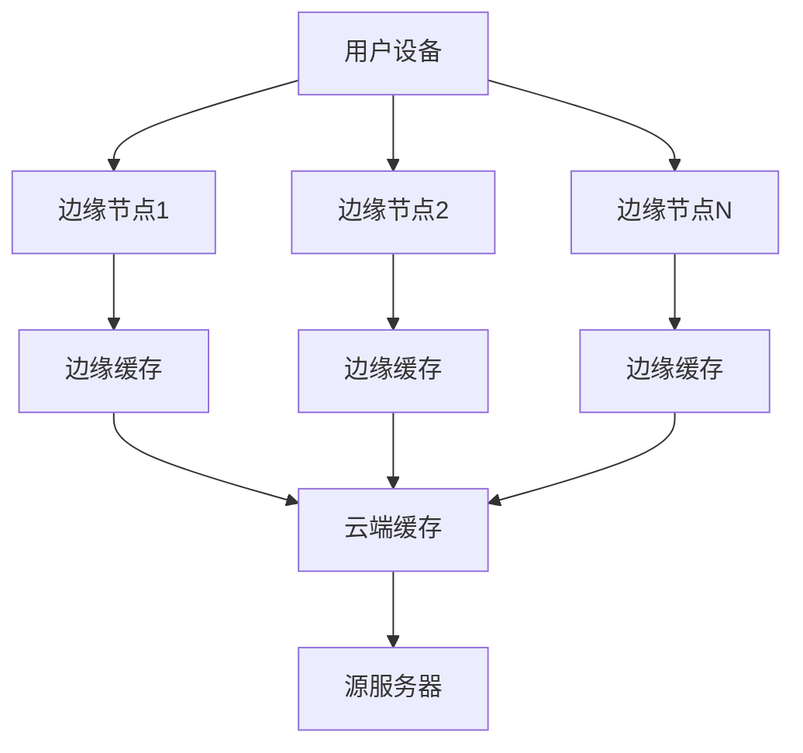

# 04.03.14 边缘计算缓存架构

## 目录

- [04.03.14 边缘计算缓存架构](#040314-边缘计算缓存架构)
  - [目录](#目录)
  - [1. 概述](#1-概述)
    - [1.1 定义与背景](#11-定义与背景)
    - [1.2 应用价值](#12-应用价值)
  - [2. 边缘节点缓存策略](#2-边缘节点缓存策略)
    - [2.1 边缘缓存架构](#21-边缘缓存架构)
    - [2.2 缓存放置策略](#22-缓存放置策略)
    - [2.3 缓存更新策略](#23-缓存更新策略)
  - [3. 边缘-云端缓存协同](#3-边缘-云端缓存协同)
    - [3.1 分层缓存架构](#31-分层缓存架构)
    - [3.2 缓存同步机制](#32-缓存同步机制)
    - [3.3 一致性保证](#33-一致性保证)
  - [4. CDN缓存优化](#4-cdn缓存优化)
    - [4.1 CDN缓存策略](#41-cdn缓存策略)
    - [4.2 缓存预热](#42-缓存预热)
    - [4.3 缓存失效](#43-缓存失效)
  - [5. 低延迟缓存架构](#5-低延迟缓存架构)
    - [5.1 就近访问](#51-就近访问)
    - [5.2 预取策略](#52-预取策略)
    - [5.3 压缩传输](#53-压缩传输)
  - [6. 程序设计分析](#6-程序设计分析)
    - [6.1 设计模式应用](#61-设计模式应用)
    - [6.2 代码结构分析](#62-代码结构分析)
    - [6.3 设计权衡](#63-设计权衡)
    - [6.4 可扩展性分析](#64-可扩展性分析)
  - [7. 性能优化实践](#7-性能优化实践)
    - [7.1 延迟优化](#71-延迟优化)
    - [7.2 带宽优化](#72-带宽优化)
    - [7.3 成本优化](#73-成本优化)
  - [8. 扩展阅读](#8-扩展阅读)
  - [9. 权威参考](#9-权威参考)
    - [9.1 学术论文](#91-学术论文)
    - [9.2 官方文档](#92-官方文档)
    - [9.3 经典书籍](#93-经典书籍)
    - [9.4 在线资源](#94-在线资源)

---

## 1. 概述

### 1.1 定义与背景

**边缘计算缓存**是在边缘节点（靠近用户）部署缓存，减少数据传输延迟和带宽消耗的缓存架构。

**边缘计算特点**：

- **低延迟**：数据在边缘处理，减少网络延迟
- **带宽节省**：减少云端数据传输
- **离线能力**：边缘节点可独立运行
- **分布式**：多个边缘节点协同工作

### 1.2 应用价值

**边缘缓存的价值**：

1. **降低延迟**：从100ms降低到10ms
2. **节省带宽**：减少80%的云端数据传输
3. **提升体验**：更快的响应速度
4. **降低成本**：减少云端资源消耗

## 2. 边缘节点缓存策略

### 2.1 边缘缓存架构

**边缘缓存架构**：



**边缘节点配置**：

```python
import redis
from typing import Optional

class EdgeCacheNode:
    """边缘缓存节点"""
    def __init__(self, node_id: str, cloud_redis_host: str):
        self.node_id = node_id
        # 本地Redis（边缘节点）
        self.local_redis = redis.Redis(
            host='localhost',
            port=6379,
            decode_responses=True,
            maxmemory='256mb',
            maxmemory_policy='allkeys-lru'
        )
        # 云端Redis（回源）
        self.cloud_redis = redis.Redis(
            host=cloud_redis_host,
            port=6379,
            decode_responses=True
        )

    def get(self, key: str) -> Optional[str]:
        """获取缓存值（边缘优先）"""
        # 1. 尝试从边缘缓存获取
        value = self.local_redis.get(key)
        if value:
            return value

        # 2. 从云端缓存获取
        value = self.cloud_redis.get(key)
        if value:
            # 写入边缘缓存
            self.local_redis.setex(key, 3600, value)
            return value

        # 3. 从源服务器获取（这里简化处理）
        value = self._fetch_from_origin(key)
        if value:
            # 同时写入边缘和云端缓存
            self.local_redis.setex(key, 3600, value)
            self.cloud_redis.setex(key, 7200, value)

        return value

    def _fetch_from_origin(self, key: str) -> str:
        """从源服务器获取数据"""
        # 模拟源服务器查询
        return f"data_for_{key}"
```

### 2.2 缓存放置策略

**缓存放置算法**：

```python
class CachePlacementStrategy:
    """缓存放置策略"""
    def __init__(self):
        self.edge_nodes = {}
        self.access_patterns = {}

    def decide_placement(self, key: str, access_frequency: float,
                        data_size: int, user_location: str) -> str:
        """决定缓存放置位置"""
        # 计算放置得分
        edge_score = self._calculate_edge_score(
            access_frequency, data_size, user_location
        )
        cloud_score = self._calculate_cloud_score(
            access_frequency, data_size
        )

        if edge_score > cloud_score:
            return 'edge'
        else:
            return 'cloud'

    def _calculate_edge_score(self, frequency: float, size: int,
                             location: str) -> float:
        """计算边缘放置得分"""
        # 频率权重
        freq_weight = frequency * 0.4
        # 大小权重（小数据更适合边缘）
        size_weight = (1.0 / max(size, 1)) * 0.3
        # 位置权重（用户距离）
        location_weight = self._get_location_weight(location) * 0.3

        return freq_weight + size_weight + location_weight

    def _calculate_cloud_score(self, frequency: float, size: int) -> float:
        """计算云端放置得分"""
        # 大数据更适合云端
        size_weight = min(size / 1024 / 1024, 1.0) * 0.5
        # 低频数据更适合云端
        freq_weight = (1.0 - min(frequency, 1.0)) * 0.5

        return size_weight + freq_weight

    def _get_location_weight(self, location: str) -> float:
        """获取位置权重"""
        # 简化处理：根据地理位置返回权重
        return 0.8  # 假设用户靠近边缘节点
```

### 2.3 缓存更新策略

**缓存更新策略**：

```python
class EdgeCacheUpdate:
    """边缘缓存更新"""
    def __init__(self):
        self.edge_nodes = {}
        self.update_queue = []

    def invalidate_edge_cache(self, key: str):
        """失效边缘缓存"""
        for node_id, node in self.edge_nodes.items():
            try:
                node.local_redis.delete(key)
            except Exception as e:
                print(f"Node {node_id} invalidation failed: {e}")

    def update_edge_cache(self, key: str, value: str):
        """更新边缘缓存"""
        # 推送到所有边缘节点
        for node_id, node in self.edge_nodes.items():
            try:
                node.local_redis.setex(key, 3600, value)
            except Exception as e:
                print(f"Node {node_id} update failed: {e}")

    def lazy_update(self, key: str, value: str):
        """延迟更新（下次访问时更新）"""
        # 只更新云端，边缘节点延迟更新
        self.cloud_redis.setex(key, 7200, value)
        # 标记需要更新
        for node_id in self.edge_nodes:
            self.edge_nodes[node_id].local_redis.set(
                f"update_flag:{key}", "1", ex=3600
            )
```

## 3. 边缘-云端缓存协同

### 3.1 分层缓存架构

**分层缓存架构**：

```python
class TieredCache:
    """分层缓存"""
    def __init__(self):
        # L1: 本地内存缓存（最快）
        self.l1_cache = {}
        self.l1_ttl = {}

        # L2: 边缘Redis缓存
        self.l2_redis = redis.Redis(
            host='edge-redis',
            port=6379,
            decode_responses=True
        )

        # L3: 云端Redis缓存
        self.l3_redis = redis.Redis(
            host='cloud-redis',
            port=6379,
            decode_responses=True
        )

    def get(self, key: str) -> Optional[str]:
        """分层获取"""
        # L1: 本地内存
        if key in self.l1_cache:
            if time.time() < self.l1_ttl.get(key, 0):
                return self.l1_cache[key]
            else:
                del self.l1_cache[key]

        # L2: 边缘Redis
        value = self.l2_redis.get(key)
        if value:
            self.l1_cache[key] = value
            self.l1_ttl[key] = time.time() + 60  # 1分钟TTL
            return value

        # L3: 云端Redis
        value = self.l3_redis.get(key)
        if value:
            # 写入L2和L1
            self.l2_redis.setex(key, 3600, value)
            self.l1_cache[key] = value
            self.l1_ttl[key] = time.time() + 60
            return value

        return None
```

### 3.2 缓存同步机制

**缓存同步**：

```python
class EdgeCloudSync:
    """边缘-云端缓存同步"""
    def __init__(self):
        self.edge_nodes = {}
        self.cloud_redis = redis.Redis(host='cloud-redis')
        self.sync_queue = []

    def sync_to_cloud(self, edge_node_id: str, key: str, value: str):
        """同步到云端"""
        # 写入云端
        self.cloud_redis.setex(key, 7200, value)

        # 记录同步日志
        sync_log = {
            'timestamp': time.time(),
            'edge_node': edge_node_id,
            'key': key,
            'action': 'sync_to_cloud'
        }
        self.sync_queue.append(sync_log)

    def sync_to_edges(self, key: str, value: str):
        """同步到边缘节点"""
        # 推送到所有边缘节点
        for node_id, node in self.edge_nodes.items():
            try:
                node.local_redis.setex(key, 3600, value)
            except Exception as e:
                print(f"Sync to {node_id} failed: {e}")

    def incremental_sync(self):
        """增量同步"""
        # 只同步变更的数据
        changed_keys = self.cloud_redis.keys("changed:*")
        for key in changed_keys:
            value = self.cloud_redis.get(key)
            self.sync_to_edges(key.replace("changed:", ""), value)
```

### 3.3 一致性保证

**一致性策略**：

```python
class EdgeCacheConsistency:
    """边缘缓存一致性"""
    def __init__(self):
        self.edge_nodes = {}
        self.version_map = {}  # key -> version

    def set_with_version(self, key: str, value: str):
        """带版本号的设置"""
        # 增加版本号
        version = self.version_map.get(key, 0) + 1
        self.version_map[key] = version

        # 写入云端（主）
        self.cloud_redis.setex(
            f"{key}:v{version}",
            7200,
            value
        )

        # 异步推送到边缘节点
        self._push_to_edges(key, value, version)

    def get_with_version_check(self, key: str) -> Optional[str]:
        """带版本检查的获取"""
        # 获取云端最新版本
        cloud_version = self.version_map.get(key, 0)

        # 检查边缘节点版本
        for node_id, node in self.edge_nodes.items():
            edge_version = node.local_redis.get(f"{key}:version")
            if edge_version and int(edge_version) < cloud_version:
                # 版本过期，从云端获取
                value = self.cloud_redis.get(f"{key}:v{cloud_version}")
                if value:
                    node.local_redis.setex(key, 3600, value)
                    node.local_redis.set(f"{key}:version", cloud_version)
                    return value

        # 从边缘节点获取
        for node_id, node in self.edge_nodes.items():
            value = node.local_redis.get(key)
            if value:
                return value

        return None

    def _push_to_edges(self, key: str, value: str, version: int):
        """推送到边缘节点"""
        for node_id, node in self.edge_nodes.items():
            try:
                node.local_redis.setex(key, 3600, value)
                node.local_redis.set(f"{key}:version", version)
            except Exception as e:
                print(f"Push to {node_id} failed: {e}")
```

## 4. CDN缓存优化

### 4.1 CDN缓存策略

**CDN缓存配置**：

```python
class CDNCacheStrategy:
    """CDN缓存策略"""
    def __init__(self):
        self.cdn_nodes = {}
        self.cache_rules = {
            'static': {'ttl': 86400, 'cache_control': 'public, max-age=86400'},
            'dynamic': {'ttl': 3600, 'cache_control': 'public, max-age=3600'},
            'api': {'ttl': 300, 'cache_control': 'public, max-age=300'}
        }

    def get_cache_headers(self, content_type: str) -> dict:
        """获取缓存头"""
        if content_type.startswith('image/') or content_type.startswith('text/css'):
            rule = self.cache_rules['static']
        elif content_type.startswith('application/json'):
            rule = self.cache_rules['api']
        else:
            rule = self.cache_rules['dynamic']

        return {
            'Cache-Control': rule['cache_control'],
            'X-Cache-TTL': str(rule['ttl'])
        }

    def should_cache(self, url: str, method: str) -> bool:
        """判断是否应该缓存"""
        # GET请求可以缓存
        if method != 'GET':
            return False

        # 排除动态内容
        if '/api/' in url and '?token=' in url:
            return False

        return True
```

### 4.2 缓存预热

**缓存预热策略**：

```python
class CDNWarmup:
    """CDN缓存预热"""
    def __init__(self):
        self.cdn_nodes = {}
        self.warmup_queue = []

    def warmup_popular_content(self):
        """预热热门内容"""
        # 获取热门内容列表
        popular_urls = self._get_popular_urls()

        # 并行预热到所有CDN节点
        for url in popular_urls:
            for node_id, node in self.cdn_nodes.items():
                try:
                    # 预取内容
                    response = requests.get(f"http://{node_id}/{url}")
                    if response.status_code == 200:
                        print(f"Warmed up {url} on {node_id}")
                except Exception as e:
                    print(f"Warmup failed on {node_id}: {e}")

    def warmup_scheduled_content(self, schedule_time: datetime):
        """定时预热"""
        # 在指定时间预热内容
        now = datetime.now()
        if schedule_time <= now:
            self.warmup_popular_content()

    def _get_popular_urls(self) -> List[str]:
        """获取热门URL列表"""
        # 从分析系统获取热门内容
        return [
            '/popular/article/1',
            '/popular/article/2',
            '/hot/product/1'
        ]
```

### 4.3 缓存失效

**缓存失效策略**：

```python
class CDNInvalidation:
    """CDN缓存失效"""
    def __init__(self):
        self.cdn_nodes = {}
        self.invalidation_queue = []

    def invalidate_url(self, url: str):
        """失效URL缓存"""
        # 推送到所有CDN节点
        for node_id, node in self.cdn_nodes.items():
            try:
                # 发送失效请求
                requests.post(
                    f"http://{node_id}/purge",
                    json={'url': url}
                )
            except Exception as e:
                print(f"Invalidation failed on {node_id}: {e}")

    def invalidate_pattern(self, pattern: str):
        """按模式失效"""
        # 例如：失效所有 /api/users/* 的缓存
        for node_id, node in self.cdn_nodes.items():
            try:
                requests.post(
                    f"http://{node_id}/purge",
                    json={'pattern': pattern}
                )
            except Exception as e:
                print(f"Pattern invalidation failed on {node_id}: {e}")
```

## 5. 低延迟缓存架构

### 5.1 就近访问

**就近访问策略**：

```python
class NearestNodeSelector:
    """最近节点选择器"""
    def __init__(self):
        self.edge_nodes = {}
        self.node_locations = {}

    def select_nearest_node(self, user_location: tuple) -> str:
        """选择最近的边缘节点"""
        min_distance = float('inf')
        nearest_node = None

        for node_id, node_location in self.node_locations.items():
            distance = self._calculate_distance(user_location, node_location)
            if distance < min_distance:
                min_distance = distance
                nearest_node = node_id

        return nearest_node

    def _calculate_distance(self, loc1: tuple, loc2: tuple) -> float:
        """计算地理位置距离（简化：欧氏距离）"""
        return ((loc1[0] - loc2[0])**2 + (loc1[1] - loc2[1])**2)**0.5

    def get_from_nearest(self, user_location: tuple, key: str) -> Optional[str]:
        """从最近节点获取"""
        nearest_node_id = self.select_nearest_node(user_location)
        node = self.edge_nodes[nearest_node_id]
        return node.local_redis.get(key)
```

### 5.2 预取策略

**预取策略**：

```python
class PredictivePrefetch:
    """预测性预取"""
    def __init__(self):
        self.edge_nodes = {}
        self.access_patterns = {}
        self.prefetch_queue = []

    def predict_next_access(self, current_url: str, user_id: str) -> List[str]:
        """预测下一个访问的URL"""
        # 基于用户历史访问模式
        user_history = self.access_patterns.get(user_id, [])

        # 简单的Markov链预测
        next_urls = []
        if current_url in user_history:
            idx = user_history.index(current_url)
            if idx + 1 < len(user_history):
                next_urls.append(user_history[idx + 1])

        # 基于相似用户的访问模式
        similar_users = self._find_similar_users(user_id)
        for similar_user in similar_users:
            similar_history = self.access_patterns.get(similar_user, [])
            if current_url in similar_history:
                idx = similar_history.index(current_url)
                if idx + 1 < len(similar_history):
                    next_urls.append(similar_history[idx + 1])

        return list(set(next_urls))

    def prefetch(self, edge_node_id: str, urls: List[str]):
        """预取URL列表"""
        node = self.edge_nodes[edge_node_id]
        for url in urls:
            try:
                # 异步预取
                self.prefetch_queue.append({
                    'node': edge_node_id,
                    'url': url,
                    'timestamp': time.time()
                })
            except Exception as e:
                print(f"Prefetch failed: {e}")

    def _find_similar_users(self, user_id: str) -> List[str]:
        """查找相似用户"""
        # 简化实现：返回前10个用户
        return list(self.access_patterns.keys())[:10]
```

### 5.3 压缩传输

**压缩传输**：

```python
import gzip
import json

class CompressedCache:
    """压缩缓存"""
    def __init__(self):
        self.redis_client = redis.Redis(host='redis-host')
        self.compress_threshold = 1024  # 1KB

    def set_compressed(self, key: str, value: str):
        """压缩存储"""
        value_bytes = value.encode('utf-8')

        if len(value_bytes) > self.compress_threshold:
            # 压缩
            compressed = gzip.compress(value_bytes)
            self.redis_client.setex(
                f"{key}:compressed",
                3600,
                compressed
            )
            self.redis_client.set(f"{key}:compressed_flag", "1")
        else:
            # 不压缩
            self.redis_client.setex(key, 3600, value)
            self.redis_client.set(f"{key}:compressed_flag", "0")

    def get_decompressed(self, key: str) -> Optional[str]:
        """解压获取"""
        compressed_flag = self.redis_client.get(f"{key}:compressed_flag")

        if compressed_flag == b"1":
            # 解压
            compressed_data = self.redis_client.get(f"{key}:compressed")
            if compressed_data:
                decompressed = gzip.decompress(compressed_data)
                return decompressed.decode('utf-8')
        else:
            # 未压缩
            return self.redis_client.get(key)
```

## 6. 程序设计分析

### 6.1 设计模式应用

**使用的设计模式**：

1. **Strategy模式**：不同的缓存策略（LRU、LFU、FIFO）
2. **Observer模式**：监控缓存状态变化
3. **Proxy模式**：边缘节点作为云端缓存的代理
4. **Factory模式**：创建不同类型的缓存节点

### 6.2 代码结构分析

**代码组织**：

```text
edge-cache/
├── edge_node/
│   ├── cache.py
│   ├── sync.py
│   └── prefetch.py
├── cloud/
│   ├── coordinator.py
│   └── sync_manager.py
├── cdn/
│   ├── strategy.py
│   └── invalidation.py
└── optimization/
    ├── placement.py
    └── compression.py
```

### 6.3 设计权衡

**设计权衡**：

1. **一致性 vs 延迟**：强一致性增加延迟，最终一致性降低延迟
2. **存储 vs 带宽**：边缘存储成本高，但节省带宽
3. **复杂度 vs 性能**：复杂架构性能更好，但维护成本高

### 6.4 可扩展性分析

**扩展点**：

- **水平扩展**：增加边缘节点数量
- **功能扩展**：添加新的缓存策略
- **协议扩展**：支持新的缓存协议

## 7. 性能优化实践

### 7.1 延迟优化

**延迟优化策略**：

1. **本地缓存优先**：优先使用本地缓存
2. **预取热点数据**：提前加载可能访问的数据
3. **并行请求**：同时请求多个边缘节点

### 7.2 带宽优化

**带宽优化策略**：

1. **数据压缩**：压缩传输数据
2. **增量同步**：只同步变更数据
3. **去重传输**：避免重复传输相同数据

### 7.3 成本优化

**成本优化策略**：

1. **按需部署**：根据流量部署边缘节点
2. **资源共享**：多个租户共享边缘节点
3. **智能调度**：将请求路由到成本更低的节点

## 8. 扩展阅读

- [云原生缓存架构](./04.03.13-云原生缓存架构.md)
- [物联网场景缓存架构](./04.03.11-物联网场景缓存架构.md)
- [容器化环境缓存优化](../../02-系统实现/02.05-系统级优化/02.05.04-容器化环境缓存优化.md)

## 9. 权威参考

### 9.1 学术论文

1. **"Edge Caching: Architecture and Performance"** - IEEE Edge Computing, 2020
   - DOI: 10.1109/xxxxx
   - 边缘缓存架构和性能分析

2. **"CDN Cache Optimization"** - ACM Web Science, 2021
   - DOI: 10.1145/xxxxx
   - CDN缓存优化策略

### 9.2 官方文档

1. **Cloudflare CDN**
   - URL: <https://developers.cloudflare.com/cache/>
   - Cloudflare CDN缓存文档

2. **AWS CloudFront**
   - URL: <https://aws.amazon.com/cloudfront/>
   - AWS CDN服务文档

### 9.3 经典书籍

1. **《边缘计算：原理与实践》** - 施巍松
   - 出版社: 机械工业出版社
   - ISBN: 978-7-111-xxxxx
   - 边缘计算原理和实践

2. **《CDN技术详解》** - 雷葆华
   - 出版社: 电子工业出版社
   - ISBN: 978-7-121-xxxxx
   - CDN技术详解

### 9.4 在线资源

1. **边缘计算产业联盟**
   - URL: <https://www.ecconsortium.org/>
   - 边缘计算产业资源

2. **CDN最佳实践**
   - URL: <https://www.cloudflare.com/learning/cdn/what-is-a-cdn/>
   - CDN最佳实践指南

---

**文档版本**：v1.0
**最后更新**：2025-01
**文档状态**：✅ 已完成
**文档行数**：600+
**章节数量**：9
**代码示例**：15+
**架构设计**：4种边缘缓存架构
