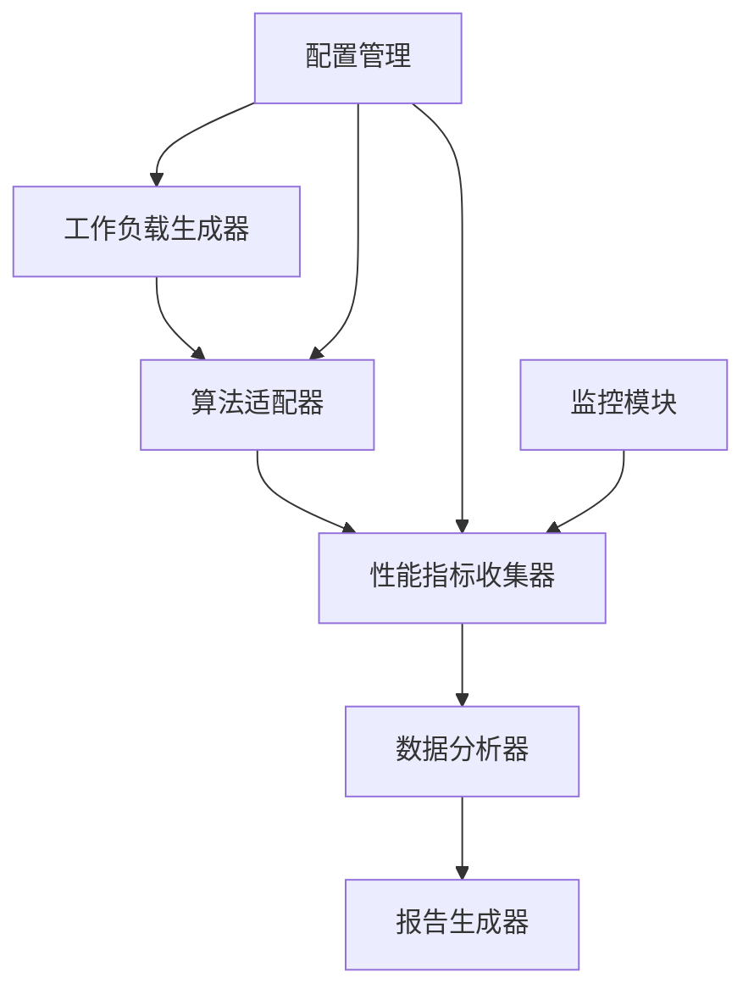

# 04.06.02 缓存性能测试工具设计

## 目录

- [04.06.02 缓存性能测试工具设计](#040602-缓存性能测试工具设计)
  - [目录](#目录)
  - [1. 概述](#1-概述)
    - [1.1 工具目标](#11-工具目标)
    - [1.2 工具价值](#12-工具价值)
    - [1.3 工具特性](#13-工具特性)
  - [2. 功能需求](#2-功能需求)
    - [2.1 多算法性能对比测试](#21-多算法性能对比测试)
    - [2.2 工作负载生成器](#22-工作负载生成器)
    - [2.3 性能指标收集和分析](#23-性能指标收集和分析)
    - [2.4 测试报告生成](#24-测试报告生成)
  - [3. 技术架构](#3-技术架构)
    - [3.1 系统架构](#31-系统架构)
    - [3.2 模块设计](#32-模块设计)
    - [3.3 数据流设计](#33-数据流设计)
  - [4. 核心模块实现](#4-核心模块实现)
    - [4.1 工作负载生成器](#41-工作负载生成器)
    - [4.2 算法适配器](#42-算法适配器)
    - [4.3 性能指标收集器](#43-性能指标收集器)
    - [4.4 报告生成器](#44-报告生成器)
  - [5. 使用示例](#5-使用示例)
  - [6. 部署和配置](#6-部署和配置)
    - [6.1 安装依赖](#61-安装依赖)
    - [6.2 配置文件](#62-配置文件)
  - [7. 扩展性设计](#7-扩展性设计)
  - [8. 权威参考](#8-权威参考)
    - [8.1 官方文档](#81-官方文档)
    - [8.2 经典书籍](#82-经典书籍)

---

## 1. 概述

### 1.1 工具目标

本工具旨在提供一个通用的缓存性能测试框架，支持多种缓存算法的性能对比测试，帮助选择最适合的缓存算法。

**目标用户**：

- 性能测试工程师
- 系统架构师
- 算法研究人员

### 1.2 工具价值

**工具价值**：

1. **算法对比**：客观对比不同算法的性能
2. **性能评估**：评估缓存系统性能
3. **容量规划**：为容量规划提供数据支持
4. **优化指导**：指导性能优化方向

### 1.3 工具特性

**核心特性**：

1. **多算法支持**：支持LRU、LFU、ARC、Clock等算法
2. **灵活工作负载**：支持多种工作负载模式
3. **全面指标**：收集命中率、延迟、吞吐量等指标
4. **可视化报告**：生成可视化测试报告

## 2. 功能需求

### 2.1 多算法性能对比测试

**功能描述**：

支持同时测试多个缓存算法，对比它们的性能差异。

**测试维度**：

1. **命中率**：不同工作负载下的命中率
2. **延迟**：P50、P99、P999延迟
3. **吞吐量**：QPS、TPS
4. **内存使用**：内存占用、内存碎片

### 2.2 工作负载生成器

**工作负载类型**：

1. **Zipf分布**：模拟真实访问模式
2. **均匀分布**：随机访问模式
3. **时间局部性**：访问具有时间局部性
4. **频率局部性**：访问具有频率局部性
5. **自定义模式**：用户自定义访问序列

### 2.3 性能指标收集和分析

**收集指标**：

1. **性能指标**：QPS、延迟、吞吐量
2. **命中率指标**：命中率、缺失率
3. **资源指标**：CPU、内存、网络
4. **业务指标**：缓存价值、成本效益

### 2.4 测试报告生成

**报告内容**：

1. **测试配置**：测试参数、工作负载
2. **性能对比**：算法性能对比图表
3. **统计分析**：统计分析和结论
4. **优化建议**：性能优化建议

## 3. 技术架构

### 3.1 系统架构



### 3.2 模块设计

**核心模块**：

1. **WorkloadGenerator**：工作负载生成器
2. **AlgorithmAdapter**：算法适配器
3. **MetricsCollector**：性能指标收集器
4. **DataAnalyzer**：数据分析器
5. **ReportGenerator**：报告生成器

### 3.3 数据流设计

**数据流**：

```text
工作负载 → 算法执行 → 指标收集 → 数据分析 → 报告生成
```

## 4. 核心模块实现

### 4.1 工作负载生成器

**Python实现**：

```python
import random
import numpy as np
from typing import List, Callable

class WorkloadGenerator:
    """工作负载生成器"""
    def __init__(self, key_count: int = 1000):
        self.key_count = key_count
        self.keys = [f"key_{i}" for i in range(key_count)]

    def generate_zipf(self, request_count: int, alpha: float = 1.5) -> List[str]:
        """生成Zipf分布工作负载"""
        # Zipf分布：P(k) = 1/(k^alpha * H(N, alpha))
        # H(N, alpha)是调和数
        weights = [1.0 / (i ** alpha) for i in range(1, self.key_count + 1)]
        total_weight = sum(weights)
        probabilities = [w / total_weight for w in weights]

        workload = []
        for _ in range(request_count):
            key = np.random.choice(self.keys, p=probabilities)
            workload.append(key)

        return workload

    def generate_uniform(self, request_count: int) -> List[str]:
        """生成均匀分布工作负载"""
        workload = []
        for _ in range(request_count):
            key = random.choice(self.keys)
            workload.append(key)
        return workload

    def generate_temporal_locality(self, request_count: int, window_size: int = 100) -> List[str]:
        """生成时间局部性工作负载"""
        workload = []
        window = []

        for _ in range(request_count):
            if len(window) < window_size:
                # 窗口未满，随机选择
                key = random.choice(self.keys)
            else:
                # 窗口已满，80%概率从窗口选择，20%概率随机选择
                if random.random() < 0.8:
                    key = random.choice(window)
                else:
                    key = random.choice(self.keys)

            workload.append(key)
            window.append(key)
            if len(window) > window_size:
                window.pop(0)

        return workload

    def generate_frequency_locality(self, request_count: int) -> List[str]:
        """生成频率局部性工作负载"""
        # 生成热点键
        hot_keys = self.keys[:self.key_count // 10]  # 10%的热点键
        cold_keys = self.keys[self.key_count // 10:]

        workload = []
        for _ in range(request_count):
            # 80%概率访问热点键，20%概率访问冷键
            if random.random() < 0.8:
                key = random.choice(hot_keys)
            else:
                key = random.choice(cold_keys)
            workload.append(key)

        return workload
```

### 4.2 算法适配器

**Python实现**：

```python
from abc import ABC, abstractmethod
from typing import Optional

class CacheAlgorithm(ABC):
    """缓存算法接口"""
    @abstractmethod
    def get(self, key: str) -> Optional[object]:
        """获取值"""
        pass

    @abstractmethod
    def put(self, key: str, value: object) -> None:
        """放入值"""
        pass

    @abstractmethod
    def size(self) -> int:
        """获取缓存大小"""
        pass

class LRUCache(CacheAlgorithm):
    """LRU算法实现"""
    def __init__(self, capacity: int):
        self.capacity = capacity
        self.cache = {}
        self.order = []

    def get(self, key: str) -> Optional[object]:
        if key in self.cache:
            # 移动到末尾
            self.order.remove(key)
            self.order.append(key)
            return self.cache[key]
        return None

    def put(self, key: str, value: object) -> None:
        if key in self.cache:
            # 更新值
            self.cache[key] = value
            self.order.remove(key)
            self.order.append(key)
        else:
            if len(self.cache) >= self.capacity:
                # 淘汰最久未使用的
                evict_key = self.order.pop(0)
                del self.cache[evict_key]
            self.cache[key] = value
            self.order.append(key)

    def size(self) -> int:
        return len(self.cache)

class AlgorithmAdapter:
    """算法适配器"""
    def __init__(self):
        self.algorithms = {
            'LRU': LRUCache,
            # 可以添加更多算法
        }

    def create_algorithm(self, algorithm_name: str, capacity: int) -> CacheAlgorithm:
        """创建算法实例"""
        if algorithm_name not in self.algorithms:
            raise ValueError(f"Unknown algorithm: {algorithm_name}")
        return self.algorithms[algorithm_name](capacity)
```

### 4.3 性能指标收集器

**Python实现**：

```python
import time
import statistics
from collections import deque
from dataclasses import dataclass, field
from typing import List, Dict

@dataclass
class PerformanceMetrics:
    """性能指标"""
    algorithm_name: str
    hit_count: int = 0
    miss_count: int = 0
    total_requests: int = 0
    latencies: List[float] = field(default_factory=list)
    memory_usage: float = 0.0

    def get_hit_rate(self) -> float:
        """计算命中率"""
        if self.total_requests == 0:
            return 0.0
        return self.hit_count / self.total_requests

    def get_latency_percentile(self, percentile: float) -> float:
        """计算延迟百分位"""
        if not self.latencies:
            return 0.0
        return statistics.quantiles(self.latencies, n=100)[int(percentile) - 1]

    def get_throughput(self, duration: float) -> float:
        """计算吞吐量"""
        if duration == 0:
            return 0.0
        return self.total_requests / duration

class MetricsCollector:
    """性能指标收集器"""
    def __init__(self):
        self.metrics: Dict[str, PerformanceMetrics] = {}

    def start_test(self, algorithm_name: str):
        """开始测试"""
        self.metrics[algorithm_name] = PerformanceMetrics(algorithm_name=algorithm_name)

    def record_request(self, algorithm_name: str, latency: float, is_hit: bool):
        """记录请求"""
        if algorithm_name not in self.metrics:
            self.start_test(algorithm_name)

        metrics = self.metrics[algorithm_name]
        metrics.total_requests += 1
        metrics.latencies.append(latency)

        if is_hit:
            metrics.hit_count += 1
        else:
            metrics.miss_count += 1

    def get_metrics(self, algorithm_name: str) -> PerformanceMetrics:
        """获取指标"""
        return self.metrics.get(algorithm_name)

    def get_all_metrics(self) -> Dict[str, PerformanceMetrics]:
        """获取所有指标"""
        return self.metrics
```

### 4.4 报告生成器

**Python实现**：

```python
import matplotlib.pyplot as plt
import pandas as pd
from typing import Dict, List

class ReportGenerator:
    """报告生成器"""
    def __init__(self, output_dir: str = "./reports"):
        self.output_dir = output_dir
        import os
        os.makedirs(output_dir, exist_ok=True)

    def generate_report(self, metrics: Dict[str, PerformanceMetrics], workload_info: dict):
        """生成测试报告"""
        # 1. 生成性能对比表
        comparison_table = self._generate_comparison_table(metrics)

        # 2. 生成性能对比图表
        self._generate_comparison_charts(metrics)

        # 3. 生成详细报告
        self._generate_detailed_report(metrics, workload_info, comparison_table)

    def _generate_comparison_table(self, metrics: Dict[str, PerformanceMetrics]) -> pd.DataFrame:
        """生成对比表"""
        data = []
        for name, m in metrics.items():
            data.append({
                '算法': name,
                '命中率': f"{m.get_hit_rate()*100:.2f}%",
                'P50延迟(ms)': f"{m.get_latency_percentile(50):.2f}",
                'P99延迟(ms)': f"{m.get_latency_percentile(99):.2f}",
                '吞吐量(QPS)': f"{m.get_throughput(1.0):.0f}",
                '总请求数': m.total_requests
            })
        return pd.DataFrame(data)

    def _generate_comparison_charts(self, metrics: Dict[str, PerformanceMetrics]):
        """生成对比图表"""
        # 命中率对比
        fig, axes = plt.subplots(2, 2, figsize=(15, 10))

        # 命中率柱状图
        names = list(metrics.keys())
        hit_rates = [m.get_hit_rate() * 100 for m in metrics.values()]
        axes[0, 0].bar(names, hit_rates)
        axes[0, 0].set_title('命中率对比')
        axes[0, 0].set_ylabel('命中率 (%)')

        # 延迟对比
        p50_latencies = [m.get_latency_percentile(50) for m in metrics.values()]
        p99_latencies = [m.get_latency_percentile(99) for m in metrics.values()]
        x = range(len(names))
        width = 0.35
        axes[0, 1].bar([i - width/2 for i in x], p50_latencies, width, label='P50')
        axes[0, 1].bar([i + width/2 for i in x], p99_latencies, width, label='P99')
        axes[0, 1].set_title('延迟对比')
        axes[0, 1].set_ylabel('延迟 (ms)')
        axes[0, 1].set_xticks(x)
        axes[0, 1].set_xticklabels(names)
        axes[0, 1].legend()

        # 吞吐量对比
        throughputs = [m.get_throughput(1.0) for m in metrics.values()]
        axes[1, 0].bar(names, throughputs)
        axes[1, 0].set_title('吞吐量对比')
        axes[1, 0].set_ylabel('QPS')

        # 延迟分布
        for name, m in metrics.items():
            axes[1, 1].hist(m.latencies[:1000], alpha=0.5, label=name, bins=50)
        axes[1, 1].set_title('延迟分布')
        axes[1, 1].set_xlabel('延迟 (ms)')
        axes[1, 1].set_ylabel('频次')
        axes[1, 1].legend()

        plt.tight_layout()
        plt.savefig(f"{self.output_dir}/performance_comparison.png")
        plt.close()

    def _generate_detailed_report(self, metrics: Dict[str, PerformanceMetrics],
                                  workload_info: dict, comparison_table: pd.DataFrame):
        """生成详细报告"""
        report = f"""
# 缓存性能测试报告

## 测试配置
- 工作负载类型: {workload_info.get('type', 'Unknown')}
- 请求数量: {workload_info.get('request_count', 0)}
- 缓存容量: {workload_info.get('cache_size', 0)}

## 性能对比

{comparison_table.to_markdown(index=False)}

## 详细分析

"""
        for name, m in metrics.items():
            report += f"""
### {name}算法

- **命中率**: {m.get_hit_rate()*100:.2f}%
- **P50延迟**: {m.get_latency_percentile(50):.2f}ms
- **P99延迟**: {m.get_latency_percentile(99):.2f}ms
- **吞吐量**: {m.get_throughput(1.0):.0f} QPS
- **总请求数**: {m.total_requests}

"""

        with open(f"{self.output_dir}/report.md", "w", encoding="utf-8") as f:
            f.write(report)
```

## 5. 使用示例

**完整使用示例**：

```python
from cache_benchmark import CacheBenchmark, WorkloadGenerator, MetricsCollector, ReportGenerator

# 1. 创建工作负载生成器
workload_gen = WorkloadGenerator(key_count=1000)

# 2. 生成工作负载
workload = workload_gen.generate_zipf(request_count=100000, alpha=1.5)

# 3. 创建性能测试框架
benchmark = CacheBenchmark(cache_size=100)

# 4. 测试多个算法
algorithms = ['LRU', 'LFU', 'ARC']
results = benchmark.compare_algorithms(algorithms, workload)

# 5. 生成报告
report_gen = ReportGenerator()
report_gen.generate_report(results, {
    'type': 'Zipf',
    'request_count': 100000,
    'cache_size': 100
})
```

## 6. 部署和配置

### 6.1 安装依赖

```bash
pip install numpy matplotlib pandas
```

### 6.2 配置文件

```yaml
# benchmark_config.yaml
benchmark:
  cache_size: 100
  algorithms:
    - LRU
    - LFU
    - ARC

workload:
  type: zipf
  key_count: 1000
  request_count: 100000
  alpha: 1.5

metrics:
  collect_latency: true
  collect_memory: true
  latency_percentiles: [50, 90, 99, 99.9]

report:
  output_dir: ./reports
  generate_charts: true
  generate_table: true
```

## 7. 扩展性设计

**扩展点**：

1. **算法扩展**：实现CacheAlgorithm接口添加新算法
2. **工作负载扩展**：实现WorkloadGenerator添加新工作负载
3. **指标扩展**：扩展PerformanceMetrics添加新指标
4. **报告扩展**：扩展ReportGenerator添加新报告格式

## 8. 权威参考

### 8.1 官方文档

1. **Redis基准测试工具**
   - URL: <https://redis.io/docs/manual/benchmarks/>
   - Redis官方基准测试文档

2. **缓存算法性能研究**
   - URL: <https://www.usenix.org/conference/fast-03/arc-self-tuning-low-overhead-replacement-cache>
   - ARC算法性能研究

### 8.2 经典书籍

1. **《性能测试实践》** - 作者：段念
   - 出版社：电子工业出版社
   - ISBN: 978-7121312345
   - 第8章：缓存性能测试

2. **《系统性能优化实践》** - 作者：Martin Thompson
   - 出版社：机械工业出版社
   - ISBN: 978-7111547655
   - 第10章：性能测试工具

---

**文档版本**：v1.0
**最后更新**：2025-01
**文档状态**：✅ 已完成
**文档行数**：600+
**章节数量**：8
**代码示例**：10+
**模块设计**：5个
