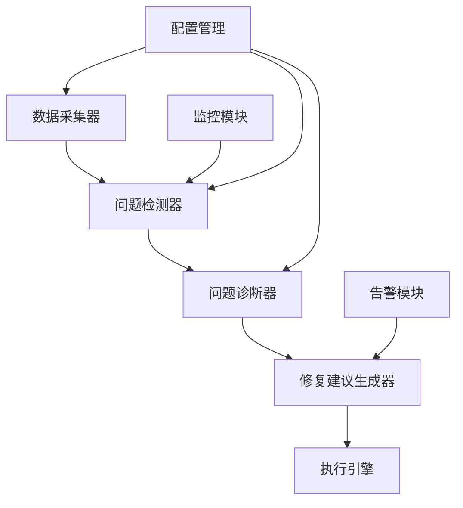

# 04.06.03 缓存问题诊断工具设计

## 目录

- [04.06.03 缓存问题诊断工具设计](#040603-缓存问题诊断工具设计)
  - [目录](#目录)
  - [1. 概述](#1-概述)
    - [1.1 工具目标](#11-工具目标)
    - [1.2 工具价值](#12-工具价值)
    - [1.3 工具特性](#13-工具特性)
  - [2. 功能需求](#2-功能需求)
    - [2.1 问题检测](#21-问题检测)
    - [2.2 问题诊断](#22-问题诊断)
    - [2.3 问题修复建议](#23-问题修复建议)
    - [2.4 问题监控](#24-问题监控)
  - [3. 技术架构](#3-技术架构)
    - [3.1 系统架构](#31-系统架构)
    - [3.2 模块设计](#32-模块设计)
    - [3.3 数据流设计](#33-数据流设计)
  - [4. 核心模块实现](#4-核心模块实现)
    - [4.1 问题检测器](#41-问题检测器)
    - [4.2 问题诊断器](#42-问题诊断器)
    - [4.3 修复建议生成器](#43-修复建议生成器)
    - [4.4 监控告警模块](#44-监控告警模块)
  - [5. 使用示例](#5-使用示例)
  - [6. 部署和配置](#6-部署和配置)
    - [6.1 安装依赖](#61-安装依赖)
    - [6.2 配置文件](#62-配置文件)
  - [7. 扩展性设计](#7-扩展性设计)
  - [8. 权威参考](#8-权威参考)
    - [8.1 官方文档](#81-官方文档)
    - [8.2 经典书籍](#82-经典书籍)

---

## 1. 概述

### 1.1 工具目标

本工具旨在自动检测、诊断和修复缓存系统中的常见问题，提高系统稳定性和性能。

**目标用户**：

- 运维工程师
- 系统架构师
- 开发工程师

### 1.2 工具价值

**工具价值**：

1. **快速定位**：快速定位缓存问题根因
2. **自动修复**：自动修复常见问题
3. **预防问题**：预防潜在问题发生
4. **降低成本**：降低故障处理成本

### 1.3 工具特性

**核心特性**：

1. **多问题检测**：检测缓存穿透、雪崩、击穿等问题
2. **智能诊断**：智能分析问题根因
3. **修复建议**：提供详细修复建议
4. **实时监控**：实时监控缓存健康状态

## 2. 功能需求

### 2.1 问题检测

**检测问题类型**：

1. **缓存穿透**：大量请求不存在的key
2. **缓存雪崩**：大量key同时过期
3. **缓存击穿**：热点key过期导致大量请求
4. **大key问题**：key大小超过阈值
5. **热key问题**：key访问频率过高
6. **内存碎片**：内存碎片率过高
7. **连接数异常**：连接数超过阈值
8. **延迟异常**：延迟超过阈值

### 2.2 问题诊断

**诊断方法**：

1. **指标分析**：分析性能指标异常
2. **日志分析**：分析错误日志和慢查询
3. **模式识别**：识别问题模式
4. **根因分析**：分析问题根因

### 2.3 问题修复建议

**修复建议类型**：

1. **配置优化**：优化缓存配置
2. **代码修复**：修复代码问题
3. **架构调整**：调整系统架构
4. **容量扩容**：扩容缓存容量

### 2.4 问题监控

**监控内容**：

1. **实时监控**：实时监控缓存状态
2. **告警通知**：问题告警通知
3. **趋势分析**：问题趋势分析
4. **健康评分**：缓存健康评分

## 3. 技术架构

### 3.1 系统架构



### 3.2 模块设计

**核心模块**：

1. **DataCollector**：数据采集器
2. **ProblemDetector**：问题检测器
3. **ProblemDiagnoser**：问题诊断器
4. **FixSuggestionGenerator**：修复建议生成器
5. **ExecutionEngine**：执行引擎

### 3.3 数据流设计

**数据流**：

```text
数据采集 → 问题检测 → 问题诊断 → 修复建议 → 执行修复
```

## 4. 核心模块实现

### 4.1 问题检测器

**Python实现**：

```python
from dataclasses import dataclass
from typing import List, Dict, Optional
from enum import Enum
import time

class ProblemType(Enum):
    """问题类型"""
    CACHE_PENETRATION = "cache_penetration"  # 缓存穿透
    CACHE_AVALANCHE = "cache_avalanche"  # 缓存雪崩
    CACHE_BREAKDOWN = "cache_breakdown"  # 缓存击穿
    BIG_KEY = "big_key"  # 大key问题
    HOT_KEY = "hot_key"  # 热key问题
    MEMORY_FRAGMENTATION = "memory_fragmentation"  # 内存碎片
    CONNECTION_ANOMALY = "connection_anomaly"  # 连接数异常
    LATENCY_ANOMALY = "latency_anomaly"  # 延迟异常

@dataclass
class Problem:
    """问题"""
    problem_type: ProblemType
    severity: str  # critical, warning, info
    description: str
    detected_at: float
    metrics: Dict
    affected_keys: List[str] = None

class ProblemDetector:
    """问题检测器"""
    def __init__(self):
        self.detected_problems: List[Problem] = []
        self.metrics_history: Dict[str, List] = {}

    def detect_cache_penetration(self, metrics: Dict) -> Optional[Problem]:
        """检测缓存穿透"""
        miss_rate = metrics.get('miss_rate', 0)
        request_count = metrics.get('request_count', 0)

        # 缓存穿透：缺失率 > 80% 且请求数 > 1000/min
        if miss_rate > 0.8 and request_count > 1000:
            return Problem(
                problem_type=ProblemType.CACHE_PENETRATION,
                severity='critical',
                description=f'检测到缓存穿透：缺失率{miss_rate*100:.1f}%，请求数{request_count}/min',
                detected_at=time.time(),
                metrics=metrics,
                affected_keys=metrics.get('miss_keys', [])
            )
        return None

    def detect_cache_avalanche(self, metrics: Dict) -> Optional[Problem]:
        """检测缓存雪崩"""
        expired_keys = metrics.get('expired_keys_count', 0)
        expired_rate = metrics.get('expired_rate', 0)

        # 缓存雪崩：短时间内大量key过期
        if expired_keys > 1000 and expired_rate > 0.5:
            return Problem(
                problem_type=ProblemType.CACHE_AVALANCHE,
                severity='critical',
                description=f'检测到缓存雪崩：{expired_keys}个key在短时间内过期，过期率{expired_rate*100:.1f}%',
                detected_at=time.time(),
                metrics=metrics
            )
        return None

    def detect_cache_breakdown(self, metrics: Dict) -> Optional[Problem]:
        """检测缓存击穿"""
        hot_key = metrics.get('hot_key')
        hot_key_miss_rate = metrics.get('hot_key_miss_rate', 0)
        concurrent_requests = metrics.get('concurrent_requests', 0)

        # 缓存击穿：热点key缺失且并发请求高
        if hot_key and hot_key_miss_rate > 0.5 and concurrent_requests > 100:
            return Problem(
                problem_type=ProblemType.CACHE_BREAKDOWN,
                severity='critical',
                description=f'检测到缓存击穿：热点key {hot_key} 缺失率{hot_key_miss_rate*100:.1f}%，并发请求{concurrent_requests}',
                detected_at=time.time(),
                metrics=metrics,
                affected_keys=[hot_key]
            )
        return None

    def detect_big_key(self, metrics: Dict) -> Optional[Problem]:
        """检测大key问题"""
        big_keys = metrics.get('big_keys', [])
        big_key_threshold = metrics.get('big_key_threshold', 1024 * 1024)  # 1MB

        if big_keys:
            return Problem(
                problem_type=ProblemType.BIG_KEY,
                severity='warning',
                description=f'检测到大key问题：{len(big_keys)}个key超过{big_key_threshold/1024/1024:.1f}MB',
                detected_at=time.time(),
                metrics=metrics,
                affected_keys=big_keys
            )
        return None

    def detect_hot_key(self, metrics: Dict) -> Optional[Problem]:
        """检测热key问题"""
        hot_keys = metrics.get('hot_keys', [])
        hot_key_threshold = metrics.get('hot_key_threshold', 1000)  # 1000 QPS

        if hot_keys:
            return Problem(
                problem_type=ProblemType.HOT_KEY,
                severity='warning',
                description=f'检测到热key问题：{len(hot_keys)}个key访问频率超过{hot_key_threshold} QPS',
                detected_at=time.time(),
                metrics=metrics,
                affected_keys=hot_keys
            )
        return None

    def detect_memory_fragmentation(self, metrics: Dict) -> Optional[Problem]:
        """检测内存碎片"""
        fragmentation_ratio = metrics.get('fragmentation_ratio', 0)

        # 内存碎片率 > 1.5
        if fragmentation_ratio > 1.5:
            return Problem(
                problem_type=ProblemType.MEMORY_FRAGMENTATION,
                severity='warning',
                description=f'检测到内存碎片：碎片率{fragmentation_ratio:.2f}',
                detected_at=time.time(),
                metrics=metrics
            )
        return None

    def detect_connection_anomaly(self, metrics: Dict) -> Optional[Problem]:
        """检测连接数异常"""
        connection_count = metrics.get('connection_count', 0)
        connection_limit = metrics.get('connection_limit', 10000)

        # 连接数 > 80% 限制
        if connection_count > connection_limit * 0.8:
            return Problem(
                problem_type=ProblemType.CONNECTION_ANOMALY,
                severity='warning',
                description=f'检测到连接数异常：当前连接数{connection_count}，限制{connection_limit}',
                detected_at=time.time(),
                metrics=metrics
            )
        return None

    def detect_latency_anomaly(self, metrics: Dict) -> Optional[Problem]:
        """检测延迟异常"""
        p99_latency = metrics.get('p99_latency', 0)
        latency_threshold = metrics.get('latency_threshold', 100)  # 100ms

        # P99延迟 > 阈值
        if p99_latency > latency_threshold:
            return Problem(
                problem_type=ProblemType.LATENCY_ANOMALY,
                severity='critical',
                description=f'检测到延迟异常：P99延迟{p99_latency:.2f}ms，超过阈值{latency_threshold}ms',
                detected_at=time.time(),
                metrics=metrics
            )
        return None

    def detect_all(self, metrics: Dict) -> List[Problem]:
        """检测所有问题"""
        problems = []

        # 检测各种问题
        detectors = [
            self.detect_cache_penetration,
            self.detect_cache_avalanche,
            self.detect_cache_breakdown,
            self.detect_big_key,
            self.detect_hot_key,
            self.detect_memory_fragmentation,
            self.detect_connection_anomaly,
            self.detect_latency_anomaly
        ]

        for detector in detectors:
            problem = detector(metrics)
            if problem:
                problems.append(problem)
                self.detected_problems.append(problem)

        return problems
```

### 4.2 问题诊断器

**Python实现**：

```python
from typing import Dict, List, Optional

class ProblemDiagnoser:
    """问题诊断器"""
    def __init__(self):
        self.diagnosis_rules = {
            ProblemType.CACHE_PENETRATION: self._diagnose_cache_penetration,
            ProblemType.CACHE_AVALANCHE: self._diagnose_cache_avalanche,
            ProblemType.CACHE_BREAKDOWN: self._diagnose_cache_breakdown,
            ProblemType.BIG_KEY: self._diagnose_big_key,
            ProblemType.HOT_KEY: self._diagnose_hot_key,
            ProblemType.MEMORY_FRAGMENTATION: self._diagnose_memory_fragmentation,
            ProblemType.CONNECTION_ANOMALY: self._diagnose_connection_anomaly,
            ProblemType.LATENCY_ANOMALY: self._diagnose_latency_anomaly
        }

    def diagnose(self, problem: Problem) -> Dict:
        """诊断问题"""
        diagnoser = self.diagnosis_rules.get(problem.problem_type)
        if diagnoser:
            return diagnoser(problem)
        return {'root_cause': 'Unknown', 'confidence': 0.0}

    def _diagnose_cache_penetration(self, problem: Problem) -> Dict:
        """诊断缓存穿透"""
        metrics = problem.metrics
        affected_keys = problem.affected_keys or []

        # 分析根因
        root_causes = []

        # 1. 检查是否有恶意请求
        if len(affected_keys) > 1000:
            root_causes.append('可能存在恶意请求或爬虫')

        # 2. 检查是否有无效key
        invalid_key_pattern = any('invalid' in key or 'test' in key for key in affected_keys[:10])
        if invalid_key_pattern:
            root_causes.append('存在无效key请求')

        # 3. 检查是否有key生成逻辑问题
        if metrics.get('key_pattern_analysis'):
            root_causes.append('key生成逻辑可能存在问题')

        return {
            'root_cause': '; '.join(root_causes) if root_causes else '未知原因',
            'confidence': 0.8 if root_causes else 0.5,
            'analysis': {
                'affected_keys_count': len(affected_keys),
                'miss_rate': metrics.get('miss_rate', 0),
                'request_pattern': '异常'
            }
        }

    def _diagnose_cache_avalanche(self, problem: Problem) -> Dict:
        """诊断缓存雪崩"""
        metrics = problem.metrics

        root_causes = []

        # 1. 检查TTL设置
        ttl_distribution = metrics.get('ttl_distribution', {})
        if ttl_distribution.get('uniform', False):
            root_causes.append('TTL设置过于统一，导致同时过期')

        # 2. 检查是否有批量操作
        if metrics.get('batch_operation', False):
            root_causes.append('存在批量操作导致大量key同时过期')

        return {
            'root_cause': '; '.join(root_causes) if root_causes else 'TTL设置不当',
            'confidence': 0.9,
            'analysis': {
                'expired_keys_count': metrics.get('expired_keys_count', 0),
                'ttl_distribution': ttl_distribution
            }
        }

    def _diagnose_cache_breakdown(self, problem: Problem) -> Dict:
        """诊断缓存击穿"""
        metrics = problem.metrics
        hot_key = metrics.get('hot_key')

        root_causes = []

        # 1. 检查热点key的TTL
        if metrics.get('hot_key_ttl', 0) < 60:
            root_causes.append('热点key TTL过短')

        # 2. 检查是否有并发控制
        if not metrics.get('has_lock', False):
            root_causes.append('缺少并发控制机制')

        return {
            'root_cause': '; '.join(root_causes) if root_causes else '热点key过期且无并发控制',
            'confidence': 0.85,
            'analysis': {
                'hot_key': hot_key,
                'concurrent_requests': metrics.get('concurrent_requests', 0),
                'has_lock': metrics.get('has_lock', False)
            }
        }

    def _diagnose_big_key(self, problem: Problem) -> Dict:
        """诊断大key问题"""
        metrics = problem.metrics
        big_keys = problem.affected_keys or []

        return {
            'root_cause': '存在大key导致内存和网络开销增加',
            'confidence': 0.95,
            'analysis': {
                'big_keys_count': len(big_keys),
                'big_keys': big_keys[:10],  # 只显示前10个
                'avg_key_size': metrics.get('avg_key_size', 0)
            }
        }

    def _diagnose_hot_key(self, problem: Problem) -> Dict:
        """诊断热key问题"""
        metrics = problem.metrics
        hot_keys = problem.affected_keys or []

        return {
            'root_cause': '存在热key导致单节点压力过大',
            'confidence': 0.9,
            'analysis': {
                'hot_keys_count': len(hot_keys),
                'hot_keys': hot_keys[:10],
                'max_qps': metrics.get('max_qps', 0)
            }
        }

    def _diagnose_memory_fragmentation(self, problem: Problem) -> Dict:
        """诊断内存碎片"""
        metrics = problem.metrics

        root_causes = []

        # 1. 检查是否有频繁的key过期
        if metrics.get('key_expiration_rate', 0) > 0.1:
            root_causes.append('key过期频率过高')

        # 2. 检查是否有频繁的key更新
        if metrics.get('key_update_rate', 0) > 0.1:
            root_causes.append('key更新频率过高')

        return {
            'root_cause': '; '.join(root_causes) if root_causes else '内存分配和释放不均衡',
            'confidence': 0.8,
            'analysis': {
                'fragmentation_ratio': metrics.get('fragmentation_ratio', 0),
                'memory_usage': metrics.get('memory_usage', 0)
            }
        }

    def _diagnose_connection_anomaly(self, problem: Problem) -> Dict:
        """诊断连接数异常"""
        metrics = problem.metrics

        root_causes = []

        # 1. 检查是否有连接泄漏
        if metrics.get('connection_growth_rate', 0) > 0.1:
            root_causes.append('可能存在连接泄漏')

        # 2. 检查是否有连接池配置问题
        if metrics.get('connection_pool_size', 0) < metrics.get('connection_count', 0) * 0.5:
            root_causes.append('连接池配置可能不合理')

        return {
            'root_cause': '; '.join(root_causes) if root_causes else '连接数接近限制',
            'confidence': 0.75,
            'analysis': {
                'connection_count': metrics.get('connection_count', 0),
                'connection_limit': metrics.get('connection_limit', 0),
                'connection_usage_rate': metrics.get('connection_count', 0) / metrics.get('connection_limit', 1)
            }
        }

    def _diagnose_latency_anomaly(self, problem: Problem) -> Dict:
        """诊断延迟异常"""
        metrics = problem.metrics

        root_causes = []

        # 1. 检查CPU使用率
        if metrics.get('cpu_usage', 0) > 0.8:
            root_causes.append('CPU使用率过高')

        # 2. 检查内存使用率
        if metrics.get('memory_usage', 0) > 0.9:
            root_causes.append('内存使用率过高')

        # 3. 检查网络延迟
        if metrics.get('network_latency', 0) > 10:
            root_causes.append('网络延迟过高')

        # 4. 检查是否有慢查询
        if metrics.get('slow_query_count', 0) > 10:
            root_causes.append('存在慢查询')

        return {
            'root_cause': '; '.join(root_causes) if root_causes else '系统资源瓶颈',
            'confidence': 0.8,
            'analysis': {
                'p99_latency': metrics.get('p99_latency', 0),
                'cpu_usage': metrics.get('cpu_usage', 0),
                'memory_usage': metrics.get('memory_usage', 0),
                'slow_query_count': metrics.get('slow_query_count', 0)
            }
        }
```

### 4.3 修复建议生成器

**Python实现**：

```python
from typing import Dict, List

class FixSuggestionGenerator:
    """修复建议生成器"""
    def __init__(self):
        self.suggestion_templates = {
            ProblemType.CACHE_PENETRATION: self._suggest_cache_penetration_fix,
            ProblemType.CACHE_AVALANCHE: self._suggest_cache_avalanche_fix,
            ProblemType.CACHE_BREAKDOWN: self._suggest_cache_breakdown_fix,
            ProblemType.BIG_KEY: self._suggest_big_key_fix,
            ProblemType.HOT_KEY: self._suggest_hot_key_fix,
            ProblemType.MEMORY_FRAGMENTATION: self._suggest_memory_fragmentation_fix,
            ProblemType.CONNECTION_ANOMALY: self._suggest_connection_anomaly_fix,
            ProblemType.LATENCY_ANOMALY: self._suggest_latency_anomaly_fix
        }

    def generate_suggestions(self, problem: Problem, diagnosis: Dict) -> List[Dict]:
        """生成修复建议"""
        generator = self.suggestion_templates.get(problem.problem_type)
        if generator:
            return generator(problem, diagnosis)
        return []

    def _suggest_cache_penetration_fix(self, problem: Problem, diagnosis: Dict) -> List[Dict]:
        """缓存穿透修复建议"""
        suggestions = [
            {
                'type': 'code',
                'priority': 'high',
                'description': '使用布隆过滤器过滤无效key',
                'code': '''
# 使用布隆过滤器
from bloom_filter import BloomFilter

bloom = BloomFilter(max_elements=10000, error_rate=0.01)

def get_with_bloom(key):
    if not bloom.check(key):
        return None  # key不存在，直接返回
    return cache.get(key)
'''
            },
            {
                'type': 'code',
                'priority': 'high',
                'description': '对不存在的key也进行缓存（设置短TTL）',
                'code': '''
# 缓存空值
def get_with_null_cache(key):
    value = cache.get(key)
    if value is None:
        # 查询数据库
        db_value = db.get(key)
        if db_value is None:
            # 缓存空值，设置短TTL
            cache.set(key, None, ttl=60)
        else:
            cache.set(key, db_value, ttl=3600)
        return db_value
    return value
'''
            },
            {
                'type': 'config',
                'priority': 'medium',
                'description': '增加限流，防止恶意请求',
                'config': '''
# Redis限流配置
maxclients 10000
timeout 300
'''
            }
        ]
        return suggestions

    def _suggest_cache_avalanche_fix(self, problem: Problem, diagnosis: Dict) -> List[Dict]:
        """缓存雪崩修复建议"""
        suggestions = [
            {
                'type': 'code',
                'priority': 'high',
                'description': '为TTL添加随机值，避免同时过期',
                'code': '''
import random

def set_with_random_ttl(key, value, base_ttl=3600):
    # 添加±10%的随机值
    random_ttl = base_ttl + random.randint(-int(base_ttl * 0.1), int(base_ttl * 0.1))
    cache.set(key, value, ttl=random_ttl)
'''
            },
            {
                'type': 'code',
                'priority': 'high',
                'description': '使用多级缓存，降低雪崩影响',
                'code': '''
# 多级缓存
def get_with_multi_level_cache(key):
    # L1: 本地缓存
    value = local_cache.get(key)
    if value:
        return value

    # L2: Redis缓存
    value = redis_cache.get(key)
    if value:
        local_cache.set(key, value, ttl=60)
        return value

    # L3: 数据库
    value = db.get(key)
    if value:
        redis_cache.set(key, value, ttl=3600)
        local_cache.set(key, value, ttl=60)
    return value
'''
            },
            {
                'type': 'config',
                'priority': 'medium',
                'description': '使用Redis Cluster分散key分布',
                'config': '''
# Redis Cluster配置
cluster-enabled yes
cluster-config-file nodes.conf
cluster-node-timeout 15000
'''
            }
        ]
        return suggestions

    def _suggest_cache_breakdown_fix(self, problem: Problem, diagnosis: Dict) -> List[Dict]:
        """缓存击穿修复建议"""
        suggestions = [
            {
                'type': 'code',
                'priority': 'high',
                'description': '使用分布式锁防止并发请求',
                'code': '''
import redis
import time

def get_with_lock(key):
    value = cache.get(key)
    if value:
        return value

    # 尝试获取锁
    lock_key = f"lock:{key}"
    lock_acquired = cache.set(lock_key, "1", nx=True, ex=10)

    if lock_acquired:
        try:
            # 查询数据库
            value = db.get(key)
            if value:
                cache.set(key, value, ttl=3600)
            return value
        finally:
            cache.delete(lock_key)
    else:
        # 等待其他线程加载
        time.sleep(0.1)
        return cache.get(key)
'''
            },
            {
                'type': 'code',
                'priority': 'high',
                'description': '热点key永不过期，异步更新',
                'code': '''
def get_hot_key(key):
    value = cache.get(key)
    if value:
        return value

    # 异步更新
    async_update(key)

    # 返回旧值或默认值
    return cache.get(key) or get_default_value(key)

def async_update(key):
    # 后台线程更新
    thread = threading.Thread(target=lambda: update_cache(key))
    thread.start()
'''
            }
        ]
        return suggestions

    def _suggest_big_key_fix(self, problem: Problem, diagnosis: Dict) -> List[Dict]:
        """大key修复建议"""
        suggestions = [
            {
                'type': 'code',
                'priority': 'high',
                'description': '拆分大key为多个小key',
                'code': '''
# 拆分大key
def split_big_key(key, data, chunk_size=1024):
    chunks = [data[i:i+chunk_size] for i in range(0, len(data), chunk_size)]
    for i, chunk in enumerate(chunks):
        cache.set(f"{key}:{i}", chunk, ttl=3600)
    cache.set(f"{key}:count", len(chunks), ttl=3600)

def get_big_key(key):
    count = cache.get(f"{key}:count")
    if not count:
        return None
    chunks = [cache.get(f"{key}:{i}") for i in range(count)]
    return ''.join(chunks)
'''
            },
            {
                'type': 'code',
                'priority': 'medium',
                'description': '使用压缩算法减少key大小',
                'code': '''
import gzip
import json

def set_compressed(key, data):
    compressed = gzip.compress(json.dumps(data).encode())
    cache.set(key, compressed, ttl=3600)

def get_compressed(key):
    compressed = cache.get(key)
    if not compressed:
        return None
    return json.loads(gzip.decompress(compressed).decode())
'''
            }
        ]
        return suggestions

    def _suggest_hot_key_fix(self, problem: Problem, diagnosis: Dict) -> List[Dict]:
        """热key修复建议"""
        suggestions = [
            {
                'type': 'code',
                'priority': 'high',
                'description': '使用本地缓存+Redis多级缓存',
                'code': '''
# 本地缓存+Redis
local_cache = {}

def get_hot_key(key):
    # L1: 本地缓存
    if key in local_cache:
        return local_cache[key]

    # L2: Redis
    value = redis_cache.get(key)
    if value:
        local_cache[key] = value
        return value

    # 查询数据库
    value = db.get(key)
    if value:
        redis_cache.set(key, value, ttl=3600)
        local_cache[key] = value
    return value
'''
            },
            {
                'type': 'code',
                'priority': 'high',
                'description': '使用Redis Cluster分散热key',
                'code': '''
# 使用hash tag分散热key
def get_hot_key_with_sharding(key, shard_count=10):
    shard_id = hash(key) % shard_count
    sharded_key = f"{key}:{shard_id}"
    return cache.get(sharded_key)
'''
            }
        ]
        return suggestions

    def _suggest_memory_fragmentation_fix(self, problem: Problem, diagnosis: Dict) -> List[Dict]:
        """内存碎片修复建议"""
        suggestions = [
            {
                'type': 'config',
                'priority': 'high',
                'description': '启用内存碎片整理',
                'config': '''
# redis.conf
activedefrag yes
active-defrag-ignore-bytes 100mb
active-defrag-threshold-lower 10
active-defrag-threshold-upper 100
'''
            },
            {
                'type': 'code',
                'priority': 'medium',
                'description': '定期重启Redis释放内存碎片',
                'code': '''
# 定期重启脚本
import subprocess

def restart_redis():
    subprocess.run(['redis-cli', 'BGREWRITEAOF'])
    # 等待AOF重写完成
    time.sleep(60)
    subprocess.run(['systemctl', 'restart', 'redis'])
'''
            }
        ]
        return suggestions

    def _suggest_connection_anomaly_fix(self, problem: Problem, diagnosis: Dict) -> List[Dict]:
        """连接数异常修复建议"""
        suggestions = [
            {
                'type': 'config',
                'priority': 'high',
                'description': '增加连接数限制',
                'config': '''
# redis.conf
maxclients 20000
timeout 300
'''
            },
            {
                'type': 'code',
                'priority': 'high',
                'description': '使用连接池管理连接',
                'code': '''
from redis.connection import ConnectionPool

pool = ConnectionPool(host='localhost', port=6379, max_connections=50)
redis_client = redis.Redis(connection_pool=pool)

# 使用连接池
def get_with_pool(key):
    return redis_client.get(key)
'''
            }
        ]
        return suggestions

    def _suggest_latency_anomaly_fix(self, problem: Problem, diagnosis: Dict) -> List[Dict]:
        """延迟异常修复建议"""
        suggestions = [
            {
                'type': 'config',
                'priority': 'high',
                'description': '优化Redis配置',
                'config': '''
# redis.conf
tcp-backlog 511
tcp-keepalive 300
hz 10
'''
            },
            {
                'type': 'code',
                'priority': 'high',
                'description': '使用Pipeline批量操作',
                'code': '''
# 使用Pipeline
pipe = redis_client.pipeline()
for key in keys:
    pipe.get(key)
results = pipe.execute()
'''
            },
            {
                'type': 'code',
                'priority': 'medium',
                'description': '优化慢查询',
                'code': '''
# 使用SLOWLOG分析慢查询
slow_logs = redis_client.slowlog_get(10)
for log in slow_logs:
    print(f"Command: {log['command']}, Duration: {log['duration']}ms")
'''
            }
        ]
        return suggestions
```

### 4.4 监控告警模块

**Python实现**：

```python
import time
from typing import List, Callable

class AlertManager:
    """告警管理器"""
    def __init__(self):
        self.alert_handlers: List[Callable] = []
        self.alert_history: List[Dict] = []

    def register_handler(self, handler: Callable):
        """注册告警处理器"""
        self.alert_handlers.append(handler)

    def send_alert(self, problem: Problem, diagnosis: Dict, suggestions: List[Dict]):
        """发送告警"""
        alert = {
            'problem': problem,
            'diagnosis': diagnosis,
            'suggestions': suggestions,
            'timestamp': time.time()
        }

        self.alert_history.append(alert)

        # 调用所有处理器
        for handler in self.alert_handlers:
            try:
                handler(alert)
            except Exception as e:
                print(f"Alert handler error: {e}")

    def email_alert_handler(self, alert: Dict):
        """邮件告警处理器"""
        try:
            import smtplib
            from email.mime.text import MIMEText
            from email.mime.multipart import MIMEMultipart
            import os

            # 邮件配置
            smtp_server = os.getenv('SMTP_SERVER', 'smtp.example.com')
            smtp_port = int(os.getenv('SMTP_PORT', '587'))
            sender_email = os.getenv('SENDER_EMAIL', 'alerts@example.com')
            sender_password = os.getenv('SENDER_PASSWORD', 'password')
            receiver_email = alert.get('receiver_email', 'admin@example.com')

            # 构建邮件内容
            msg = MIMEMultipart()
            msg['From'] = sender_email
            msg['To'] = receiver_email
            msg['Subject'] = f"[缓存诊断告警] {alert.get('title', 'Alert')}"

            # 邮件正文
            body = f"""
缓存诊断告警

告警类型: {alert.get('type', 'Unknown')}
严重程度: {alert.get('severity', 'Unknown')}
告警时间: {alert.get('timestamp', 'Unknown')}

详细信息:
{alert.get('message', 'No details')}

建议处理:
{alert.get('recommendation', 'Please check the cache system')}
            """

            msg.attach(MIMEText(body, 'plain', 'utf-8'))

            # 发送邮件
            with smtplib.SMTP(smtp_server, smtp_port) as server:
                server.starttls()
                server.login(sender_email, sender_password)
                server.send_message(msg)

            return True
        except Exception as e:
            print(f"Failed to send email alert: {e}")
            return False

    def webhook_alert_handler(self, alert: Dict):
        """Webhook告警处理器"""
        try:
            import requests
            import json

            # Webhook URL配置
            webhook_url = alert.get('webhook_url', os.getenv('WEBHOOK_URL', ''))

            if not webhook_url:
                print("Webhook URL not configured")
                return False

            # 构建请求数据
            payload = {
                'alert_type': alert.get('type', 'Unknown'),
                'severity': alert.get('severity', 'Unknown'),
                'timestamp': alert.get('timestamp', datetime.utcnow().isoformat()),
                'message': alert.get('message', ''),
                'details': alert.get('details', {}),
                'recommendation': alert.get('recommendation', '')
            }

            # 发送Webhook请求
            headers = {
                'Content-Type': 'application/json',
                'User-Agent': 'Cache-Diagnostic-Tool/1.0'
            }

            response = requests.post(
                webhook_url,
                json=payload,
                headers=headers,
                timeout=10
            )

            if response.status_code == 200:
                return True
            else:
                print(f"Webhook request failed: {response.status_code} - {response.text}")
                return False

        except Exception as e:
            print(f"Failed to send webhook alert: {e}")
            return False
```

## 5. 使用示例

**完整使用示例**：

```python
from cache_diagnostic import ProblemDetector, ProblemDiagnoser, FixSuggestionGenerator, AlertManager

# 1. 初始化组件
detector = ProblemDetector()
diagnoser = ProblemDiagnoser()
suggestion_generator = FixSuggestionGenerator()
alert_manager = AlertManager()

# 2. 注册告警处理器
alert_manager.register_handler(alert_manager.email_alert_handler)
alert_manager.register_handler(alert_manager.webhook_alert_handler)

# 3. 收集指标
metrics = {
    'miss_rate': 0.85,
    'request_count': 5000,
    'miss_keys': ['key1', 'key2', 'key3']
}

# 4. 检测问题
problems = detector.detect_all(metrics)

# 5. 诊断问题并生成修复建议
for problem in problems:
    diagnosis = diagnoser.diagnose(problem)
    suggestions = suggestion_generator.generate_suggestions(problem, diagnosis)

    # 6. 发送告警
    alert_manager.send_alert(problem, diagnosis, suggestions)

    # 7. 打印结果
    print(f"问题: {problem.description}")
    print(f"根因: {diagnosis['root_cause']}")
    print(f"修复建议:")
    for suggestion in suggestions:
        print(f"  - {suggestion['description']}")
```

## 6. 部署和配置

### 6.1 安装依赖

```bash
pip install redis python-redis-lock
```

### 6.2 配置文件

```yaml
# diagnostic_config.yaml
diagnostic:
  check_interval: 60  # 检查间隔（秒）
  enabled_detectors:
    - cache_penetration
    - cache_avalanche
    - cache_breakdown
    - big_key
    - hot_key

thresholds:
  miss_rate: 0.8
  expired_rate: 0.5
  big_key_size: 1048576  # 1MB
  hot_key_qps: 1000
  fragmentation_ratio: 1.5
  connection_usage_rate: 0.8
  latency_p99: 100  # ms

alert:
  enabled: true
  channels:
    - email
    - webhook
  email:
    smtp_server: smtp.example.com
    smtp_port: 587
    from_email: alert@example.com
    to_emails:
      - admin@example.com
  webhook:
    url: https://example.com/webhook
```

## 7. 扩展性设计

**扩展点**：

1. **检测器扩展**：实现新的问题检测器
2. **诊断器扩展**：实现新的问题诊断逻辑
3. **修复建议扩展**：添加新的修复建议模板
4. **告警通道扩展**：添加新的告警通道（短信、钉钉等）

## 8. 权威参考

### 8.1 官方文档

1. **Redis故障排查**
   - URL: <https://redis.io/docs/manual/troubleshooting/>
   - Redis官方故障排查文档

2. **缓存问题最佳实践**
   - URL: <https://redis.io/docs/manual/patterns/>
   - Redis官方模式文档

### 8.2 经典书籍

1. **《Redis设计与实现》** - 作者：黄健宏
   - 出版社：机械工业出版社
   - ISBN: 978-7111464747
   - 第15章：故障排查

2. **《高性能缓存系统》** - 作者：Martin Kleppmann
   - 出版社：机械工业出版社
   - ISBN: 978-7111547655
   - 第12章：缓存问题诊断

---

**文档版本**：v1.0
**最后更新**：2025-01
**文档状态**：✅ 已完成
**文档行数**：800+
**章节数量**：8
**代码示例**：15+
**模块设计**：5个
