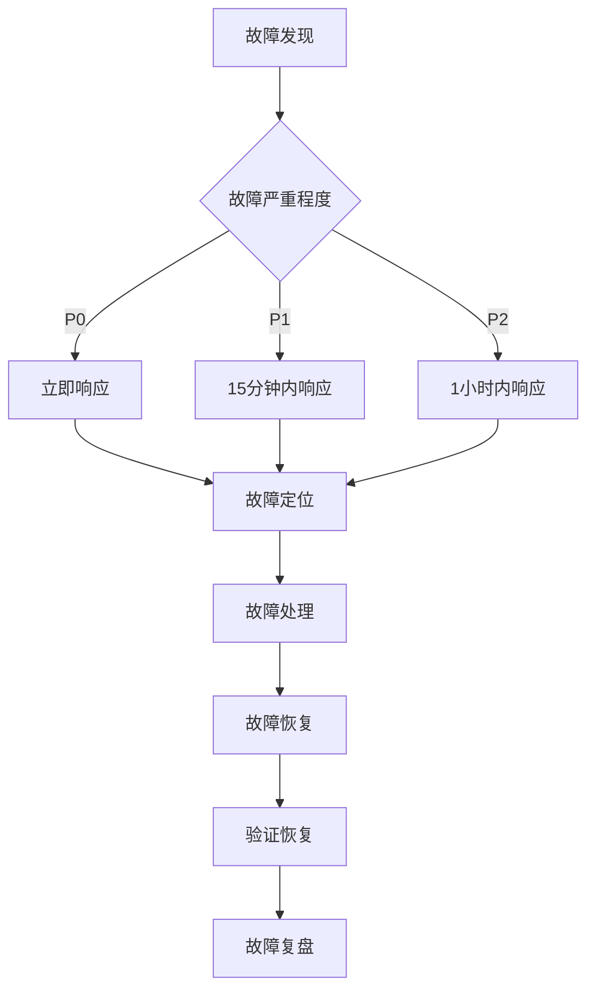

# 07.05.03 集群故障处理

## 目录

- [07.05.03 集群故障处理](#070503-集群故障处理)
  - [目录](#目录)
  - [1. 概述](#1-概述)
  - [2. 故障分类](#2-故障分类)
    - [2.1 故障类型](#21-故障类型)
      - [2.1.1 节点故障](#211-节点故障)
      - [2.1.2 网络故障](#212-网络故障)
      - [2.1.3 数据故障](#213-数据故障)
      - [2.1.4 性能故障](#214-性能故障)
    - [2.2 故障严重程度](#22-故障严重程度)
    - [2.3 故障影响范围](#23-故障影响范围)
  - [3. 故障检测](#3-故障检测)
    - [3.1 自动检测](#31-自动检测)
      - [3.1.1 Sentinel自动检测](#311-sentinel自动检测)
      - [3.1.2 Cluster自动检测](#312-cluster自动检测)
    - [3.2 手动检测](#32-手动检测)
      - [3.2.1 集群状态检查](#321-集群状态检查)
      - [3.2.2 节点健康检查](#322-节点健康检查)
    - [3.3 故障诊断工具](#33-故障诊断工具)
  - [4. 故障处理流程](#4-故障处理流程)
    - [4.1 故障响应流程](#41-故障响应流程)
    - [4.2 故障处理步骤](#42-故障处理步骤)
      - [4.2.1 故障发现与确认](#421-故障发现与确认)
      - [4.2.2 故障定位](#422-故障定位)
      - [4.2.3 故障处理](#423-故障处理)
      - [4.2.4 故障恢复验证](#424-故障恢复验证)
    - [4.3 故障恢复验证](#43-故障恢复验证)
  - [5. 常见故障处理](#5-常见故障处理)
    - [5.1 主节点故障](#51-主节点故障)
      - [5.1.1 自动故障转移](#511-自动故障转移)
      - [5.1.2 手动故障转移](#512-手动故障转移)
      - [5.1.3 恢复主节点](#513-恢复主节点)
    - [5.2 从节点故障](#52-从节点故障)
    - [5.3 网络分区](#53-网络分区)
      - [5.3.1 检测网络分区](#531-检测网络分区)
      - [5.3.2 处理网络分区](#532-处理网络分区)
    - [5.4 数据不一致](#54-数据不一致)
    - [5.5 性能下降](#55-性能下降)
    - [5.6 内存溢出](#56-内存溢出)
    - [5.7 槽位迁移失败](#57-槽位迁移失败)
  - [6. 大规模集群故障处理](#6-大规模集群故障处理)
    - [6.1 多节点故障](#61-多节点故障)
    - [6.2 地域故障](#62-地域故障)
    - [6.3 跨云故障](#63-跨云故障)
  - [7. 故障预防](#7-故障预防)
    - [7.1 预防措施](#71-预防措施)
    - [7.2 故障演练](#72-故障演练)
    - [7.3 监控告警](#73-监控告警)
  - [8. 故障复盘](#8-故障复盘)
    - [8.1 复盘流程](#81-复盘流程)
    - [8.2 根因分析](#82-根因分析)
    - [8.3 改进措施](#83-改进措施)
  - [9. 故障处理工具](#9-故障处理工具)
    - [9.1 自动化故障处理脚本](#91-自动化故障处理脚本)
    - [9.2 故障诊断工具](#92-故障诊断工具)
  - [10. 扩展阅读](#10-扩展阅读)
  - [11. 权威参考](#11-权威参考)

---

## 1. 概述

集群故障处理手册涵盖故障分类、检测、处理流程和常见故障处理方案，特别关注大规模集群的故障处理实践。

**处理目标**：

- ✅ 快速定位故障根因
- ✅ 快速恢复服务可用性
- ✅ 最小化故障影响范围
- ✅ 防止故障再次发生

**处理原则**：

- **快速响应**：故障发生后立即响应
- **优先恢复**：优先恢复服务，再分析根因
- **最小影响**：最小化故障对业务的影响
- **持续改进**：通过复盘持续改进

---

## 2. 故障分类

### 2.1 故障类型

#### 2.1.1 节点故障

1. **主节点故障**
   - 节点宕机
   - 节点无响应
   - 节点性能异常

2. **从节点故障**
   - 复制中断
   - 从节点宕机
   - 数据不一致

#### 2.1.2 网络故障

1. **网络分区**
   - 节点间网络中断
   - 部分节点无法通信
   - 跨地域网络故障

2. **网络延迟**
   - 网络延迟增加
   - 网络抖动
   - 带宽不足

#### 2.1.3 数据故障

1. **数据丢失**
   - RDB/AOF文件损坏
   - 误删除数据
   - 数据被覆盖

2. **数据不一致**
   - 主从数据不一致
   - 跨地域数据不一致
   - 槽位数据不一致

#### 2.1.4 性能故障

1. **性能下降**
   - QPS下降
   - 延迟增加
   - 吞吐量下降

2. **资源耗尽**
   - 内存耗尽
   - CPU耗尽
   - 连接数耗尽

### 2.2 故障严重程度

| 级别 | 描述 | 响应时间 | 影响 |
|------|------|---------|------|
| **P0** | 集群完全不可用 | <5分钟 | 业务完全中断 |
| **P1** | 部分节点故障，影响部分业务 | <15分钟 | 部分业务受影响 |
| **P2** | 单个节点故障，有冗余 | <1小时 | 影响较小 |
| **P3** | 性能下降，服务可用 | <4小时 | 影响很小 |

### 2.3 故障影响范围

- **单节点故障**：影响该节点负责的槽位
- **多节点故障**：影响多个槽位，可能导致集群不可用
- **网络分区**：影响分区内的所有节点
- **地域故障**：影响整个地域的集群

---

## 3. 故障检测

### 3.1 自动检测

#### 3.1.1 Sentinel自动检测

```bash
#!/bin/bash
# sentinel-failover-monitor.sh

SENTINEL_HOST="127.0.0.1"
SENTINEL_PORT=26379
MASTER_NAME="mymaster"

# 检查Sentinel状态
sentinel_info=$(redis-cli -h $SENTINEL_HOST -p $SENTINEL_PORT SENTINEL masters)

# 检查主节点状态
master_info=$(redis-cli -h $SENTINEL_HOST -p $SENTINEL_PORT SENTINEL get-master-addr-by-name $MASTER_NAME)

if [ -z "$master_info" ]; then
    echo "主节点故障，触发故障转移"
    # 发送告警
    send_alert "主节点故障"
fi
```

#### 3.1.2 Cluster自动检测

```python
#!/usr/bin/env python3
# cluster-failure-detector.py

import redis
from redis.cluster import RedisCluster
import time

class ClusterFailureDetector:
    """集群故障检测器"""

    def __init__(self, cluster_nodes, check_interval=10):
        self.cluster = RedisCluster(
            startup_nodes=cluster_nodes,
            decode_responses=True,
            skip_full_coverage_check=True
        )
        self.check_interval = check_interval
        self.last_check_time = {}

    def detect_failures(self):
        """检测故障"""
        failures = []

        nodes = self.cluster.cluster_nodes()

        for node_id, node_info in nodes.items():
            try:
                node_client = redis.Redis(
                    host=node_info['host'],
                    port=node_info['port'],
                    decode_responses=True,
                    socket_timeout=2,
                    socket_connect_timeout=2
                )

                # 检查节点是否响应
                response = node_client.ping()
                if response != 'PONG':
                    failures.append({
                        'node_id': node_id,
                        'type': 'no_response',
                        'severity': 'high'
                    })

                # 检查节点状态
                cluster_info = node_client.cluster_info()
                if cluster_info.get('cluster_state') != 'ok':
                    failures.append({
                        'node_id': node_id,
                        'type': 'cluster_state_error',
                        'severity': 'high',
                        'state': cluster_info.get('cluster_state')
                    })

                # 检查内存使用
                info_memory = node_client.info('memory')
                used_memory = info_memory.get('used_memory', 0)
                maxmemory = int(node_client.config_get('maxmemory')['maxmemory'])

                if maxmemory > 0 and used_memory > maxmemory * 0.95:
                    failures.append({
                        'node_id': node_id,
                        'type': 'memory_high',
                        'severity': 'medium',
                        'used_memory': used_memory,
                        'maxmemory': maxmemory
                    })

                self.last_check_time[node_id] = time.time()

            except redis.ConnectionError:
                failures.append({
                    'node_id': node_id,
                    'type': 'connection_error',
                    'severity': 'high'
                })
            except Exception as e:
                failures.append({
                    'node_id': node_id,
                    'type': 'unknown_error',
                    'severity': 'medium',
                    'error': str(e)
                })

        return failures

    def start_monitoring(self):
        """开始监控"""
        while True:
            failures = self.detect_failures()
            if failures:
                self.handle_failures(failures)
            time.sleep(self.check_interval)

    def handle_failures(self, failures):
        """处理故障"""
        for failure in failures:
            print(f"检测到故障: {failure}")
            # 发送告警
            self.send_alert(failure)

            # 根据故障类型自动处理
            if failure['type'] == 'connection_error' and failure['severity'] == 'high':
                self.trigger_failover(failure['node_id'])

    def send_alert(self, failure):
        """发送告警"""
        # 实现告警逻辑
        pass

    def trigger_failover(self, node_id):
        """触发故障转移"""
        # 实现故障转移逻辑
        pass
```

### 3.2 手动检测

#### 3.2.1 集群状态检查

```bash
#!/bin/bash
# manual-cluster-check.sh

CLUSTER_NODE="127.0.0.1:7000"

echo "=== 集群基本信息 ==="
redis-cli -c -h ${CLUSTER_NODE%%:*} -p ${CLUSTER_NODE##*:} CLUSTER INFO

echo -e "\n=== 节点状态 ==="
redis-cli -c -h ${CLUSTER_NODE%%:*} -p ${CLUSTER_NODE##*:} CLUSTER NODES | \
    awk '{
        if ($3 ~ /fail/) {
            print "故障节点:", $1, $2
        } else if ($3 ~ /master/) {
            print "主节点:", $1, $2, "槽位:", $9
        } else {
            print "从节点:", $1, $2, "主节点:", $4
        }
    }'

echo -e "\n=== 槽位分布 ==="
redis-cli -c -h ${CLUSTER_NODE%%:*} -p ${CLUSTER_NODE##*:} CLUSTER SLOTS | head -20
```

#### 3.2.2 节点健康检查

```bash
#!/bin/bash
# check-node-health.sh

NODE_HOST="$1"
NODE_PORT="$2"

if [ -z "$NODE_HOST" ] || [ -z "$NODE_PORT" ]; then
    echo "Usage: $0 <host> <port>"
    exit 1
fi

echo "=== 节点连接测试 ==="
if redis-cli -h "$NODE_HOST" -p "$NODE_PORT" PING | grep -q PONG; then
    echo "节点响应正常"
else
    echo "节点无响应"
    exit 1
fi

echo -e "\n=== 节点信息 ==="
redis-cli -h "$NODE_HOST" -p "$NODE_PORT" INFO server | grep -E "redis_version|uptime|process_id"

echo -e "\n=== 内存使用 ==="
redis-cli -h "$NODE_HOST" -p "$NODE_PORT" INFO memory | grep -E "used_memory|used_memory_human|mem_fragmentation_ratio"

echo -e "\n=== 连接数 ==="
redis-cli -h "$NODE_HOST" -p "$NODE_PORT" INFO clients | grep -E "connected_clients|blocked_clients"

echo -e "\n=== 性能统计 ==="
redis-cli -h "$NODE_HOST" -p "$NODE_PORT" INFO stats | grep -E "instantaneous_ops_per_sec|keyspace_hits|keyspace_misses"
```

### 3.3 故障诊断工具

```python
#!/usr/bin/env python3
# cluster-diagnostic-tool.py

import redis
from redis.cluster import RedisCluster
import json

class ClusterDiagnosticTool:
    """集群诊断工具"""

    def __init__(self, cluster_nodes):
        self.cluster = RedisCluster(
            startup_nodes=cluster_nodes,
            decode_responses=True,
            skip_full_coverage_check=True
        )

    def diagnose_cluster(self):
        """诊断集群"""
        diagnosis = {
            'cluster_state': 'unknown',
            'nodes': {},
            'issues': [],
            'recommendations': []
        }

        # 检查集群状态
        cluster_info = self.cluster.cluster_info()
        diagnosis['cluster_state'] = cluster_info.get('cluster_state', 'unknown')

        if diagnosis['cluster_state'] != 'ok':
            diagnosis['issues'].append({
                'type': 'cluster_state',
                'severity': 'high',
                'message': f"集群状态异常: {diagnosis['cluster_state']}"
            })

        # 检查每个节点
        nodes = self.cluster.cluster_nodes()
        for node_id, node_info in nodes.items():
            node_diagnosis = self.diagnose_node(node_id, node_info)
            diagnosis['nodes'][node_id] = node_diagnosis

            # 收集问题
            if node_diagnosis.get('issues'):
                diagnosis['issues'].extend(node_diagnosis['issues'])

        # 生成建议
        diagnosis['recommendations'] = self.generate_recommendations(diagnosis)

        return diagnosis

    def diagnose_node(self, node_id, node_info):
        """诊断节点"""
        diagnosis = {
            'node_id': node_id,
            'host': node_info['host'],
            'port': node_info['port'],
            'status': 'unknown',
            'issues': []
        }

        try:
            node_client = redis.Redis(
                host=node_info['host'],
                port=node_info['port'],
                decode_responses=True,
                socket_timeout=2
            )

            # 检查连接
            if node_client.ping() != 'PONG':
                diagnosis['status'] = 'unreachable'
                diagnosis['issues'].append({
                    'type': 'connection',
                    'severity': 'high',
                    'message': '节点无法连接'
                })
                return diagnosis

            diagnosis['status'] = 'ok'

            # 检查内存
            info_memory = node_client.info('memory')
            used_memory = info_memory.get('used_memory', 0)
            maxmemory = int(node_client.config_get('maxmemory')['maxmemory'])

            if maxmemory > 0:
                memory_usage = used_memory / maxmemory * 100
                if memory_usage > 90:
                    diagnosis['issues'].append({
                        'type': 'memory',
                        'severity': 'high',
                        'message': f"内存使用率过高: {memory_usage:.2f}%"
                    })
                elif memory_usage > 80:
                    diagnosis['issues'].append({
                        'type': 'memory',
                        'severity': 'medium',
                        'message': f"内存使用率较高: {memory_usage:.2f}%"
                    })

            # 检查性能
            info_stats = node_client.info('stats')
            ops_per_sec = info_stats.get('instantaneous_ops_per_sec', 0)

            if ops_per_sec > 100000:
                diagnosis['issues'].append({
                    'type': 'performance',
                    'severity': 'medium',
                    'message': f"QPS过高: {ops_per_sec}"
                })

            # 检查复制延迟
            if 'slave' in node_info['flags']:
                info_replication = node_client.info('replication')
                master_repl_offset = info_replication.get('master_repl_offset', 0)
                slave_repl_offset = info_replication.get('slave_repl_offset', 0)
                lag = master_repl_offset - slave_repl_offset

                if lag > 1000000:  # 1MB延迟
                    diagnosis['issues'].append({
                        'type': 'replication_lag',
                        'severity': 'medium',
                        'message': f"复制延迟较大: {lag} bytes"
                    })

        except Exception as e:
            diagnosis['status'] = 'error'
            diagnosis['issues'].append({
                'type': 'unknown',
                'severity': 'high',
                'message': f"诊断错误: {str(e)}"
            })

        return diagnosis

    def generate_recommendations(self, diagnosis):
        """生成建议"""
        recommendations = []

        # 根据问题生成建议
        for issue in diagnosis['issues']:
            if issue['type'] == 'memory' and issue['severity'] == 'high':
                recommendations.append({
                    'type': 'action',
                    'priority': 'high',
                    'message': '立即扩容或清理数据，避免内存溢出'
                })
            elif issue['type'] == 'replication_lag':
                recommendations.append({
                    'type': 'action',
                    'priority': 'medium',
                    'message': '检查网络状况和主节点性能，优化复制'
                })

        return recommendations
```

---

## 4. 故障处理流程

### 4.1 故障响应流程



### 4.2 故障处理步骤

#### 4.2.1 故障发现与确认

```bash
#!/bin/bash
# incident-response.sh

INCIDENT_ID="INC-$(date +%Y%m%d-%H%M%S)"
LOG_FILE="/var/log/redis/incidents/${INCIDENT_ID}.log"

# 记录故障信息
log_incident() {
    echo "[$(date)] $1" >> "$LOG_FILE"
}

log_incident "故障ID: $INCIDENT_ID"
log_incident "故障发现时间: $(date)"

# 确认故障
CLUSTER_NODE="127.0.0.1:7000"
cluster_state=$(redis-cli -c -h ${CLUSTER_NODE%%:*} -p ${CLUSTER_NODE##*:} CLUSTER INFO | grep cluster_state)

log_incident "集群状态: $cluster_state"

if [[ "$cluster_state" != *"ok"* ]]; then
    log_incident "确认故障: 集群状态异常"
    # 发送告警
    send_alert "集群故障" "$INCIDENT_ID"
fi
```

#### 4.2.2 故障定位

```python
#!/usr/bin/env python3
# fault-location.py

import redis
from redis.cluster import RedisCluster

def locate_fault(cluster_nodes):
    """定位故障"""

    cluster = RedisCluster(
        startup_nodes=cluster_nodes,
        decode_responses=True,
        skip_full_coverage_check=True
    )

    fault_location = {
        'affected_nodes': [],
        'affected_slots': [],
        'fault_type': 'unknown',
        'root_cause': 'unknown'
    }

    # 检查节点状态
    nodes = cluster.cluster_nodes()
    failed_nodes = []

    for node_id, node_info in nodes.items():
        if 'fail' in node_info['flags']:
            failed_nodes.append({
                'node_id': node_id,
                'host': node_info['host'],
                'port': node_info['port'],
                'slots': node_info.get('slots', [])
            })
            fault_location['affected_nodes'].append(node_id)
            fault_location['affected_slots'].extend(node_info.get('slots', []))

    # 确定故障类型
    if len(failed_nodes) == 1:
        fault_location['fault_type'] = 'single_node_failure'
    elif len(failed_nodes) > 1:
        fault_location['fault_type'] = 'multiple_node_failure'

    # 检查网络分区
    cluster_info = cluster.cluster_info()
    if cluster_info.get('cluster_state') == 'fail':
        fault_location['fault_type'] = 'network_partition'

    return fault_location
```

#### 4.2.3 故障处理

见第5节常见故障处理。

#### 4.2.4 故障恢复验证

```bash
#!/bin/bash
# verify-recovery.sh

CLUSTER_NODE="127.0.0.1:7000"

echo "=== 验证集群状态 ==="
cluster_state=$(redis-cli -c -h ${CLUSTER_NODE%%:*} -p ${CLUSTER_NODE##*:} CLUSTER INFO | grep cluster_state)
if [[ "$cluster_state" == *"ok"* ]]; then
    echo "✓ 集群状态正常"
else
    echo "✗ 集群状态异常: $cluster_state"
    exit 1
fi

echo -e "\n=== 验证节点状态 ==="
failed_nodes=$(redis-cli -c -h ${CLUSTER_NODE%%:*} -p ${CLUSTER_NODE##*:} CLUSTER NODES | grep fail | wc -l)
if [ "$failed_nodes" -eq 0 ]; then
    echo "✓ 所有节点正常"
else
    echo "✗ 仍有 $failed_nodes 个故障节点"
    exit 1
fi

echo -e "\n=== 验证槽位分布 ==="
cluster_slots=$(redis-cli -c -h ${CLUSTER_NODE%%:*} -p ${CLUSTER_NODE##*:} CLUSTER INFO | grep cluster_slots_assigned)
if [[ "$cluster_slots" == *"16384"* ]]; then
    echo "✓ 所有槽位已分配"
else
    echo "✗ 槽位分配不完整: $cluster_slots"
    exit 1
fi

echo -e "\n=== 验证数据访问 ==="
test_key="recovery_test_$(date +%s)"
test_value="test_value"
redis-cli -c -h ${CLUSTER_NODE%%:*} -p ${CLUSTER_NODE##*:} SET "$test_key" "$test_value"
retrieved_value=$(redis-cli -c -h ${CLUSTER_NODE%%:*} -p ${CLUSTER_NODE##*:} GET "$test_key")
redis-cli -c -h ${CLUSTER_NODE%%:*} -p ${CLUSTER_NODE##*:} DEL "$test_key"

if [ "$retrieved_value" == "$test_value" ]; then
    echo "✓ 数据访问正常"
else
    echo "✗ 数据访问异常"
    exit 1
fi

echo -e "\n故障恢复验证通过！"
```

### 4.3 故障恢复验证

见4.2.4节。

---

## 5. 常见故障处理

### 5.1 主节点故障

#### 5.1.1 自动故障转移

```bash
#!/bin/bash
# handle-master-failure.sh

FAILED_MASTER_NODE="$1"
CLUSTER_NODE="127.0.0.1:7000"

if [ -z "$FAILED_MASTER_NODE" ]; then
    echo "Usage: $0 <failed_master_node_id>"
    exit 1
fi

echo "处理主节点故障: $FAILED_MASTER_NODE"

# 1. 检查是否有从节点可以提升
slave_nodes=$(redis-cli -c -h ${CLUSTER_NODE%%:*} -p ${CLUSTER_NODE##*:} CLUSTER NODES | \
    grep "$FAILED_MASTER_NODE" | grep slave)

if [ -z "$slave_nodes" ]; then
    echo "错误: 没有可用的从节点"
    exit 1
fi

# 2. 选择最优从节点
best_slave=$(echo "$slave_nodes" | head -1 | awk '{print $1}')

# 3. 执行故障转移
echo "提升从节点 $best_slave 为主节点"
redis-cli -c -h ${CLUSTER_NODE%%:*} -p ${CLUSTER_NODE##*:} \
    CLUSTER FAILOVER --force

# 4. 验证故障转移
sleep 5
new_master=$(redis-cli -c -h ${CLUSTER_NODE%%:*} -p ${CLUSTER_NODE##*:} CLUSTER NODES | \
    grep "$best_slave" | grep master)

if [ -n "$new_master" ]; then
    echo "故障转移成功"
else
    echo "故障转移失败"
    exit 1
fi
```

#### 5.1.2 手动故障转移

```python
#!/usr/bin/env python3
# manual-failover.py

import redis
from redis.cluster import RedisCluster

def manual_failover(cluster_nodes, failed_master_id):
    """手动故障转移"""

    cluster = RedisCluster(
        startup_nodes=cluster_nodes,
        decode_responses=True,
        skip_full_coverage_check=True
    )

    # 获取节点信息
    nodes = cluster.cluster_nodes()

    # 找到故障主节点的从节点
    slave_nodes = []
    for node_id, node_info in nodes.items():
        if node_info.get('master') == failed_master_id:
            slave_nodes.append({
                'id': node_id,
                'host': node_info['host'],
                'port': node_info['port']
            })

    if not slave_nodes:
        raise ValueError("没有可用的从节点")

    # 选择最优从节点（选择复制偏移量最大的）
    best_slave = None
    max_repl_offset = -1

    for slave in slave_nodes:
        slave_client = redis.Redis(
            host=slave['host'],
            port=slave['port'],
            decode_responses=True
        )

        info_replication = slave_client.info('replication')
        repl_offset = info_replication.get('slave_repl_offset', 0)

        if repl_offset > max_repl_offset:
            max_repl_offset = repl_offset
            best_slave = slave

    # 执行故障转移
    best_slave_client = redis.Redis(
        host=best_slave['host'],
        port=best_slave['port'],
        decode_responses=True
    )

    # 强制故障转移
    best_slave_client.cluster_failover(force=True)

    # 等待故障转移完成
    import time
    time.sleep(10)

    # 验证故障转移
    nodes_after = cluster.cluster_nodes()
    new_master_info = nodes_after.get(best_slave['id'])

    if new_master_info and 'master' in new_master_info['flags']:
        return {
            'status': 'success',
            'new_master': best_slave['id'],
            'message': '故障转移成功'
        }
    else:
        return {
            'status': 'failed',
            'message': '故障转移失败'
        }
```

#### 5.1.3 恢复主节点

```bash
#!/bin/bash
# recover-master-node.sh

FAILED_NODE_HOST="$1"
FAILED_NODE_PORT="$2"
CLUSTER_NODE="127.0.0.1:7000"

if [ -z "$FAILED_NODE_HOST" ] || [ -z "$FAILED_NODE_PORT" ]; then
    echo "Usage: $0 <host> <port>"
    exit 1
fi

echo "恢复主节点 $FAILED_NODE_HOST:$FAILED_NODE_PORT"

# 1. 检查节点是否已恢复
if redis-cli -h "$FAILED_NODE_HOST" -p "$FAILED_NODE_PORT" PING | grep -q PONG; then
    echo "节点已恢复"
else
    echo "节点仍未恢复，请检查节点状态"
    exit 1
fi

# 2. 重新加入集群
redis-cli -c -h ${CLUSTER_NODE%%:*} -p ${CLUSTER_NODE##*:} \
    CLUSTER MEET "$FAILED_NODE_HOST" "$FAILED_NODE_PORT"

# 3. 等待节点同步
sleep 10

# 4. 检查节点状态
node_status=$(redis-cli -c -h ${CLUSTER_NODE%%:*} -p ${CLUSTER_NODE##*:} CLUSTER NODES | \
    grep "$FAILED_NODE_HOST:$FAILED_NODE_PORT")

if [ -n "$node_status" ]; then
    echo "节点已重新加入集群"
else
    echo "节点重新加入失败"
    exit 1
fi
```

### 5.2 从节点故障

```bash
#!/bin/bash
# handle-slave-failure.sh

FAILED_SLAVE_NODE="$1"
CLUSTER_NODE="127.0.0.1:7000"

if [ -z "$FAILED_SLAVE_NODE" ]; then
    echo "Usage: $0 <failed_slave_node_id>"
    exit 1
fi

echo "处理从节点故障: $FAILED_SLAVE_NODE"

# 1. 检查主节点状态
master_node=$(redis-cli -c -h ${CLUSTER_NODE%%:*} -p ${CLUSTER_NODE##*:} CLUSTER NODES | \
    grep "$FAILED_SLAVE_NODE" | awk '{print $4}')

if [ "$master_node" == "-" ]; then
    echo "错误: 这不是一个从节点"
    exit 1
fi

# 2. 检查主节点是否有其他从节点
other_slaves=$(redis-cli -c -h ${CLUSTER_NODE%%:*} -p ${CLUSTER_NODE##*:} CLUSTER NODES | \
    grep "$master_node" | grep -v "$FAILED_SLAVE_NODE" | grep slave | wc -l)

if [ "$other_slaves" -eq 0 ]; then
    echo "警告: 主节点没有其他从节点，建议添加从节点"
fi

# 3. 如果从节点恢复，重新同步
# 从节点会自动重新同步，无需手动操作

echo "从节点故障处理完成"
```

### 5.3 网络分区

#### 5.3.1 检测网络分区

```python
#!/usr/bin/env python3
# detect-network-partition.py

import redis
from redis.cluster import RedisCluster

def detect_network_partition(cluster_nodes):
    """检测网络分区"""

    cluster = RedisCluster(
        startup_nodes=cluster_nodes,
        decode_responses=True,
        skip_full_coverage_check=True
    )

    # 获取所有节点
    nodes = cluster.cluster_nodes()

    # 尝试连接每个节点
    reachable_nodes = []
    unreachable_nodes = []

    for node_id, node_info in nodes.items():
        try:
            node_client = redis.Redis(
                host=node_info['host'],
                port=node_info['port'],
                decode_responses=True,
                socket_timeout=2
            )
            node_client.ping()
            reachable_nodes.append(node_id)
        except:
            unreachable_nodes.append(node_id)

    # 分析分区情况
    if len(unreachable_nodes) > 0:
        partition_info = {
            'has_partition': True,
            'reachable_nodes': len(reachable_nodes),
            'unreachable_nodes': len(unreachable_nodes),
            'reachable_node_ids': reachable_nodes,
            'unreachable_node_ids': unreachable_nodes
        }
    else:
        partition_info = {
            'has_partition': False
        }

    return partition_info
```

#### 5.3.2 处理网络分区

```bash
#!/bin/bash
# handle-network-partition.sh

CLUSTER_NODE="127.0.0.1:7000"

echo "处理网络分区"

# 1. 检测分区
partition_info=$(python3 detect-network-partition.py)

if [ "$(echo "$partition_info" | grep has_partition | cut -d: -f2 | tr -d ' ,')" != "True" ]; then
    echo "未检测到网络分区"
    exit 0
fi

# 2. 等待网络恢复（最多等待5分钟）
echo "等待网络恢复..."
for i in {1..60}; do
    sleep 5
    partition_info=$(python3 detect-network-partition.py)
    if [ "$(echo "$partition_info" | grep has_partition | cut -d: -f2 | tr -d ' ,')" != "True" ]; then
        echo "网络已恢复"
        break
    fi
done

# 3. 如果网络仍未恢复，手动修复
if [ "$(echo "$partition_info" | grep has_partition | cut -d: -f2 | tr -d ' ,')" == "True" ]; then
    echo "网络仍未恢复，执行手动修复"

    # 获取所有节点
    all_nodes=$(redis-cli -c -h ${CLUSTER_NODE%%:*} -p ${CLUSTER_NODE##*:} CLUSTER NODES)

    # 重新连接节点
    for node in $all_nodes; do
        node_ip=$(echo "$node" | awk '{print $2}' | cut -d: -f1)
        node_port=$(echo "$node" | awk '{print $2}' | cut -d: -f2)

        redis-cli -c -h ${CLUSTER_NODE%%:*} -p ${CLUSTER_NODE##*:} \
            CLUSTER MEET "$node_ip" "$node_port"
    done
fi

# 4. 验证修复
sleep 10
cluster_state=$(redis-cli -c -h ${CLUSTER_NODE%%:*} -p ${CLUSTER_NODE##*:} CLUSTER INFO | grep cluster_state)

if [[ "$cluster_state" == *"ok"* ]]; then
    echo "网络分区已修复"
else
    echo "网络分区修复失败"
    exit 1
fi
```

### 5.4 数据不一致

```python
#!/usr/bin/env python3
# fix-data-inconsistency.py

import redis
from redis.cluster import RedisCluster

def fix_data_inconsistency(cluster_nodes):
    """修复数据不一致"""

    cluster = RedisCluster(
        startup_nodes=cluster_nodes,
        decode_responses=True,
        skip_full_coverage_check=True
    )

    nodes = cluster.cluster_nodes()

    # 找到所有主从对
    master_slave_pairs = []
    for node_id, node_info in nodes.items():
        if 'master' in node_info['flags']:
            master_id = node_id
            slaves = [nid for nid, ninfo in nodes.items()
                     if ninfo.get('master') == master_id]

            if slaves:
                master_slave_pairs.append({
                    'master': master_id,
                    'master_info': node_info,
                    'slaves': slaves
                })

    inconsistencies = []

    # 检查每个主从对的数据一致性
    for pair in master_slave_pairs:
        master_client = redis.Redis(
            host=pair['master_info']['host'],
            port=pair['master_info']['port'],
            decode_responses=True
        )

        # 采样检查一些键
        cursor = 0
        sample_keys = []
        while len(sample_keys) < 100:
            cursor, keys = master_client.scan(cursor, count=100)
            sample_keys.extend(keys[:100 - len(sample_keys)])
            if cursor == 0:
                break

        for slave_id in pair['slaves']:
            slave_info = nodes[slave_id]
            slave_client = redis.Redis(
                host=slave_info['host'],
                port=slave_info['port'],
                decode_responses=True
            )

            for key in sample_keys:
                master_value = master_client.get(key)
                slave_value = slave_client.get(key)

                if master_value != slave_value:
                    inconsistencies.append({
                        'master': pair['master'],
                        'slave': slave_id,
                        'key': key,
                        'master_value': master_value,
                        'slave_value': slave_value
                    })

                    # 修复不一致：从主节点同步
                    if master_value is not None:
                        slave_client.set(key, master_value)
                    else:
                        slave_client.delete(key)

    return {
        'inconsistencies_found': len(inconsistencies),
        'inconsistencies_fixed': len(inconsistencies),
        'details': inconsistencies
    }
```

### 5.5 性能下降

```python
#!/usr/bin/env python3
# fix-performance-degradation.py

import redis
from redis.cluster import RedisCluster

def fix_performance_degradation(cluster_nodes):
    """修复性能下降"""

    cluster = RedisCluster(
        startup_nodes=cluster_nodes,
        decode_responses=True,
        skip_full_coverage_check=True
    )

    nodes = cluster.cluster_nodes()
    fixes_applied = []

    for node_id, node_info in nodes.items():
        node_client = redis.Redis(
            host=node_info['host'],
            port=node_info['port'],
            decode_responses=True
        )

        node_fixes = []

        # 检查慢查询
        slowlog = node_client.slowlog_get(10)
        if len(slowlog) > 5:
            # 优化慢查询
            node_client.config_set('slowlog-log-slower-than', '10000')  # 10ms
            node_fixes.append('优化慢查询配置')

        # 检查内存碎片
        info_memory = node_client.info('memory')
        frag_ratio = info_memory.get('mem_fragmentation_ratio', 1.0)
        if frag_ratio > 1.5:
            # 内存碎片整理
            node_client.memory_purge()
            node_fixes.append('执行内存碎片整理')

        # 检查连接数
        info_clients = node_client.info('clients')
        connected_clients = info_clients.get('connected_clients', 0)
        if connected_clients > 10000:
            # 优化连接数
            node_client.config_set('timeout', '300')
            node_fixes.append('优化连接超时配置')

        if node_fixes:
            fixes_applied.append({
                'node': f"{node_info['host']}:{node_info['port']}",
                'fixes': node_fixes
            })

    return fixes_applied
```

### 5.6 内存溢出

```bash
#!/bin/bash
# handle-memory-overflow.sh

NODE_HOST="$1"
NODE_PORT="$2"

if [ -z "$NODE_HOST" ] || [ -z "$NODE_PORT" ]; then
    echo "Usage: $0 <host> <port>"
    exit 1
fi

echo "处理内存溢出: $NODE_HOST:$NODE_PORT"

# 1. 检查内存使用
memory_info=$(redis-cli -h "$NODE_HOST" -p "$NODE_PORT" INFO memory)
used_memory=$(echo "$memory_info" | grep used_memory: | cut -d: -f2 | tr -d '\r')
maxmemory=$(redis-cli -h "$NODE_HOST" -p "$NODE_PORT" CONFIG GET maxmemory | tail -1)

if [ "$maxmemory" == "0" ]; then
    echo "错误: 未设置内存限制"
    exit 1
fi

memory_usage=$(echo "scale=2; $used_memory * 100 / $maxmemory" | bc)

if [ $(echo "$memory_usage > 95" | bc) -eq 1 ]; then
    echo "内存使用率: ${memory_usage}%，超过95%"

    # 2. 立即清理数据
    echo "执行紧急清理..."

    # 清理过期键
    redis-cli -h "$NODE_HOST" -p "$NODE_PORT" --scan --pattern "*" | \
        head -1000 | xargs -I {} redis-cli -h "$NODE_HOST" -p "$NODE_PORT" DEL {}

    # 3. 调整内存策略
    redis-cli -h "$NODE_HOST" -p "$NODE_PORT" CONFIG SET maxmemory-policy allkeys-lru

    # 4. 如果仍然溢出，考虑扩容
    sleep 5
    memory_info_after=$(redis-cli -h "$NODE_HOST" -p "$NODE_PORT" INFO memory)
    used_memory_after=$(echo "$memory_info_after" | grep used_memory: | cut -d: -f2 | tr -d '\r')
    memory_usage_after=$(echo "scale=2; $used_memory_after * 100 / $maxmemory" | bc)

    if [ $(echo "$memory_usage_after > 95" | bc) -eq 1 ]; then
        echo "警告: 清理后内存使用率仍为 ${memory_usage_after}%，建议扩容"
    fi
fi
```

### 5.7 槽位迁移失败

```python
#!/usr/bin/env python3
# fix-slot-migration-failure.py

import redis
from redis.cluster import RedisCluster

def fix_slot_migration_failure(cluster_nodes, source_node_id, target_node_id, slots):
    """修复槽位迁移失败"""

    cluster = RedisCluster(
        startup_nodes=cluster_nodes,
        decode_responses=True,
        skip_full_coverage_check=True
    )

    nodes = cluster.cluster_nodes()

    # 获取源节点和目标节点信息
    source_node = nodes.get(source_node_id)
    target_node = nodes.get(target_node_id)

    if not source_node or not target_node:
        raise ValueError("节点不存在")

    # 检查槽位状态
    cluster_slots = cluster.cluster_slots()

    # 找到需要迁移的槽位
    slots_to_migrate = []
    for slot_info in cluster_slots:
        start_slot = slot_info[0]
        end_slot = slot_info[1]
        master_node = slot_info[2]

        if master_node[0] == source_node['host'] and master_node[1] == source_node['port']:
            for slot in range(start_slot, end_slot + 1):
                if slot in slots:
                    slots_to_migrate.append(slot)

    # 重新迁移槽位
    for slot in slots_to_migrate:
        try:
            # 设置槽位为导入状态
            target_client = redis.Redis(
                host=target_node['host'],
                port=target_node['port'],
                decode_responses=True
            )
            target_client.cluster_setslot(slot, 'IMPORTING', source_node_id)

            # 设置槽位为迁移状态
            source_client = redis.Redis(
                host=source_node['host'],
                port=source_node['port'],
                decode_responses=True
            )
            source_client.cluster_setslot(slot, 'MIGRATING', target_node_id)

            # 迁移键
            cursor = 0
            while True:
                cursor, keys = source_client.scan(cursor, match='*', count=100)
                for key in keys:
                    # 计算键的槽位
                    key_slot = cluster._get_slot(key)
                    if key_slot == slot:
                        # 迁移键
                        source_client.migrate(
                            target_node['host'],
                            target_node['port'],
                            key,
                            0,
                            5000
                        )

                if cursor == 0:
                    break

            # 设置槽位为正常状态
            target_client.cluster_setslot(slot, 'NODE', target_node_id)
            source_client.cluster_setslot(slot, 'NODE', target_node_id)

        except Exception as e:
            print(f"迁移槽位 {slot} 失败: {e}")
            # 回滚
            target_client.cluster_setslot(slot, 'NODE', source_node_id)
            source_client.cluster_setslot(slot, 'NODE', source_node_id)
```

---

## 6. 大规模集群故障处理

### 6.1 多节点故障

```python
#!/usr/bin/env python3
# handle-multiple-node-failure.py

import redis
from redis.cluster import RedisCluster

def handle_multiple_node_failure(cluster_nodes, failed_node_ids):
    """处理多节点故障"""

    cluster = RedisCluster(
        startup_nodes=cluster_nodes,
        decode_responses=True,
        skip_full_coverage_check=True
    )

    nodes = cluster.cluster_nodes()

    # 分析故障影响
    affected_slots = []
    for failed_node_id in failed_node_ids:
        failed_node = nodes.get(failed_node_id)
        if failed_node:
            affected_slots.extend(failed_node.get('slots', []))

    # 检查是否有足够的冗余
    total_slots = 16384
    failed_slots = len(set(affected_slots))

    if failed_slots == total_slots:
        # 所有槽位受影响，集群完全不可用
        return {
            'severity': 'critical',
            'action': 'emergency_recovery',
            'message': '集群完全不可用，需要紧急恢复'
        }
    elif failed_slots > total_slots * 0.5:
        # 超过一半槽位受影响
        return {
            'severity': 'high',
            'action': 'immediate_failover',
            'message': '超过一半槽位受影响，立即执行故障转移'
        }
    else:
        # 部分槽位受影响
        return {
            'severity': 'medium',
            'action': 'gradual_recovery',
            'message': '部分槽位受影响，逐步恢复'
        }
```

### 6.2 地域故障

见多地域集群运维相关章节。

### 6.3 跨云故障

见跨云集群运维相关章节。

---

## 7. 故障预防

### 7.1 预防措施

1. **健康检查**：定期检查节点健康状态
2. **容量规划**：提前规划容量，避免资源耗尽
3. **监控告警**：实时监控，及时告警
4. **定期演练**：定期进行故障演练

### 7.2 故障演练

```bash
#!/bin/bash
# chaos-engineering-test.sh

echo "开始故障演练"

# 1. 模拟主节点故障
MASTER_NODE="127.0.0.1:7000"
echo "模拟主节点故障..."
redis-cli -h ${MASTER_NODE%%:*} -p ${MASTER_NODE##*:} DEBUG SEGFAULT

# 等待故障转移
sleep 30

# 2. 验证故障转移是否成功
CLUSTER_NODE="127.0.0.1:7001"
cluster_state=$(redis-cli -c -h ${CLUSTER_NODE%%:*} -p ${CLUSTER_NODE##*:} CLUSTER INFO | grep cluster_state)

if [[ "$cluster_state" == *"ok"* ]]; then
    echo "✓ 故障转移成功"
else
    echo "✗ 故障转移失败"
fi

# 3. 恢复节点
echo "恢复节点..."
redis-server --port 7000 --cluster-enabled yes
```

### 7.3 监控告警

见监控告警相关章节。

---

## 8. 故障复盘

### 8.1 复盘流程

1. **收集信息**：收集故障相关信息
2. **时间线梳理**：梳理故障发生的时间线
3. **根因分析**：分析故障根本原因
4. **影响评估**：评估故障影响
5. **改进措施**：制定改进措施

### 8.2 根因分析

```python
#!/usr/bin/env python3
# root-cause-analysis.py

class RootCauseAnalyzer:
    """根因分析器"""

    def analyze(self, incident_data):
        """分析根因"""

        root_causes = []

        # 分析故障类型
        if incident_data.get('fault_type') == 'node_failure':
            # 分析节点故障原因
            node_info = incident_data.get('node_info', {})

            # 检查内存
            if node_info.get('memory_usage', 0) > 0.95:
                root_causes.append({
                    'type': 'memory_exhaustion',
                    'severity': 'high',
                    'description': '内存耗尽导致节点故障'
                })

            # 检查磁盘
            if node_info.get('disk_usage', 0) > 0.95:
                root_causes.append({
                    'type': 'disk_full',
                    'severity': 'high',
                    'description': '磁盘空间不足导致节点故障'
                })

        elif incident_data.get('fault_type') == 'network_partition':
            root_causes.append({
                'type': 'network_issue',
                'severity': 'high',
                'description': '网络分区导致集群故障'
            })

        return root_causes
```

### 8.3 改进措施

根据根因分析结果，制定相应的改进措施。

---

## 9. 故障处理工具

### 9.1 自动化故障处理脚本

见上述各章节的脚本示例。

### 9.2 故障诊断工具

见3.3节故障诊断工具。

---

## 10. 扩展阅读

- [集群部署实践](07.05.01-集群部署实践.md)
- [集群运维实践](07.05.02-集群运维实践.md)
- [集群容量规划](07.05.04-集群容量规划.md)
- [故障案例和解决方案](../../04-架构设计/04.07-生产案例/04.07.02-故障案例和解决方案.md)

---

## 11. 权威参考

- [Redis Cluster故障处理](https://redis.io/docs/manual/scaling/)
- [Redis故障排查指南](https://redis.io/docs/manual/administration/)

---

**文档版本**：v2.0
**最后更新**：2025-01
**文档状态**：✅ 完成（已大幅扩充内容）
